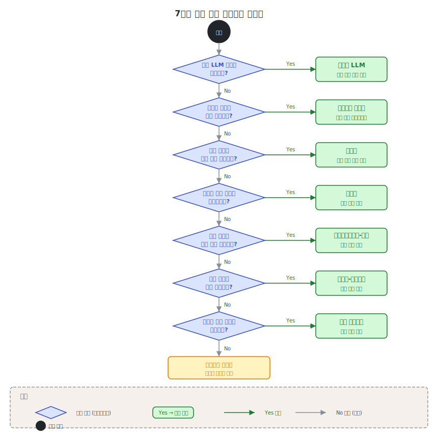

# 제2단원. 기본 패턴 — 에이전틱 시스템의 빌딩 블록

---

## 학습 목표

이 단원을 마치면 다음을 할 수 있다:

1. 에이전틱 시스템의 6가지 기본 빌딩 블록과 자율 에이전트(완전한 시스템)를 설명할 수 있다
2. 각 패턴의 적합/부적합 상황을 판별할 수 있다
3. 패턴을 조합하여 복합 시스템을 설계할 수 있다
4. Anthropic의 공식 가이드라인에 따라 적절한 복잡도를 선택할 수 있다

---

이 단원의 내용은 Anthropic의 "Building Effective Agents" (2024)를 기반으로 한다. Erik Schluntz와 Barry Zhang이 수십 개 팀과의 협업에서 도출한 패턴들이며, 가장 성공적인 구현이 복잡한 프레임워크가 아닌 **단순하고 조합 가능한 패턴**에 기반하였다는 발견이 핵심이다.

> "지난 한 해 동안 우리는 업계 전반에서 LLM 에이전트를 구축하는 수십 개 팀과 협력하였다. 일관되게, 가장 성공적인 구현은 복잡한 프레임워크나 전문 라이브러리를 사용하지 않았다. 대신, 단순하고 조합 가능한 패턴으로 구축하고 있었다."
> — Anthropic, "Building Effective Agents" (2024)

---

## 2.1 증강된 LLM (Augmented LLM)

### 개념

에이전틱 시스템의 가장 기본적인 빌딩 블록은 **증강된 LLM**이다. 이는 검색(retrieval), 도구(tools), 메모리(memory) 등의 기능으로 강화된 LLM을 의미한다. 현재의 모델은 이러한 기능을 능동적으로 사용할 수 있다 — 자체적으로 검색 쿼리를 생성하고, 적절한 도구를 선택하며, 어떤 정보를 유지할지 결정한다.

```
┌─────────────────────────────────────────────┐
│              증강된 LLM                       │
│                                             │
│  ┌─────────┐  ┌─────────┐  ┌─────────┐     │
│  │ 검색    │  │  도구    │  │ 메모리   │     │
│  │Retrieval│  │  Tools   │  │ Memory  │     │
│  └────┬────┘  └────┬────┘  └────┬────┘     │
│       │            │            │           │
│       ▼            ▼            ▼           │
│  ┌─────────────────────────────────────┐    │
│  │              LLM                    │    │
│  │  (Claude, GPT, Gemini 등)          │    │
│  └─────────────────────────────────────┘    │
└─────────────────────────────────────────────┘
```

### 구현 시 핵심

Anthropic은 두 가지에 집중할 것을 권고한다:

1. 기능을 **특정 사용 사례에 맞게 조정**한다
2. LLM에 **쉽고 잘 문서화된 인터페이스**를 제공한다

도구 인터페이스 설계는 인간-컴퓨터 인터페이스(HCI) 설계만큼 중요하다:

> "에이전트-컴퓨터 인터페이스(ACI)에도 인간-컴퓨터 인터페이스(HCI)에 투입하는 만큼의 노력을 투자할 계획을 세워라."
> — Anthropic (2024)

---

## 2.2 프롬프트 체이닝 (Prompt Chaining)

### 개념

**프롬프트 체이닝**은 작업을 일련의 단계로 분해하여, 각 LLM 호출이 이전 호출의 출력을 처리하는 패턴이다. 중간 단계에 프로그래밍 방식의 검증(게이트)을 추가하여 프로세스가 올바른 경로에 있는지 확인할 수 있다.

```
┌──────────┐     ┌──────────┐     ┌──────────┐
│  LLM     │────▶│  게이트   │────▶│  LLM     │
│  호출 1   │     │  (검증)   │     │  호출 2   │
│          │     │          │     │          │
│  초안    │     │  기준     │     │  최종    │
│  생성    │     │  충족?    │     │  완성    │
└──────────┘     └──────────┘     └──────────┘
```

### 적합한 상황

- 작업을 **고정된 하위 작업으로 쉽고 깔끔하게 분해**할 수 있는 경우
- 지연 시간을 희생하더라도 **더 높은 정확도**를 원하는 경우

### 실전 예시

```python
# 예시: 마케팅 카피 생성 → 번역 체인
def marketing_chain(product_description, target_language):
    # 단계 1: 영어 마케팅 카피 생성
    english_copy = llm.call(
        f"Write compelling marketing copy for: {product_description}"
    )
    
    # 게이트: 카피가 300자 이하인지 확인
    if len(english_copy) > 300:
        english_copy = llm.call(
            f"Shorten this to under 300 characters: {english_copy}"
        )
    
    # 단계 2: 대상 언어로 번역
    translated = llm.call(
        f"Translate to {target_language}, preserving marketing tone: {english_copy}"
    )
    
    return translated
```

### 실전 도구의 적용

- **Superpowers**: brainstorming → writing-plans → executing-plans 체인이 대표적인 프롬프트 체이닝이다
- **GSD**: discuss → plan → execute → verify의 6단계 파이프라인
- **OMC**: Team 모드의 5단계 파이프라인(plan → prd → exec → verify → fix)

---

## 2.3 라우팅 (Routing)

### 개념

**라우팅**은 입력을 분류하여 전문화된 후속 작업으로 연결하는 패턴이다. 관심사를 분리하고, 각 경로에 최적화된 프롬프트를 사용할 수 있게 한다.

```
                    ┌──────────────┐
              ┌────▶│ 일반 질문     │──▶ 간단한 응답 프롬프트
              │     └──────────────┘
┌──────────┐  │     ┌──────────────┐
│  분류기   │──┼────▶│ 환불 요청     │──▶ 환불 처리 워크플로우
│          │  │     └──────────────┘
└──────────┘  │     ┌──────────────┐
              └────▶│ 기술 지원     │──▶ 진단 + 해결 프롬프트
                    └──────────────┘
```

### 적합한 상황

- 별도로 처리하는 것이 더 나은 **뚜렷한 카테고리**가 있는 복잡한 작업
- 분류가 LLM 또는 전통적 분류 모델로 **정확하게** 수행될 수 있는 경우

### 모델 라우팅의 특수 사례

라우팅의 중요한 응용 중 하나는 **모델 라우팅**이다. 쉽고 흔한 질문은 비용 효율적인 소형 모델(Haiku)로, 어렵고 드문 질문은 고성능 모델(Opus)로 라우팅한다. 이에 대한 상세한 논의는 [5단원 모델 라우팅 패턴](05_모델_라우팅_패턴.md)에서 다룬다.

### 실전 도구의 적용

- **OMC**: 3티어 모델 라우팅(Opus/Sonnet/Haiku)이 핵심 기능이다. 작업 복잡도에 따라 자동으로 모델을 선택한다
- **gstack**: 브라우저 자동화 시 네비게이션은 Haiku, 분석은 Sonnet, 복잡한 판단은 Opus로 자동 라우팅한다

---

## 2.4 병렬화 (Parallelization)

### 개념

LLM이 **동시에** 작업을 수행하고, 출력을 프로그래밍 방식으로 집계하는 패턴이다. 두 가지 변형이 있다:

- **섹셔닝(Sectioning)**: 작업을 독립적 하위 작업으로 분할하여 병렬 실행
- **투표(Voting)**: 동일 작업을 여러 번 실행하여 다양한 출력을 획득

```
섹셔닝:                           투표:

┌──────────┐                    ┌──────────┐
│ 하위작업1  │──┐                 │ 시도 1    │──┐
└──────────┘  │                 └──────────┘  │
┌──────────┐  │  집계           ┌──────────┐  │  다수결
│ 하위작업2  │──┼──────▶ 결과     │ 시도 2    │──┼──────▶ 결과
└──────────┘  │                 └──────────┘  │
┌──────────┐  │                 ┌──────────┐  │
│ 하위작업3  │──┘                 │ 시도 3    │──┘
└──────────┘                    └──────────┘
```

### 적합한 상황

- 분할된 하위 작업을 **속도를 위해 병렬화**할 수 있는 경우
- 더 높은 신뢰도를 위해 **여러 관점이나 시도**가 필요한 경우

### 실전 예시

**섹셔닝 예시**: 가드레일 분리
```
사용자 쿼리 ──┬──▶ [LLM A] 핵심 응답 생성
              └──▶ [LLM B] 부적절 콘텐츠 스크리닝
```

동일한 LLM이 가드레일과 핵심 응답을 모두 처리하는 것보다, 분리하는 것이 더 나은 성능을 보인다.

**투표 예시**: 코드 보안 검토
```
코드 ──┬──▶ [프롬프트 A] 보안 취약점 검사 ──┐
       ├──▶ [프롬프트 B] 인젝션 공격 검사   ──┤──▶ 하나라도 문제 발견 시 플래그
       └──▶ [프롬프트 C] 권한 상승 검사     ──┘
```

### Python asyncio 기반 병렬화 예시

**섹셔닝(Sectioning) — 가드레일 분리 구현**

```python
import asyncio
from anthropic import Anthropic

client = Anthropic()

async def run_llm(system_prompt: str, user_message: str) -> str:
    """단일 LLM 호출 (비동기)"""
    # 실제 환경에서는 async 클라이언트 사용
    response = client.messages.create(
        model="claude-haiku-4-20250514",
        max_tokens=1024,
        system=system_prompt,
        messages=[{"role": "user", "content": user_message}]
    )
    return response.content[0].text

async def parallel_sectioning(query: str) -> dict:
    """섹셔닝 패턴: 핵심 응답과 가드레일을 병렬 처리"""
    core_task = run_llm(
        "사용자의 질문에 정확하고 유용하게 답변한다.",
        query
    )
    guard_task = run_llm(
        "다음 텍스트가 유해하거나 부적절한 내용을 포함하는지만 판단한다. "
        "포함하면 'BLOCK', 아니면 'PASS'로만 답한다.",
        query
    )
    # 두 작업을 동시에 실행
    core_response, guard_result = await asyncio.gather(core_task, guard_task)
    
    if "BLOCK" in guard_result:
        return {"status": "blocked", "response": "요청을 처리할 수 없다."}
    return {"status": "ok", "response": core_response}

# 투표(Voting) 패턴 — 보안 검토에 다수결 적용
async def voting_security_review(code: str) -> dict:
    """투표 패턴: 3가지 관점으로 보안 취약점을 동시 검토"""
    perspectives = [
        ("SQL 인젝션과 XSS 취약점에 집중하여 검토한다.", "인젝션 공격"),
        ("인증 우회와 권한 상승 취약점을 검토한다.", "인증/권한"),
        ("민감 데이터 노출과 암호화 문제를 검토한다.", "데이터 보안"),
    ]
    
    tasks = [
        run_llm(
            f"{prompt} 문제 발견 시 'ISSUE: [설명]', 없으면 'CLEAN'으로만 답한다.",
            f"코드를 검토하라:\n{code}"
        )
        for prompt, _ in perspectives
    ]
    results = await asyncio.gather(*tasks)
    
    issues = [
        f"[{perspectives[i][1]}] {r.replace('ISSUE:', '').strip()}"
        for i, r in enumerate(results)
        if r.startswith("ISSUE")
    ]
    return {
        "has_issues": len(issues) > 0,
        "issues": issues,
        "verdict": "보안 이슈 발견" if issues else "검토 통과"
    }
```

### 실전 도구의 적용

- **OMC Ultrapilot**: 최대 5개 워커가 독립된 git worktree에서 병렬 실행
- **GSD**: 웨이브(wave) 패턴으로 독립 태스크를 병렬 실행
- **Gas Town**: 12~30개 Polecat이 각각 독립된 태스크를 병렬 수행

---

## 2.5 오케스트레이터-워커 (Orchestrator-Workers)

### 개념

중앙 LLM이 **동적으로** 작업을 분해하고, 워커 LLM에 위임하며, 결과를 합성하는 패턴이다. 병렬화와 위상적으로 유사하지만, 핵심 차이는 **하위 작업이 사전에 정의되지 않고 오케스트레이터가 입력에 따라 결정**한다는 점이다.

```
┌──────────────────────────────────────────────┐
│           오케스트레이터 (Opus)                 │
│                                              │
│  입력 분석 → 하위 작업 도출 → 워커 할당        │
│                                              │
│  ┌────────┐  ┌────────┐  ┌────────┐         │
│  │워커 A   │  │워커 B   │  │워커 C   │         │
│  │(Sonnet) │  │(Sonnet) │  │(Sonnet) │         │
│  └───┬────┘  └───┬────┘  └───┬────┘         │
│      │           │           │               │
│      └───────────┼───────────┘               │
│                  │                           │
│           결과 합성 및 반환                    │
└──────────────────────────────────────────────┘
```

### 적합한 상황

- **필요한 하위 작업을 사전에 예측할 수 없는** 복잡한 작업
- 코딩에서 변경할 파일 수와 각 파일의 변경 성격이 작업에 따라 달라지는 경우

### 핵심 참조: Anthropic의 공식 패턴

이 패턴은 Anthropic의 Research 기능에서 공식적으로 사용하는 아키텍처이다:

> "우리의 Research 시스템은 lead agent가 프로세스를 조율하면서 병렬로 작동하는 전문화된 subagent에게 위임하는 orchestrator-worker 패턴의 멀티에이전트 아키텍처를 사용한다."
> — Anthropic (2025)

이 패턴을 Claude Code에 적용한 것이 **Opus lead agent + Sonnet subagent** 공식 패턴이다:

```
Main Session (Opus, lead agent)
  ├─▶ Teammate A (Sonnet, subagent): 탐색
  ├─▶ Teammate B (Sonnet, subagent): 구현
  └─▶ Teammate C (Sonnet, subagent): 검증
```

- 단일 Opus 대비 **90.2% 성능 향상**
- 적정 규모: **3~5 에이전트** (그 이상은 합성 복잡도가 이점을 상쇄)

### Claude Code Agent Teams API 활용 예시

Claude Code의 공식 Agent Teams API를 사용하면 오케스트레이터-워커 패턴을 직접 구현할 수 있다:

```python
# Claude Code Agent Teams를 사용한 오케스트레이터-워커 패턴
# 이 코드는 Claude Code 세션 내에서 실행된다 (CLAUDE.md 기반 에이전트 정의 필요)

import subprocess
import json

def orchestrate_refactoring(feature_description: str) -> dict:
    """
    오케스트레이터: 기능 설명을 받아 하위 작업으로 분해하고 워커에 위임한다.
    실제 Claude Code 환경에서는 Task 도구로 subagent를 호출한다.
    """
    # 1단계: 오케스트레이터가 작업 분해
    # (Claude Code에서 Opus 모델이 이 역할 담당)
    subtasks = [
        {"id": "T1", "agent": "architect", "task": f"설계 분석: {feature_description}"},
        {"id": "T2", "agent": "implementer", "task": f"구현: {feature_description}"},
        {"id": "T3", "agent": "tester", "task": f"테스트 작성: {feature_description}"},
    ]
    
    # 2단계: 워커 에이전트 병렬 실행
    # Claude Code에서는 SendMessage 도구로 각 에이전트에 위임
    results = {}
    for task in subtasks:
        # SendMessage(agent=task["agent"], message=task["task"])에 해당
        results[task["id"]] = f"[{task['agent']}] {task['task']} 완료"
    
    # 3단계: 결과 합성
    return {
        "status": "완료",
        "subtasks": len(subtasks),
        "results": results
    }
```

**주의**: 실제 Claude Code 환경에서는 `Task` 도구를 사용하여 `.claude/agents/` 폴더에 정의된 에이전트에 작업을 위임한다. 상세 구현 방법은 9단원에서 다룬다.

### 실전 도구의 적용

- **OMC Team 모드**: 5단계 파이프라인(plan → prd → exec → verify → fix)
- **ECC chief-of-staff**: 최상위 오케스트레이터로서 복잡한 작업의 에이전트 배분 담당
- **Superpowers subagent-driven-development**: 작업별 신선한 subagent 파견 (orchestrator는 메인 세션)

---

## 2.6 평가자-최적화자 (Evaluator-Optimizer)

### 개념

한 LLM 호출이 응답을 생성하고, 다른 LLM 호출이 평가와 피드백을 제공하는 **루프 구조**이다.

```
┌──────────┐     ┌──────────┐     ┌──────────┐
│ 생성자    │────▶│ 평가자    │────▶│ 판정     │
│(Sonnet)  │     │(Opus)    │     │          │
│          │     │          │     │ Pass?    │
│ 초안     │     │ 품질     │     │          │
│ 생성     │     │ 평가     │     │ Yes→반환 │
└──────────┘     └──────────┘     │ No→재시도│
      ▲                           └─────┬───┘
      │                                 │
      └──── 피드백과 함께 재생성 ◄────────┘
```

### 적합한 상황

- **명확한 평가 기준**이 있는 경우
- **반복적 개선이 측정 가능한 가치**를 제공하는 경우

### 핵심 발견: 반복 횟수의 수확 체감

```
품질 개선률:

  1차 반복  ████████████████████████████████████████  60%
  2차 반복  █████████████████████████                  25%
  3차 반복  █████                                       5%
  4차 이후  ██                                          2%

→ 품질 개선의 85%가 첫 2회 반복에서 달성된다
→ 3회째는 2회째 비용의 2배를 쓰면서 한계 개선만 제공한다
```

### 실전 도구의 적용

- **OMC Ralph 모드**: Planner → Executor → Verifier를 무한 반복하며, 검증 통과까지 계속한다
- **ECC eval-harness**: 평가 프레임워크를 실행하여 품질 메트릭을 수집한다
- **Superpowers TDD 스킬**: RED-GREEN-REFACTOR 사이클을 강제하는 것이 평가자-최적화자 패턴의 코딩 특화 버전이다

---

## 2.7 자율 에이전트 (Autonomous Agents)

### 개념

에이전트는 작업 명세를 받은 후 **독립적으로** 계획하고 실행한다. 각 단계에서 환경으로부터 **실측 데이터(ground truth)**를 획득하여 진행 상황을 평가한다. 인간의 판단이 필요한 체크포인트에서 일시 정지하거나, 블로커를 만나면 인간에게 돌아갈 수 있다.

```
┌─────────────────────────────────────────┐
│          자율 에이전트 루프               │
│                                         │
│  ┌──────────┐                           │
│  │ 작업     │                           │
│  │ 명세     │                           │
│  └────┬─────┘                           │
│       │                                 │
│       ▼                                 │
│  ┌──────────┐     ┌──────────┐         │
│  │ 행동     │────▶│ 환경     │         │
│  │ 결정     │     │ 관찰     │         │
│  └──────────┘     └────┬─────┘         │
│       ▲                │               │
│       │                │               │
│       └────────────────┘               │
│       (결과 기반 다음 행동 결정)         │
│                                         │
│  종료 조건: 작업 완료 또는 최대 반복 도달 │
└─────────────────────────────────────────┘
```

### 적합한 상황

- 필요한 단계 수를 **예측하기 어렵거나 불가능**한 개방형 문제
- 고정된 경로를 **하드코딩할 수 없는** 경우

### 주의사항

> "에이전트의 자율적 특성은 더 높은 비용과 오류 복합 가능성을 의미한다. 샌드박스 환경에서의 광범위한 테스트와 적절한 가드레일을 권고한다."
> — Anthropic (2024)

### 자율 에이전트의 안전장치 구현 예시

프로덕션 자율 에이전트에는 반드시 무한 루프 방지와 비용 제한 안전장치가 필요하다:

```python
import time
from dataclasses import dataclass, field
from typing import Optional

@dataclass
class AgentSafeguards:
    """자율 에이전트의 안전장치 설정"""
    max_iterations: int = 50          # 최대 반복 횟수
    max_cost_usd: float = 50.0        # 최대 비용 (USD)
    max_time_seconds: int = 3600      # 최대 실행 시간 (초)
    human_review_threshold: float = 0.3  # 실패율 임계값: 30% 초과 시 중단
    
    # 실행 중 추적 상태
    iterations: int = 0
    estimated_cost_usd: float = 0.0
    start_time: float = field(default_factory=time.time)
    failed_steps: int = 0
    total_steps: int = 0

class SafeAutonomousAgent:
    """안전장치가 포함된 자율 에이전트"""
    
    def __init__(self, safeguards: AgentSafeguards):
        self.sg = safeguards
    
    def check_safeguards(self) -> Optional[str]:
        """안전장치 점검. 중단 이유를 반환하거나 None(계속)을 반환한다."""
        if self.sg.iterations >= self.sg.max_iterations:
            return f"최대 반복 횟수 초과 ({self.sg.max_iterations}회)"
        
        if self.sg.estimated_cost_usd >= self.sg.max_cost_usd:
            return f"비용 한도 초과 (${self.sg.estimated_cost_usd:.2f} >= ${self.sg.max_cost_usd})"
        
        elapsed = time.time() - self.sg.start_time
        if elapsed >= self.sg.max_time_seconds:
            return f"시간 한도 초과 ({elapsed:.0f}초)"
        
        if self.sg.total_steps > 0:
            failure_rate = self.sg.failed_steps / self.sg.total_steps
            if failure_rate > self.sg.human_review_threshold:
                return f"실패율 임계값 초과 ({failure_rate*100:.1f}%) — 인간 검토 필요"
        
        return None  # 계속 진행
    
    def run(self, task: dict) -> dict:
        """안전장치 내에서 자율 실행"""
        while not task.get("complete", False):
            stop_reason = self.check_safeguards()
            if stop_reason:
                return {
                    "status": "stopped",
                    "reason": stop_reason,
                    "iterations": self.sg.iterations,
                    "cost_usd": self.sg.estimated_cost_usd,
                    "partial_result": task.get("partial_result")
                }
            
            # 실제 에이전트 스텝 실행 (여기서 LLM 호출)
            self.sg.iterations += 1
            self.sg.estimated_cost_usd += 0.05  # 예시: 스텝당 $0.05
            
            # 작업 진행 (실제 구현에서는 LLM 호출로 대체)
            task["complete"] = self.sg.iterations >= 3  # 예시 종료 조건
        
        return {"status": "complete", "iterations": self.sg.iterations}
```

### 실전 도구의 적용

- **OMC Ralph 모드**: Planner → Executor → Verifier 루프를 검증 통과까지 자율 반복. rate limit에도 자동 재개
- **GSD auto 모드**: 마일스톤 단위의 완전 자율 실행. DLP 7가지 안전장치로 무한 루프 방지
- **Gas Town Mayor + Polecat**: Mayor orchestrator가 Polecat subagent들을 동적 배정하는 자율 시스템

자율 에이전트는 완전한 시스템 유형으로서, 위의 6가지 기본 빌딩 블록(2.1~2.6)을 내부적으로 조합하여 구현한다. 예를 들어 OMC Ralph는 계획-실행 단계에서 오케스트레이터-워커(2.5)를, 검증 단계에서 평가자-최적화자(2.6)를 사용한다.

---

## 2.8 패턴 선택 가이드

### 결정 트리

```
작업 분석 시작
    │
    ├─ 단일 LLM 호출로 충분한가?
    │   └─ Yes → 증강된 LLM (2.1)
    │
    ├─ 고정된 단계로 분해 가능한가?
    │   └─ Yes → 프롬프트 체이닝 (2.2)
    │
    ├─ 입력 유형에 따라 다른 처리가 필요한가?
    │   └─ Yes → 라우팅 (2.3)
    │
    ├─ 독립적 하위 작업이 있는가?
    │   └─ Yes → 병렬화 (2.4)
    │
    ├─ 하위 작업을 사전에 예측할 수 없는가?
    │   └─ Yes → 오케스트레이터-워커 (2.5)
    │
    ├─ 반복적 개선이 측정 가능한 가치가 있는가?
    │   └─ Yes → 평가자-최적화자 (2.6)
    │
    └─ 개방형 문제로 자율적 탐색이 필요한가?
        └─ Yes → 자율 에이전트 (2.7)
```



### 패턴 비교 매트릭스

| 패턴 | 예측 가능성 | 유연성 | 비용 | 지연 시간 | 복잡도 |
|------|-----------|--------|------|----------|--------|
| 증강된 LLM | 높음 | 낮음 | 최저 | 최저 | 최저 |
| 프롬프트 체이닝 | 높음 | 낮음 | 낮음 | 중간 | 낮음 |
| 라우팅 | 중간 | 중간 | 중간 | 낮음 | 낮음 |
| 병렬화 | 중간 | 중간 | 중간 | 낮음 | 중간 |
| 오케스트레이터-워커 | 낮음 | 높음 | 높음 | 높음 | 높음 |
| 평가자-최적화자 | 중간 | 중간 | 높음 | 높음 | 중간 |
| 자율 에이전트 | 최저 | 최고 | 최고 | 최고 | 최고 |

> **핵심 정리: Anthropic의 세 가지 원칙**
>
> 에이전트 구현 시 따라야 할 세 가지 핵심 원칙:
> 1. 에이전트 설계에서 **단순성을 유지**한다
> 2. 에이전트의 계획 단계를 명시적으로 보여주어 **투명성을 우선**한다
> 3. 철저한 도구 **문서화와 테스트**를 통해 에이전트-컴퓨터 인터페이스(ACI)를 신중히 설계한다

---

## 복습 질문

1. Anthropic이 정의한 6가지 기본 워크플로우 패턴을 나열하고, 각각을 한 문장으로 설명하라.

2. 프롬프트 체이닝과 오케스트레이터-워커의 핵심 차이점은 무엇인가? 각각 적합한 상황의 예를 들어 설명하라.

3. 병렬화의 두 가지 변형(섹셔닝과 투표)을 비교하고, 각각의 실전 사용 사례를 제시하라.

4. 평가자-최적화자 패턴에서 "품질 개선의 85%가 첫 2회 반복에서 달성된다"는 발견이 시스템 설계에 주는 시사점은 무엇인가?

5. "가장 간단한 솔루션을 찾고, 필요할 때만 복잡성을 증가시키라"는 Anthropic의 조언을 따를 때, 새 프로젝트에서 패턴 선택의 올바른 접근법은 무엇인가?

---

*이전 단원: [제1단원. 서론](01_서론.md) | 다음 단원: [제3단원. 오케스트레이션 패턴](03_오케스트레이션_패턴.md)*
