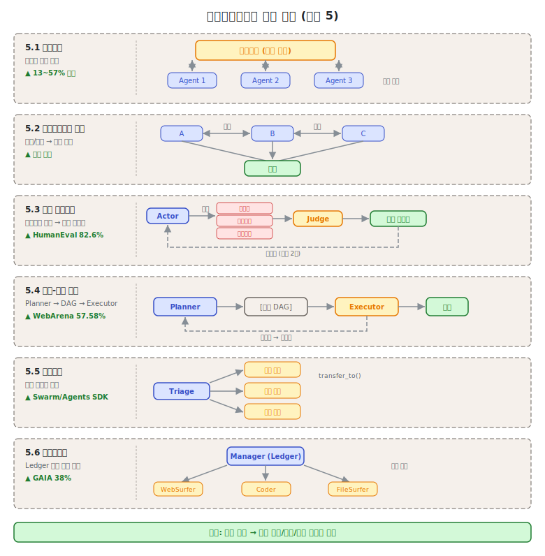
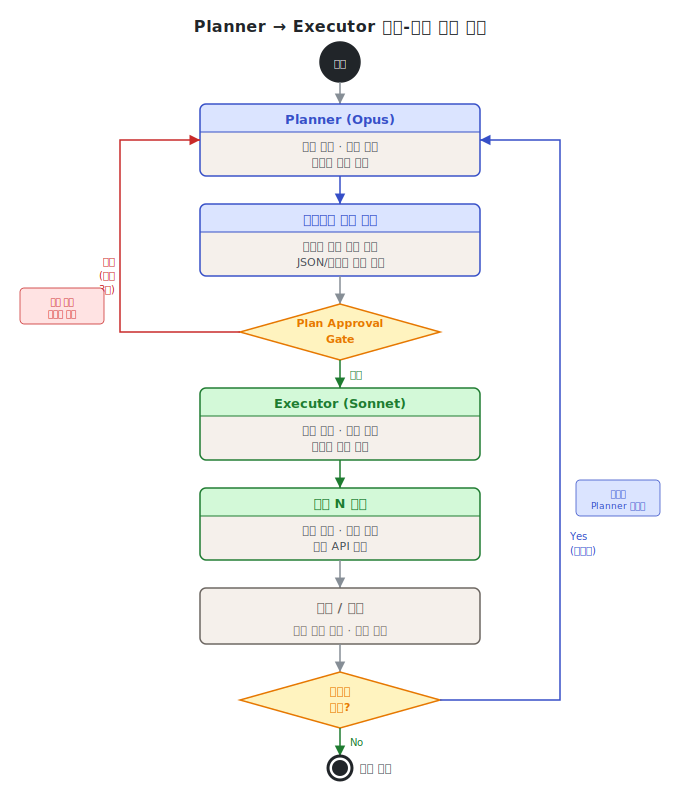
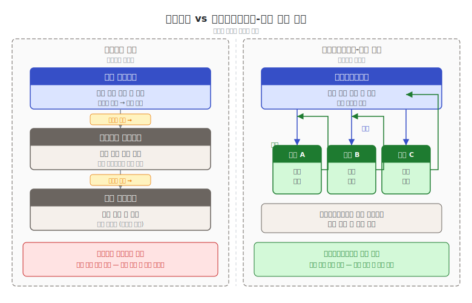

# 제3단원. 오케스트레이션 패턴 — 에이전트 간 협업 구조

---

## 학습 목표

이 단원을 마치면 다음을 할 수 있다:

1. 6가지 오케스트레이션 패턴의 아키텍처와 동작 원리를 설명할 수 있다
2. 각 패턴의 장단점과 적합한 사용 시나리오를 판별할 수 있다
3. Plan Approval Gate를 포함한 실무 핵심 패턴을 설계에 적용할 수 있다
4. 패턴 간의 관계와 조합 가능성을 분석할 수 있다

---

[2단원](02_기본_패턴.md)에서 다룬 기본 빌딩 블록을 기반으로, 이 단원에서는 에이전트 간의 **협업 구조**를 결정하는 오케스트레이션 패턴을 심층적으로 다룬다. 이 패턴들은 "에이전트가 서로 어떻게 소통하고 조율하는가"라는 질문에 답한다.

오케스트레이션 패턴은 기본 패턴(2단원)과 달리 **에이전트 간 관계**에 초점을 맞춘다. 단일 에이전트의 행동 방식이 아닌, 여러 에이전트가 함께 작동하는 방식을 정의한다. 이 구분은 설계의 복잡도를 체계적으로 관리하는 데 핵심적이다.



---

## 3.1 블랙보드 패턴 (Blackboard Pattern)

### 개념

**블랙보드 패턴**은 공유 작업 공간(블랙보드)을 중앙 통신 허브로 사용하는 패턴이다. 오케스트레이터 에이전트가 작업을 게시하면, subagent들이 자신의 역량에 따라 **자율적으로 참여를 결정**한다. 제어 컴포넌트가 현재 블랙보드 상태를 기반으로 다음 행동자를 선택한다.

이 패턴은 1970~80년대 AI 연구에서 유래하였다. 원래는 음성 인식 시스템에서 여러 지식 소스(음운론, 어휘론, 구문론)가 공유 데이터 구조에 접근하여 협력적으로 해석을 구성하는 방식이었다. 현대 LLM 시스템에서는 이 개념이 에이전트 간 비동기 협업 구조로 재탄생하였다.

```
┌──────────────────────────────────────────┐
│           블랙보드 (공유 작업 공간)          │
│                                          │
│  [작업 A: 미해결]  [결과 B: 완료]          │
│  [상태 C: 진행중]  [요청 D: 대기]          │
│                                          │
└──────────┬──────────┬──────────┬─────────┘
           │          │          │
     ┌─────▼─────┐ ┌──▼─────┐ ┌─▼────────┐
     │ Agent 1   │ │Agent 2 │ │ Agent 3  │
     │ (코드분석) │ │(테스트)│ │ (문서화) │
     │           │ │        │ │          │
     │ "작업A는  │ │"작업A는│ │"상태C에  │
     │  내가     │ │ 나와   │ │ 기여할   │
     │  적합"    │ │ 무관"  │ │ 수 있음" │
     └───────────┘ └────────┘ └──────────┘
```

### 성능 수치

- 정적 할당 대비 **13~57% 성능 향상** (arxiv 2510.01285)
- 2.88~3.29 라운드로 합의 도달
- 특히 탐색적 분석 워크로드에서 효과 극대화

### 작동 메커니즘

블랙보드 패턴의 핵심은 세 가지 컴포넌트로 구성된다:

1. **블랙보드(Blackboard)**: 공유 데이터 구조. 모든 에이전트가 읽고 쓸 수 있다. 현재 문제 상태, 부분 해결책, 진행 상황을 기록한다.

2. **지식 소스(Knowledge Source, KS)**: 각 에이전트가 담당하는 전문 영역. 자신의 조건이 충족될 때만 블랙보드에 기여한다.

3. **제어 컴포넌트(Control Component)**: 블랙보드 상태를 감시하고 다음에 활성화할 에이전트를 결정한다. orchestrator 역할을 수행한다.

```python
# 블랙보드 패턴의 구조적 예시
class Blackboard:
    def __init__(self):
        self.tasks = {}       # 작업 목록
        self.results = {}     # 완료된 결과
        self.state = {}       # 현재 시스템 상태

class KnowledgeSource:
    def can_contribute(self, blackboard: Blackboard) -> bool:
        """자신이 현재 기여할 수 있는지 판단"""
        raise NotImplementedError

    def contribute(self, blackboard: Blackboard) -> None:
        """블랙보드에 결과 기록"""
        raise NotImplementedError

class Controller:
    def __init__(self, blackboard: Blackboard, sources: list):
        self.blackboard = blackboard
        self.sources = sources

    def run(self):
        while not self.is_solved():
            # 기여 가능한 에이전트 탐색
            candidates = [s for s in self.sources
                          if s.can_contribute(self.blackboard)]
            if candidates:
                # 우선순위에 따라 선택 후 실행
                best = self.select_best(candidates)
                best.contribute(self.blackboard)
```

### 적합한 상황

- 에이전트 역량이 겹치고, 사전에 최적 에이전트를 예측할 수 없는 **탐색적 분석**
- 여러 전문가가 공유 문제에 점진적으로 기여하는 구조
- 작업 완료 조건이 유연하고, 부분적 해결책도 가치가 있는 경우

### 부적합한 상황

- 작업 할당이 명확한 경우 (오버헤드만 증가)
- 실시간 응답이 필요한 경우 (합의 도달에 여러 라운드 소요)
- 에이전트 간 의존성이 선형적인 경우 (단순 파이프라인이 더 적합)

### arxiv 2510.01285 실험 설계

이 연구는 코드 리뷰 작업에서 블랙보드 패턴과 정적 할당 방식을 비교하였다. 10개 팀의 소프트웨어 에이전트가 오픈소스 버그 수정 작업 300개를 처리하였다. 블랙보드 그룹은 에이전트가 자율적으로 작업을 선택하고, 정적 할당 그룹은 사전에 작업이 배정되었다. 결과는 블랙보드 그룹이 13~57% 높은 성공률을 보였으며, 특히 복잡도가 높은 작업(상위 25%)에서 차이가 가장 컸다.

---

## 3.2 멀티에이전트 토론 (Multi-Agent Debate)

### 개념

여러 LLM 인스턴스가 독립적으로 답변을 제시한 뒤, **비판과 반론을 반복**하여 공통 최종 답에 수렴한다.

```
라운드 1:
  Agent A: "이 함수의 시간 복잡도는 O(n log n)이다"
  Agent B: "아니다, 내부 루프 때문에 O(n^2)이다"
  Agent C: "Agent A에 동의한다. 정렬 알고리즘이 지배적이다"

라운드 2:
  Agent A: "Agent B의 지적을 재검토했다. 내부 루프가 정렬 후 실행되므로..."
  Agent B: "재분석 결과, 정렬이 지배적이므로 O(n log n)이 맞다"

최종: 합의 → O(n log n)
```

### 핵심 발견

2025년 연구에 따르면, **팀 구성의 다양성이 토론 구조보다 더 중요**하다. 다수결 투표만으로도 대부분의 성능 향상을 달성할 수 있다는 발견이 있다(arxiv 2511.07784). 이는 토론의 "과정"보다 다양한 관점을 가진 에이전트들이 독립적으로 평가하는 "구조" 자체가 핵심임을 의미한다.

### 구현 시 주의사항

```python
def answers_converged(answers: list, threshold: float = 0.95) -> bool:
    """모든 답변 쌍의 cosine similarity가 threshold 이상이면 수렴으로 판정한다.
    실제 구현에서는 text-embedding-3-small 등의 임베딩 API를 사용한다.
    여기서는 핵심 단어 집합의 자카드 유사도로 근사한다."""
    if len(answers) < 2:
        return True
    tokens = [set(a.lower().split()) for a in answers]
    for i in range(len(tokens)):
        for j in range(i + 1, len(tokens)):
            intersection = len(tokens[i] & tokens[j])
            union = len(tokens[i] | tokens[j])
            if union == 0 or intersection / union < threshold:
                return False
    return True

# 멀티에이전트 토론 구현의 핵심 포인트
def multi_agent_debate(question: str, agents: list, max_rounds: int = 3):
    # 라운드 1: 독립적 초기 답변 (서로의 답변 보지 않음)
    initial_answers = []
    for agent in agents:
        answer = agent.answer_independently(question)
        initial_answers.append(answer)

    # 라운드 2~N: 다른 에이전트 답변을 보고 비판/재검토
    current_answers = initial_answers
    for round_num in range(2, max_rounds + 1):
        new_answers = []
        for i, agent in enumerate(agents):
            other_answers = [a for j, a in enumerate(current_answers) if j != i]
            revised = agent.critique_and_revise(
                question,
                own_answer=current_answers[i],
                others_answers=other_answers
            )
            new_answers.append(revised)

        # 수렴 확인 (모든 에이전트가 동의하면 조기 종료)
        if answers_converged(new_answers):
            break
        current_answers = new_answers

    return aggregate_final_answer(current_answers)
```

### 적합한 상황

- 수학적 추론, 사실 검증, 환각 감소가 중요한 작업
- 정답이 존재하고 논리적으로 수렴 가능한 문제

### 부적합한 상황

- 창의적 작업 (정답이 없으므로 수렴하지 않음)
- API 비용 민감 환경 (에이전트 수 × 라운드 수만큼 호출 증가)

---

## 3.3 다중 에이전트 리플렉션 (Multi-Agent Reflexion)

### 개념

단일 에이전트 자기 비판을 **다수의 페르소나 기반 비평가**로 확장한다. 실패 시 여러 비평가가 다른 관점에서 진단하고, 심판 모델이 통합 피드백을 생성하여 재시도한다. **확인 편향(confirmation bias)**을 구조적으로 방지한다.

단일 에이전트 리플렉션의 근본적 한계는, 에이전트가 자신의 오류를 같은 방식으로 반복 진단한다는 점이다. "나는 X라고 생각했는데 틀렸다. 따라서 Y가 맞겠다"는 추론이 또 다른 X를 낳을 수 있다. 다중 비평가를 도입하면 이 편향이 구조적으로 완화된다.

```
┌──────────┐     실패      ┌──────────────────────────┐
│  생성자   │────────────▶ │  다중 비평가               │
│          │              │                          │
│  코드    │              │  비평가 A (보안 관점):     │
│  생성    │              │  "인증 검사가 누락됨"      │
│          │              │                          │
│          │              │  비평가 B (성능 관점):     │
│          │              │  "N+1 쿼리 문제 발생"     │
│          │              │                          │
│          │              │  비평가 C (유지보수 관점): │
│          │              │  "순환 의존성이 생성됨"    │
│          │              └──────────┬───────────────┘
│          │                         │
│          │     통합 피드백           │
│          │◄────────────────────────┘
└──────────┘
```

### 성능 수치

- HotPotQA: 44% → 47% 향상
- HumanEval: 76.4% → **82.6%** (6.2 포인트 향상)
- 대가: API 호출 약 3배 증가
- 출처: arxiv 2512.20845

### 비평가 역할 설계 원칙

효과적인 다중 리플렉션을 위해 비평가 역할은 서로 **직교(orthogonal)**해야 한다. 즉, 각 비평가가 서로 다른 실패 모드를 담당해야 한다.

코드 생성 맥락에서 권장하는 비평가 역할:
- **보안 비평가**: SQL 인젝션, XSS, 인증 누락, 권한 상승
- **성능 비평가**: N+1 쿼리, 불필요한 루프, 메모리 누수
- **유지보수 비평가**: 복잡도, 중복 코드, 테스트 가능성
- **정확성 비평가**: 로직 오류, 경계 조건, 예외 처리

### 적합한 상황

- 코드 생성, 멀티홉 QA
- 단일 에이전트 리플렉션이 같은 오류를 반복하는 경우
- 다양한 실패 모드가 예상되는 복잡한 작업

---

## 3.4 계획-실행 분리 (Planner-Executor Separation)

### 개념

**"무엇을 할지"(Planner)**와 **"어떻게 할지"(Executor)**를 엄격히 분리한다. Planner가 구조화된 계획(시퀀스 또는 DAG)을 생성하면, Executor가 각 원자적 단계를 처리한다. 실행 후 피드백이 Planner로 돌아와 재계획이 가능하다.

```
┌──────────────┐              ┌──────────────┐
│  Planner     │              │  Executor    │
│  (Opus)      │              │  (Sonnet)    │
│              │   계획 전달   │              │
│  1. API 설계 │─────────────▶│  단계 1 실행  │
│  2. DB 스키마│              │       │      │
│  3. 테스트   │   피드백      │       ▼      │
│  4. 문서화   │◄─────────────│  결과/오류    │
│              │              │              │
│  (재계획)    │              │  단계 2 실행  │
└──────────────┘              └──────────────┘
```



### 핵심 발견

> **약한 Planner가 가장 치명적 병목이다** — 계획 품질이 전체 성능을 지배한다 (arxiv 2503.09572)

이 발견은 실전 도구 설계에 직접적인 영향을 미쳤다. OMC에서 Planner에 Opus 티어를 배정하고, Executor에 Sonnet을 배정하는 전략이 이에 해당한다. Planner를 저렴한 모델로 운용하면 비용은 절감되지만, 잘못된 계획으로 인한 재작업 비용이 훨씬 크다.

### Planner 출력 형식: 구조화된 계획

Planner가 생성하는 계획은 Executor가 해석할 수 있는 명확한 형식이어야 한다:

```json
{
  "plan_id": "task-20260408-001",
  "objective": "OAuth2 인증 시스템 구현",
  "steps": [
    {
      "step_id": 1,
      "action": "API 엔드포인트 설계",
      "assignee": "architect",
      "dependencies": [],
      "acceptance_criteria": "OpenAPI 3.0 스펙 생성 완료",
      "estimated_tokens": 2000
    },
    {
      "step_id": 2,
      "action": "JWT 토큰 발급 구현",
      "assignee": "executor",
      "dependencies": [1],
      "acceptance_criteria": "단위 테스트 통과",
      "estimated_tokens": 4000
    }
  ],
  "rollback_strategy": "각 단계별 Git 커밋으로 개별 롤백 가능"
}
```

### 실전 도구의 적용

| 도구 | Planner | Executor | 피드백 루프 |
|------|---------|----------|-----------|
| **OMC** | Planner(Opus) → team-plan | Executor(Sonnet) → team-exec | team-verify → team-fix |
| **GSD** | discuss + plan 단계 | execute 단계 (깨끗한 컨텍스트) | verify → 재계획 |
| **Superpowers** | brainstorming + writing-plans | subagent-driven-development | 2-stage review |
| **Gas Town** | Mayor (작업 분해) | Polecat (단일 태스크) | Witness → 에스컬레이션 |

---

## 3.4.1 Plan Approval Gate (계획 승인 게이트)

### 개념

계획-실행 분리 패턴의 중요한 변형으로, 에이전트가 코드 작성 전에 **계획서를 제출**하고 리드(lead agent 또는 인간)의 승인을 받아야 실행을 시작한다.

```
Subagent ──▶ 계획서 작성 ──▶ Lead 승인? ──▶ Yes: 실행 시작
                                   │
                                   No: 수정 후 재제출
                                   │
                          Subagent ◀─────────────────
```

이 패턴의 필요성은 다음과 같은 실전 문제에서 비롯된다:

> "검증자가 거의 완벽해야 한다 — 그렇지 않으면 Claude는 잘못된 문제를 푼다."

에이전트가 검증 없이 코드를 작성하기 시작하면, 설령 코드 품질이 높더라도 **방향이 잘못되었을 때** 되돌리기 어렵다. 계획 승인 게이트는 이 비용을 사전에 차단한다.

### 구현 예시

```python
class PlanApprovalGate:
    def __init__(self, lead_agent, approval_threshold: float = 0.8):
        self.lead = lead_agent
        self.threshold = approval_threshold

    def submit_plan(self, subagent_id: str, plan: dict) -> dict:
        """subagent가 계획서를 제출하고 승인을 요청"""
        review = self.lead.review_plan(plan)

        if review["approval_score"] >= self.threshold:
            return {
                "approved": True,
                "feedback": review.get("suggestions", []),
                "constraints": review.get("must_not", [])
            }
        else:
            return {
                "approved": False,
                "reason": review["rejection_reason"],
                "required_revisions": review["required_revisions"]
            }

    def execute_with_gate(self, subagent, task: dict):
        """Plan Approval Gate를 통과한 경우에만 실행"""
        max_attempts = 3
        for attempt in range(max_attempts):
            plan = subagent.create_plan(task)
            result = self.submit_plan(subagent.id, plan)

            if result["approved"]:
                # 승인된 계획에 제약사항을 포함하여 실행
                return subagent.execute(plan, constraints=result["constraints"])
            else:
                # 거절 사유를 반영하여 계획 수정
                task["revision_notes"] = result["required_revisions"]

        raise MaxAttemptsExceededError(f"계획이 {max_attempts}회 거절됨")
```

### 효과

- 잘못된 방향의 작업을 **사전 차단**. 잘못된 방향으로 수 시간의 작업이 낭비되는 것을 방지한다.
- OMC에서 architect의 구현 계획을 team-lead가 승인 후 implementer에 전달하는 흐름이 이 패턴을 구현한다.

### 적용 지침

Plan Approval Gate는 모든 작업에 무조건 적용하는 것이 아니라, 다음 기준으로 선택적으로 적용한다:

- **적용 권장**: 파일 10개 이상 수정, 데이터베이스 스키마 변경, 외부 API 연동, 보안 관련 변경
- **불필요**: 단순 문서 수정, 독립된 유틸리티 함수 추가, 포맷팅 변경

---

## 3.5 핸드오프 오케스트레이션 (Handoff Orchestration)

### 개념

에이전트가 런타임 맥락에 따라 **대화 제어권을 다른 에이전트에게 동적으로 이전**한다. 전화 연결처럼, 각 에이전트가 상황을 분석하여 다음 담당자를 결정한다.

```
┌──────────┐   핸드오프    ┌──────────┐   핸드오프    ┌──────────┐
│ 접수     │────────────▶│ 기술지원  │────────────▶│ 결제팀   │
│ 에이전트  │              │ 에이전트  │              │ 에이전트  │
│          │              │          │              │          │
│ "기술    │              │ "결제    │              │ 문제     │
│  문제군" │              │  관련"   │              │ 해결     │
└──────────┘              └──────────┘              └──────────┘
```

이 패턴은 OpenAI Swarm(현 Agents SDK)과 Semantic Kernel의 핵심 프리미티브이다. 암묵적 조정 대비 **무한 루프를 방지**하는 장점이 있다.

### OpenAI Agents SDK 코드 예시

```python
from agents import Agent, handoff, Runner

# 전문화된 에이전트 정의
billing_agent = Agent(
    name="Billing Agent",
    instructions="결제, 환불, 청구서 관련 문의를 처리한다.",
    tools=[process_refund, check_invoice]
)

tech_support_agent = Agent(
    name="Tech Support Agent",
    instructions="기술적 문제를 진단하고 해결한다.",
    tools=[run_diagnostics, check_logs]
)

# 접수 에이전트: 맥락에 따라 핸드오프 결정
triage_agent = Agent(
    name="Triage Agent",
    instructions="""
    고객 문의를 접수하고 적절한 담당 에이전트로 이관한다.
    - 결제/청구/환불 관련 → billing_agent로 이관
    - 기술 오류/버그/설정 관련 → tech_support_agent로 이관
    """,
    handoffs=[
        handoff(billing_agent),
        handoff(tech_support_agent)
    ]
)

# 실행
runner = Runner()
result = runner.run(triage_agent, "지난달 결제가 이중으로 청구되었습니다")
```



### 핸드오프 vs 오케스트레이터-워커 비교

핸드오프 패턴은 2단원의 오케스트레이터-워커와 혼동하기 쉽다. 핵심 차이는 다음과 같다:

| 관점 | 핸드오프 | 오케스트레이터-워커 |
|------|---------|-----------------|
| 제어권 이전 | 이전됨 (발신자가 제어권 잃음) | 유지됨 (orchestrator가 항상 제어) |
| 결과 수신 | 최종 에이전트가 직접 응답 | orchestrator가 결과 수집 후 합성 |
| 적합한 작업 | 선형 에스컬레이션 체인 | 병렬 분해 후 합성 필요한 작업 |
| 무한 루프 위험 | 낮음 (단방향) | 중간 (재계획 루프) |

### 실전 도구의 적용

- **OMC 스킬 핸드오프 계약**: 스킬 간 `on_success`와 `on_failure` 타겟을 SKILL.md에 명시한다
- **Gas Town 에스컬레이션 체인**: Polecat → Deacon → Mayor → Overseer로 자동 에스컬레이션

### 무한 루프 방지 메커니즘

핸드오프 구현 시 순환 참조(A→B→A)를 방지하는 장치가 필수적이다:

```python
class HandoffRouter:
    def __init__(self, max_hops: int = 5):
        self.max_hops = max_hops

    def route(self, context: dict, visited: list = None) -> str:
        if visited is None:
            visited = []

        if len(visited) >= self.max_hops:
            return "fallback_agent"  # 최대 홉 초과 시 폴백

        next_agent = self.decide_next(context)

        if next_agent in visited:
            # 이미 방문한 에이전트로 핸드오프 시도 → 순환 감지
            return "escalation_agent"

        visited.append(next_agent)
        return next_agent
```

---

## 3.6 Magentic-One 동적 오케스트레이션

### 개념

Microsoft Research가 제안한 **Magentic-One** 패턴에서, 전담 매니저 에이전트가 전문가 팀을 조율하되, **진행 상황에 따라 다음 행동자를 동적으로 선택**한다. 정적 supervisor와 달리 진행 원장(ledger)을 유지하며 계획을 지속적으로 재평가한다.

```
┌──────────────────────────────────────────────┐
│           매니저 에이전트                       │
│                                              │
│  진행 원장(Ledger):                            │
│  - 현재 목표: API 통합                         │
│  - 완료: 인터페이스 정의, 인증 구현              │
│  - 진행중: 엔드포인트 구현                       │
│  - 다음 행동자 결정: ← 동적 선택                │
│                                              │
│  ┌────────┐  ┌────────┐  ┌────────┐         │
│  │코더    │  │웹서퍼  │  │파일    │         │
│  │        │  │        │  │서퍼    │         │
│  └────────┘  └────────┘  └────────┘         │
│  ┌────────┐  ┌────────┐                     │
│  │터미널  │  │분석가  │                     │
│  │        │  │        │                     │
│  └────────┘  └────────┘                     │
└──────────────────────────────────────────────┘
```

### 진행 원장(Ledger)의 JSON 구조

매니저 에이전트가 유지하는 진행 원장의 구조 예시:

```json
{
  "task": "OAuth2 인증 시스템 구현",
  "completed": [
    {
      "step": "인터페이스 설계",
      "agent": "coder",
      "result_summary": "OpenAPI 3.0 스펙 생성 완료",
      "timestamp": "2026-04-08T10:30:00Z"
    }
  ],
  "in_progress": {
    "step": "JWT 토큰 발급 구현",
    "agent": "coder",
    "started_at": "2026-04-08T10:45:00Z"
  },
  "pending": [
    {"step": "통합 테스트 실행", "blocker": "JWT 구현 완료 대기"},
    {"step": "문서화", "blocker": "테스트 완료 대기"}
  ],
  "next_action": {
    "reasoning": "JWT 구현이 진행 중이므로, 다음은 단위 테스트를 병렬 준비",
    "selected_agent": "coder",
    "assigned_step": "JWT 단위 테스트 스켈레톤 작성"
  }
}
```

이 원장 구조의 핵심은 `next_action.reasoning` 필드이다. 매니저가 다음 행동자를 선택하는 이유를 명시적으로 기록하여, 의사결정 과정의 투명성을 확보한다.

### 적합한 상황

- 에이전트 참여 순서를 사전에 결정할 수 없는 **복잡한 범용 작업**
- 고정 워크플로우가 실패하는 **개방형 작업**
- 웹 검색, 코드 실행, 파일 관리 등 이종 작업이 혼합된 경우

### Magentic-One vs Planner-Executor 비교

| 관점 | Magentic-One | Planner-Executor |
|------|-------------|-----------------|
| 계획 생성 | 실행 중 지속적 재평가 | 사전 전체 계획 |
| 에이전트 다양성 | 이종 도구 에이전트 | 동종 실행 에이전트 |
| 투명성 | 원장으로 추적 가능 | 계획 문서로 추적 |
| 오버헤드 | 높음 (지속적 재평가) | 중간 (1회 계획) |

---

## 3.7 오케스트레이션 패턴 비교 매트릭스

| 패턴 | 중앙 집중도 | 동적성 | 확장성 | 복잡도 | 최적 에이전트 수 |
|------|-----------|--------|--------|--------|---------------|
| 블랙보드 | 중간 | 높음 | 높음 | 높음 | 3~10 |
| 멀티에이전트 토론 | 낮음 | 중간 | 낮음 | 중간 | 2~5 |
| 다중 리플렉션 | 중간 | 중간 | 낮음 | 중간 | 2~4 |
| 계획-실행 분리 | 높음 | 중간 | 높음 | 중간 | 2~N |
| Plan Approval Gate | 높음 | 낮음 | 중간 | 낮음 | 2~3 |
| 핸드오프 | 낮음 | 높음 | 중간 | 낮음 | 2~8 |
| Magentic-One | 높음 | 최고 | 중간 | 높음 | 3~6 |

---

## 3.8 패턴 선택 흐름도

```
작업 특성 파악
    │
    ├─ 에이전트 역할이 사전에 확정되는가?
    │   ├─ Yes, 순차적 → 계획-실행 분리 (3.4)
    │   ├─ Yes, 에스컬레이션 형태 → 핸드오프 (3.5)
    │   └─ No, 동적 → Magentic-One (3.6) 또는 블랙보드 (3.1)
    │
    ├─ 계획 승인이 필요한가? (중요/고위험 작업)
    │   └─ Yes → Plan Approval Gate (3.4.1) 추가 적용
    │
    ├─ 정답 수렴이 목표인가?
    │   └─ Yes → 멀티에이전트 토론 (3.2)
    │
    └─ 다각적 품질 개선이 목표인가?
        └─ Yes → 다중 리플렉션 (3.3)
```

---

> **핵심 정리: 패턴 선택 기준**
>
> - 작업 할당이 **미리 알려져 있으면** → 계획-실행 분리
> - 고위험 작업으로 **사전 승인이 필요하면** → Plan Approval Gate 추가
> - 작업 할당을 **런타임에 결정**해야 하면 → Magentic-One 또는 핸드오프
> - **정답 수렴**이 목표면 → 멀티에이전트 토론
> - **다각적 품질 개선**이 목표면 → 다중 리플렉션
> - 참여 에이전트를 **자율적으로 결정**해야 하면 → 블랙보드

---

## 복습 질문

1. 블랙보드 패턴에서 에이전트가 "자율적으로 참여를 결정"하는 것의 장점과 단점을 각각 2가지씩 서술하라.

2. 계획-실행 분리 패턴에서 "약한 Planner가 가장 치명적 병목"이라는 발견이 모델 티어 배정 전략에 주는 시사점을 논하라.

3. Plan Approval Gate를 모든 작업에 적용하지 않고 선택적으로 적용하는 기준을 설명하고, 적용이 권장되는 작업 유형 3가지를 제시하라.

4. 핸드오프 오케스트레이션과 Magentic-One 동적 오케스트레이션의 차이를 설명하고, 각각이 적합한 시나리오를 제시하라.

5. 멀티에이전트 토론 패턴에서 "팀 구성의 다양성이 토론 구조보다 중요하다"는 연구 결과의 실무적 함의를 설명하라.

6. 실전 도구(OMC, GSD, Superpowers, Gas Town) 중 하나를 선택하고, 해당 도구가 이 단원의 어떤 오케스트레이션 패턴을 구현하는지 분석하라.

---

*이전 단원: [제2단원. 기본 패턴](02_기본_패턴.md) | 다음 단원: [제4단원. 작업 분해 패턴](04_작업_분해_패턴.md)*
