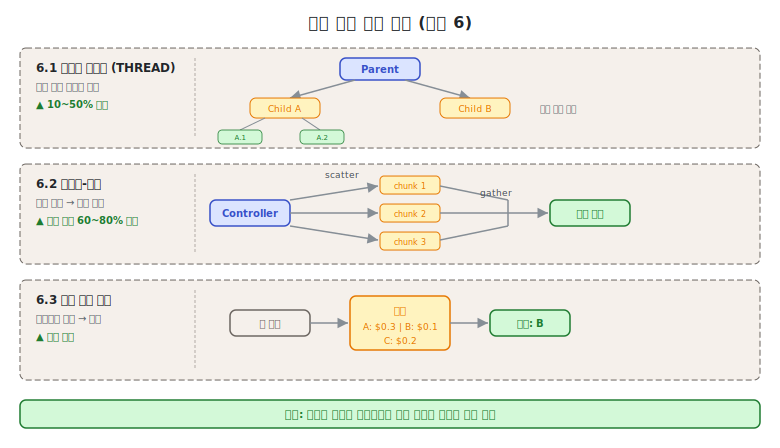
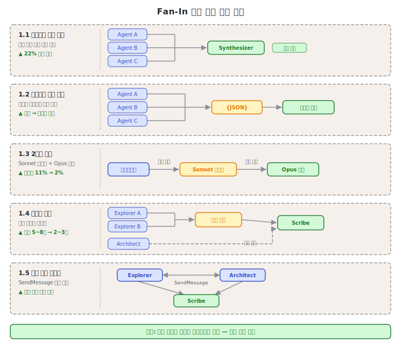

# 제4단원. 작업 분해 패턴 — 복잡한 작업의 에이전트 단위 분할

---

## 학습 목표

이 단원을 마치면 다음을 할 수 있다:

1. 재귀적 스레드 생성, 스캐터-개더, 시장 기반 할당 패턴을 설명할 수 있다
2. Fan-In 병목의 원인을 분석하고 5가지 해소 전략을 적용할 수 있다
3. 작업의 특성에 맞는 분해 패턴을 선택할 수 있다
4. GSD의 "철의 규칙"을 포함한 실무 분해 기준을 실제 작업에 적용할 수 있다

---



작업 분해는 멀티에이전트 시스템의 성능을 결정하는 핵심 요소이다. 분해가 너무 조잡하면 각 에이전트의 컨텍스트 부담이 과중해지고, 너무 세밀하면 Fan-In 병목이 발생한다. 이 단원에서는 최적의 분해 전략을 체계적으로 선택하는 방법을 학습한다.

---

## 4.1 재귀적 스레드 생성 (Recursive Spawning / THREAD)

### 개념

모델 생성을 **실행 스레드**로 프레이밍하여, 하위 문제를 만나면 자식 스레드를 동적 스폰한다. 자식이 또 자식을 스폰할 수 있어 **임의 깊이의 점진적 분해**가 가능하다. NAACL 2025에서 발표된 THREAD 프레임워크가 대표적이다.

```
Thread 0 (루트)
├── 하위 문제 A 발견 → Thread 1 스폰
│   ├── 더 세부 문제 발견 → Thread 1.1 스폰
│   └── 결과 반환 ↑
├── 하위 문제 B 발견 → Thread 2 스폰
│   └── 결과 반환 ↑
└── Thread 1, 2 결과 합성 → 최종 답변
```

### 성능 수치

- 소형 모델(Llama-3-8b)에서 기존 대비 **10~50% 절대 성능 향상**
- 모델 컨텍스트 윈도우의 **100배 입력** 처리 가능
- 출처: arxiv 2405.17402

### THREAD 프레임워크의 핵심 알고리즘

THREAD의 성능 향상 원리는 "컨텍스트 분산"에 있다. 단일 에이전트가 100만 토큰의 코드베이스를 처리하는 대신, 각 스레드가 자신의 범위만 담당하여 컨텍스트 부담을 수직으로 분산한다.

```python
class Thread:
    def __init__(self, thread_id: str, task: str, depth: int = 0):
        self.id = thread_id
        self.task = task
        self.depth = depth
        self.children = []
        self.result = None

    def execute(self, max_depth: int = 5) -> str:
        if self.depth >= max_depth:
            # 최대 깊이 도달 시 현재 컨텍스트로만 처리
            return self.process_without_spawning()

        # LLM에게 작업 분석 요청
        analysis = llm.analyze(
            task=self.task,
            instruction="이 작업을 처리하려면 하위 문제가 필요한가? "
                        "필요하다면 각 하위 문제를 명시하라."
        )

        if analysis.needs_subproblems:
            # 자식 스레드 스폰
            for i, subproblem in enumerate(analysis.subproblems):
                child = Thread(
                    thread_id=f"{self.id}.{i+1}",
                    task=subproblem,
                    depth=self.depth + 1
                )
                self.children.append(child)

            # 자식 스레드 병렬 실행
            child_results = parallel_execute(self.children)

            # 자식 결과 합성
            self.result = llm.synthesize(
                original_task=self.task,
                child_results=child_results
            )
        else:
            # 분해 불필요, 직접 처리
            self.result = llm.solve(self.task)

        return self.result
```

이 알고리즘의 핵심은 각 스레드가 **독립적 컨텍스트 윈도우**를 가진다는 점이다. Thread 1.1은 자신의 하위 문제만 알고 있으며, 루트 Thread 0의 전체 컨텍스트를 가질 필요가 없다.

### 실전 도구의 적용

- **OMC Ultrapilot**: Planner가 태스크를 분해하고, 각 subagent마다 별도 워커를 스폰하는 구조. 최대 5 워커 동시 실행
- **GSD auto 모드**: 마일스톤 → 슬라이스 → 태스크의 3단계 계층적 분해
- **Gas Town Mayor**: 작업을 분해하여 Polecat에게 동적 할당

### 재귀 깊이 관리

재귀적 스레드 생성의 가장 큰 위험은 과도한 분해이다. 분해 비용이 이점을 초과하지 않도록 다음 규칙을 적용한다:

- **최대 깊이 제한**: 일반적으로 3~4 단계가 적정. 그 이상은 컨텍스트 전달 오버헤드가 커진다.
- **원자적 태스크 기준**: 단일 컨텍스트 윈도우(100K 토큰 이내)에서 완결 가능하면 더 이상 분해하지 않는다.
- **GSD의 철의 규칙**: "태스크는 반드시 하나의 컨텍스트 윈도우에 들어가야 한다. 들어가지 않으면 그것은 두 개의 태스크이다."

---

## 4.2 스캐터-개더 / Fork-Join

### 개념

컨트롤러가 독립적 하위 작업을 여러 에이전트에 **병렬 분배(scatter/fork)**하고, 동기화 배리어에서 결과를 수집하여 **집계(gather/join)**한다.

```
                    scatter
Controller ──────┬──────────▶ Agent A (chunk 1) ──┐
                 │                                 │
                 ├──────────▶ Agent B (chunk 2) ──┤── gather ──▶ 집계 결과
                 │                                 │
                 └──────────▶ Agent C (chunk 3) ──┘
```

### 성능 수치

- 적합한 워크로드에서 처리 시간 **60~80% 단축**, 품질 유지
- 출처: AWS Prescriptive Guidance

### GSD의 웨이브 패턴 적용

GSD는 이 패턴을 **웨이브(wave)**라는 개념으로 구현한다:

```
웨이브 1 (독립 태스크 병렬 실행):
  ┌──────────┐  ┌──────────┐  ┌──────────┐
  │ T01: DB  │  │ T02: API │  │ T03: UI  │
  │ 스키마   │  │ 타입 정의 │  │ 컴포넌트 │
  └──────────┘  └──────────┘  └──────────┘
       │              │              │
       ▼              ▼              ▼
웨이브 2 (의존성 있는 태스크):
  ┌──────────────────────────────────────┐
  │ T04: API 엔드포인트 구현              │
  │ (T01 스키마 + T02 타입에 의존)        │
  └──────────────────────────────────────┘
```

각 태스크는 독립된 Git 커밋을 생성하므로, 문제 발생 시 **개별 태스크 단위로 롤백**할 수 있다.

### OMC Ultrapilot의 worktree 기반 병렬화

GSD 웨이브 외에, OMC Ultrapilot은 **git worktree**를 활용하여 물리적 파일 시스템 격리와 함께 병렬화를 구현한다:

```bash
# OMC Ultrapilot이 내부적으로 수행하는 worktree 격리
# 각 워커는 독립된 worktree에서 동일 저장소를 동시에 수정 가능

# 워커 1: feature/auth-api worktree
git worktree add .workers/worker-1 -b feature/auth-api

# 워커 2: feature/db-schema worktree
git worktree add .workers/worker-2 -b feature/db-schema

# 워커 3: feature/ui-components worktree
git worktree add .workers/worker-3 -b feature/ui-components

# 병렬 실행 후 메인 브랜치로 순차 머지
# (충돌은 Refinery 에이전트가 처리)
```

worktree 격리의 핵심 장점은 **파일 잠금(file lock) 없는 병렬 실행**이다. 여러 에이전트가 동일 파일을 동시에 수정하는 충돌 없이 독립된 작업 공간에서 작업한다.

### 스캐터-개더의 의존성 관리

실제 소프트웨어 개발 작업에서 완전히 독립적인 하위 작업은 드물다. 의존성이 있는 경우 DAG(Directed Acyclic Graph)로 실행 순서를 관리한다:

```python
from typing import List, Dict
import asyncio

class DAGExecutor:
    def __init__(self):
        self.tasks: Dict[str, dict] = {}
        self.completed: set = set()

    def add_task(self, task_id: str, task: dict, dependencies: List[str]):
        self.tasks[task_id] = {
            "task": task,
            "dependencies": dependencies,
            "status": "pending"
        }

    async def execute_all(self):
        while len(self.completed) < len(self.tasks):
            # 의존성이 충족된 태스크 탐색
            ready = [
                tid for tid, t in self.tasks.items()
                if tid not in self.completed
                and all(dep in self.completed for dep in t["dependencies"])
            ]

            if not ready:
                break  # 교착 상태 감지

            # 준비된 태스크 병렬 실행 (scatter)
            results = await asyncio.gather(*[
                self.run_task(tid) for tid in ready
            ])

            # 완료 표시 (gather)
            for tid in ready:
                self.completed.add(tid)
```

---

## 4.3 시장 기반 작업 할당 (Market-Based Task Allocation)

### 개념

작업 할당을 **경매**로 처리한다. 새 작업이 도착하면 에이전트들이 예상 역량, 비용, 확신도를 기반으로 입찰하고, 코디네이터가 낙찰자를 선정한다.

```
새 작업: "OAuth2.0 인증 구현"

  Agent A (보안 전문): 입찰 $0.50, 확신도 0.95
  Agent B (백엔드):    입찰 $0.30, 확신도 0.70
  Agent C (프론트):    입찰 $0.20, 확신도 0.30

  → Agent A 낙찰 (확신도 최고)
```

### Python 구현 예시

```python
from dataclasses import dataclass
from typing import List

@dataclass
class Bid:
    agent_id: str
    cost: float          # 예상 토큰/시간 비용
    confidence: float    # 작업 완수 확신도 (0.0~1.0)
    estimated_time: int  # 예상 소요 시간 (초)

class MarketCoordinator:
    def __init__(self, agents: list):
        self.agents = agents

    def solicit_bids(self, task: dict) -> List[Bid]:
        """모든 에이전트에게 입찰 요청"""
        bids = []
        for agent in self.agents:
            # 에이전트에게 작업 설명과 함께 입찰 요청
            bid_response = agent.evaluate_task(task)
            if bid_response.willing_to_bid:
                bids.append(Bid(
                    agent_id=agent.id,
                    cost=bid_response.estimated_cost,
                    confidence=bid_response.confidence,
                    estimated_time=bid_response.estimated_time
                ))
        return bids

    def select_winner(self, bids: List[Bid], strategy: str = "confidence_first") -> str:
        """낙찰자 선정"""
        if not bids:
            return None

        if strategy == "confidence_first":
            # 확신도 우선: 가장 자신 있는 에이전트 선택
            return max(bids, key=lambda b: b.confidence).agent_id

        elif strategy == "cost_efficiency":
            # 비용 효율: 확신도/비용 비율 최대화
            return max(bids, key=lambda b: b.confidence / b.cost).agent_id

        elif strategy == "fastest":
            # 속도 우선: 최단 시간 예상 에이전트 선택
            return min(bids, key=lambda b: b.estimated_time).agent_id

    def allocate(self, task: dict, strategy: str = "confidence_first") -> str:
        bids = self.solicit_bids(task)
        winner = self.select_winner(bids, strategy)
        if winner:
            self.notify_winner(winner, task)
        return winner
```

### 장점

- 에이전트 추가/제거 시 **동적 확장** 가능
- 중앙 계획자가 모든 역량을 알 필요 없음
- 에이전트 부하를 자동으로 분산

### 적합한 상황

- 이종 에이전트가 많은 대규모 시스템
- 가용성이 변하는 동적 환경
- 비용 최적화가 중요한 경우

### 한계

- **입찰 정확도 의존**: 에이전트가 자신의 역량을 정확히 평가하지 못하면 성능이 저하된다. 초기에는 과신(overconfidence)이 일반적이다.
- **입찰 오버헤드**: 모든 에이전트가 모든 작업에 입찰하면 불필요한 API 호출이 증가한다. 사전 필터링(카테고리 매칭)을 병행해야 한다.
- **전략적 입찰 가능성**: 에이전트가 실제 능력보다 높은 확신도를 보고하여 작업을 독점하려 할 수 있다.

---

## 4.4 Fan-In 병목 해소 전략

여러 에이전트가 병렬로 결과를 생산하고 단일 에이전트가 이를 합성하는 구조에서, 합성 에이전트가 **병목**이 되는 문제는 멀티에이전트 시스템의 가장 흔한 성능 저하 원인이다. 5가지 해소 전략을 소개한다.



Fan-In 병목이 발생하는 구체적 원인:

1. **컨텍스트 과부하**: 여러 에이전트의 결과가 합성 에이전트의 컨텍스트 윈도우를 초과한다.
2. **비구조화된 출력**: 각 에이전트가 다른 형식으로 결과를 반환하여 합성 작업이 복잡해진다.
3. **동기 대기**: 가장 느린 에이전트가 완료될 때까지 합성 에이전트가 유휴 상태로 대기한다.
4. **중복 정보**: 병렬 에이전트들이 동일한 정보를 발견하여 중복 처리가 필요하다.

### 4.4.1 스트리밍 증분 집계

모든 병렬 에이전트가 완료될 때까지 기다리지 않고, **결과가 도착하는 즉시** 합성을 시작한다.

```
시간 ──────────────────────────────────────────→

Agent A  ████████ 완료
Agent B  ████████████████ 완료
Agent C  ██████████████████████████ 완료

기존:    대기─────────────────────── ████ 합성
증분:    ─────── ██ 합성A ── ██ 합성B ── ██ 합성C
```

**효과**: 벽시계 시간 약 **22% 단축**

**구현 시 주의**: 나중에 도착한 결과가 기존 합성 내용과 모순될 수 있으므로, 최종 조율(reconciliation) 단계가 필요하다. 특히 Agent C의 결과가 Agent A에 대한 수정을 포함하는 경우, 증분 합성된 내용을 다시 검토해야 한다.

```python
async def streaming_aggregation(agents: list, task: dict):
    """스트리밍 증분 집계 구현"""
    partial_results = []
    aggregated = ""

    async for result in stream_parallel_results(agents, task):
        partial_results.append(result)

        # 결과 도착 즉시 부분 합성
        incremental = await synthesizer.merge_incremental(
            existing=aggregated,
            new_result=result
        )
        aggregated = incremental

    # 최종 조율 (모순 해결)
    final = await synthesizer.reconcile(aggregated, partial_results)
    return final
```

### 4.4.2 구조화된 출력 계약

에이전트 간 출력을 **정해진 JSON 스키마**로 통일하여, 합성 작업을 기계적으로 만든다.

```json
{
  "files": [{"path": "...", "role": "...", "key_functions": [...]}],
  "call_chains": [...],
  "confidence": "confirmed | uncertain",
  "uncertain_items": []
}
```

**효과**: 합성 에이전트의 작업이 "창의적 정리"에서 "기계적 병합"으로 변환

**스키마 설계 원칙**:
- `notes` 필드를 반드시 포함하여 예상치 못한 발견을 기록할 수 있게 한다
- `confidence` 필드로 합성 에이전트가 결과를 얼마나 신뢰해야 하는지 표시한다
- 빈 배열(`[]`)을 허용하여 해당 정보가 없는 경우를 구분한다

### 4.4.3 2단계 병합

합성을 **정규화(싼 모델)**와 **판단(비싼 모델)** 두 단계로 분리한다.

```
Phase 1 (Sonnet): 정규화 + 중복 제거 (cosine ≥ 0.9 기준)
Phase 2 (Opus):   충돌 해결 + 서사적 합성
```

**효과**: 중복률 11% → 2%로 감소, 사실 충돌 7% 중 86%가 1차 재검증으로 해결

**비용 효율성**: Phase 1에서 전체 입력의 70~80%를 처리한 후, Phase 2에는 정제된 10~20%만 전달한다. Sonnet의 비용은 Opus의 약 1/5이므로, 전체 합성 비용이 크게 절감된다.

```python
async def two_phase_merge(raw_results: list) -> str:
    # Phase 1: 정규화 (Sonnet - 저비용)
    normalized = await sonnet.process(
        instruction="중복 제거 (cosine 유사도 0.9 이상), 형식 통일",
        data=raw_results
    )

    # Phase 2: 판단 (Opus - 고품질)
    final = await opus.process(
        instruction="충돌 해결, 서사 합성, 최종 결과 생성",
        data=normalized
    )
    return final
```

### 4.4.4 계층적 분해

모든 에이전트가 하나의 합성자에게 보고하는 대신, **중간 리더**가 선합성한다.

```
기존 (flat):                    계층적:
  Explorer A ──┐                  Explorer A ──┐
  Explorer B ──┤──▶ Scribe        Explorer B ──┤──▶ 탐색리더 ──┐
  Explorer C ──┤   (과부하)       Explorer C ──┘               ├──▶ Scribe
  Architect  ──┘                  Architect ────────────────────┘
```

**효과**: 합성자가 처리하는 입력이 원시 결과 5~8개 → 선합성 요약 2~3개로 축소

**적정 규모**: 에이전트 수 3~5가 최적. 그 이상은 합성 복잡도가 이점을 상쇄한다.

### 4.4.5 직접 피어 메시징

에이전트 간 **직접 통신**으로 lead agent를 거치지 않고 결과를 교환한다. Claude Code Agent Teams의 `SendMessage`로 구현한다.

```
기존:                            직접 피어 메시징:
  Explorer ──▶ Lead ──▶ Scribe   Explorer ──▶ Scribe (직접)
  Architect ──▶ Lead             Explorer ──▶ Architect (설계 검증)
                                 Architect ──▶ Scribe (직접)
```

**효과**: lead agent의 중계 부담 제거, 결과 전달 지연 감소

**Claude Code Agent Teams 코드 예시**:

```python
# Claude Code Agent Teams의 SendMessage 활용
# (CLAUDE.md 또는 hooks.json에 설정)

class PeerMessaging:
    def send_to_peer(self, target_agent: str, message: dict):
        """
        Claude Code의 SendMessage 도구를 통해 직접 전달
        target_agent: 수신 에이전트 이름 (예: "scribe", "architect")
        message: 전달할 구조화된 결과
        """
        return {
            "tool": "SendMessage",
            "params": {
                "recipient": target_agent,
                "content": message,
                "priority": message.get("priority", "normal")
            }
        }

# Explorer가 Scribe에게 직접 탐색 결과 전달
# lead agent를 거치지 않으므로 lead의 컨텍스트를 절약
explorer_result = {
    "files_analyzed": ["auth.py", "models.py"],
    "findings": [...],
    "priority": "high"
}
send_to_peer("scribe", explorer_result)
```

**메시지 폭증 방지**: 에이전트 간 메시지 대상을 명시적으로 지정해야 한다. 모든 에이전트가 모든 에이전트에게 메시지를 보내면 O(n²) 통신 복잡도가 발생한다.

---

## 4.5 작업 분해 패턴 비교

| 패턴 | 분해 시점 | 깊이 | 병렬성 | 비용 | 적합한 작업 |
|------|----------|------|--------|------|-----------|
| 재귀적 스레드 | 동적 (런타임) | 임의 | 높음 | 높음 | 가변 깊이 추론 |
| 스캐터-개더 | 정적 (사전) | 1단계 | 높음 | 중간 | 독립 청크 처리 |
| 시장 기반 | 동적 (경매) | 1단계 | 높음 | 중간 | 이종 에이전트 환경 |

---

## 4.6 작업 분해 선택 가이드

### 결정 트리

```
작업 분해 시작
    │
    ├─ 작업의 하위 구조를 사전에 알 수 있는가?
    │   ├─ Yes, 독립적 청크로 분리 가능 → 스캐터-개더 (4.2)
    │   └─ No, 실행 중 발견 → 재귀적 스레드 (4.1)
    │
    ├─ 여러 전문 에이전트에게 배정해야 하는가?
    │   └─ Yes, 이종 에이전트 환경 → 시장 기반 할당 (4.3)
    │
    ├─ Fan-In 병목이 예상되는가?
    │   └─ Yes → 해소 전략 선택 (4.4)
    │       ├─ 긴 대기 시간 문제 → 스트리밍 증분 집계 (4.4.1)
    │       ├─ 비구조화된 출력 → 구조화된 출력 계약 (4.4.2)
    │       ├─ 중복 과다 → 2단계 병합 (4.4.3)
    │       ├─ 합성자 과부하 → 계층적 분해 (4.4.4)
    │       └─ lead 병목 → 직접 피어 메시징 (4.4.5)
    │
    └─ 단일 컨텍스트 윈도우로 처리 가능한가?
        └─ Yes → 분해 불필요
```

---

> **핵심 정리: GSD의 "철의 규칙"**
>
> GSD 프레임워크는 작업 분해에 대한 강력한 원칙을 제시한다:
>
> **"태스크는 반드시 하나의 컨텍스트 윈도우에 들어가야 한다. 들어가지 않으면 그것은 두 개의 태스크이다."**
>
> 이 규칙은 모든 작업 분해 패턴에 보편적으로 적용되는 실용적 기준이다. 재귀적 스레드는 이 규칙을 자동으로 적용하는 메커니즘이며, 스캐터-개더는 사전에 이 규칙에 맞게 청크를 설계한다.
>
> **추가 원칙**: 태스크가 너무 작으면 Fan-In 병목이 발생한다. 최소 단위는 "의미 있는 독립 결과물을 생성하는 최소 작업"이다.

---

## 복습 질문

1. 재귀적 스레드 생성(THREAD) 패턴이 소형 모델에서 10~50% 성능 향상을 달성하는 원리를 설명하라.

2. Fan-In 병목의 5가지 해소 전략을 나열하고, 각각의 핵심 아이디어를 한 문장으로 요약하라.

3. 2단계 병합에서 Phase 1(Sonnet)과 Phase 2(Opus)의 역할 분담이 비용 효율적인 이유를 논하라.

4. GSD의 "철의 규칙"이 멀티에이전트 시스템의 컨텍스트 관리에 주는 시사점을 서술하라.

5. 시장 기반 작업 할당과 정적 작업 할당의 트레이드오프를 분석하라.

6. 스캐터-개더 패턴과 재귀적 스레드 생성의 차이점을 설명하고, 각각 적합한 작업 유형을 2가지씩 제시하라.

---

*이전 단원: [제3단원. 오케스트레이션 패턴](03_오케스트레이션_패턴.md) | 다음 단원: [제5단원. 모델 라우팅 패턴](05_모델_라우팅_패턴.md)*
