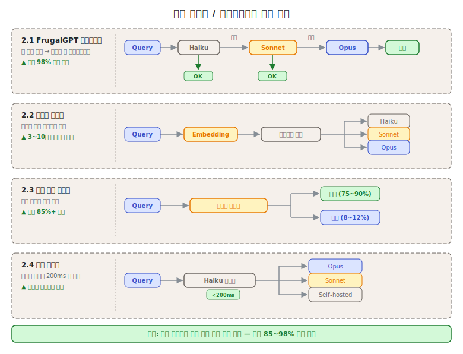
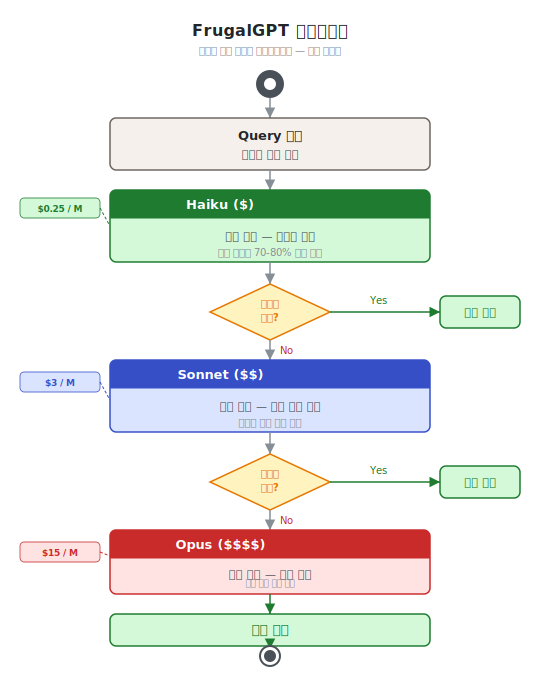
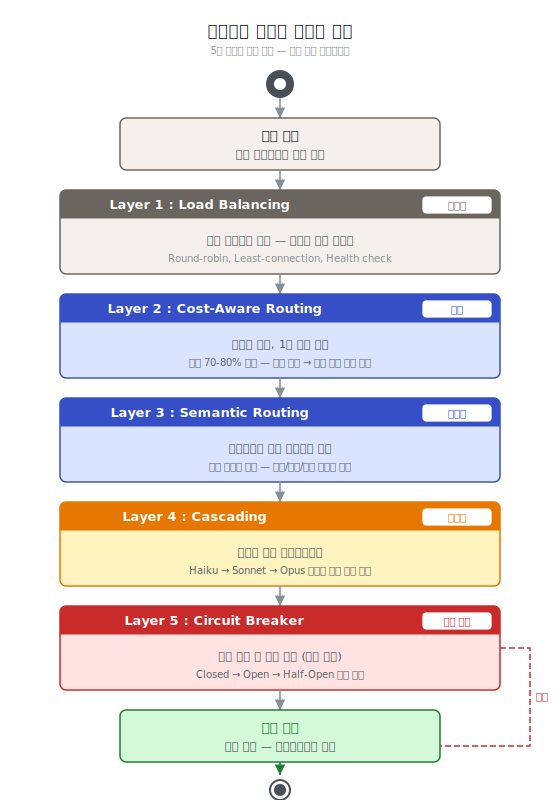

# 제5단원. 모델 라우팅 패턴 — 비용과 품질의 균형

---

## 학습 목표

이 단원을 마치면 다음을 할 수 있다:

1. 4가지 핵심 모델 라우팅 패턴(캐스케이딩, 의미적, 비용 인식, 섀도)을 설명할 수 있다
2. 프로덕션 환경에서 라우팅 레이어를 설계할 수 있다
3. 비용 절감 효과를 정량적으로 분석할 수 있다
4. FrugalGPT의 신뢰도 평가 방법을 구현 수준에서 이해할 수 있다

---



모델 라우팅은 멀티에이전트 시스템의 **경제성**을 결정하는 핵심 패턴이다. 모든 작업에 최고급 모델을 사용하면 최고의 품질을 얻지만, 비용이 비현실적으로 증가한다. 작업 특성에 맞는 모델을 선택하면, 품질을 유지하면서 비용을 대폭 절감할 수 있다.

모델 라우팅의 근본적 동기는 다음 수치에 있다:

> GPT-4 성능의 **95%를 유지**하면서 비용 **85% 이상 절감** 가능
> — 비용 인식 라우팅 연구 종합 (2024)

이 목표를 달성하기 위한 4가지 핵심 패턴을 이 단원에서 다룬다.

---

## 5.1 FrugalGPT 캐스케이딩

### 개념

싼 모델부터 시작하여, **응답 신뢰도가 낮으면** 다음 티어 모델로 에스컬레이션한다.

```
Query ──▶ Haiku ──▶ 신뢰도 평가 ──▶ 충분? ──Yes──▶ 반환
                                       │
                                       No
                                       ▼
                    Sonnet ──▶ 신뢰도 평가 ──▶ 충분? ──Yes──▶ 반환
                                                  │
                                                  No
                                                  ▼
                                                Opus ──▶ 반환
```



### 성능 수치

- GPT-4 수준 성능을 유지하면서 **최대 98% 비용 절감**
- 동일 비용으로 정확도 **4% 향상**

### 신뢰도 평가 방법 상세

FrugalGPT 캐스케이딩의 핵심은 각 단계에서 "이 응답으로 충분한가"를 판단하는 신뢰도 평가이다. 세 가지 방법이 있으며, 각각 작동 원리가 다르다.

| 방법 | 정확도 | 지연 | 비용 |
|------|--------|------|------|
| DistilBERT 기반 스코어링 | 높음 | 낮음 | 매우 낮음 |
| 자기 일관성 샘플링(AutoMix) | 높음 | 중간 | 낮음 |
| Hidden-state 프로브 | 최고 | 낮음 | 매우 낮음 |

**1. DistilBERT 기반 스코어링**

응답과 쿼리를 DistilBERT로 임베딩하여 의미적 일치도를 계산한다. 모델 응답이 쿼리의 핵심 요소를 커버하는지 측정하는 방식이다. 별도 LLM 호출 없이 경량 분류기만 사용하므로 지연이 매우 낮다.

```python
from transformers import DistilBertTokenizer, DistilBertModel
import torch

class DistilBERTScorer:
    def __init__(self):
        self.tokenizer = DistilBertTokenizer.from_pretrained('distilbert-base-uncased')
        self.model = DistilBertModel.from_pretrained('distilbert-base-uncased')
        # 신뢰도 임계값 분류기 (파인튜닝 필요)
        self.classifier = torch.nn.Linear(768, 1)

    def score(self, query: str, response: str) -> float:
        """응답의 신뢰도 점수 반환 (0.0~1.0)"""
        inputs = self.tokenizer(
            query + " [SEP] " + response,
            return_tensors="pt", truncation=True, max_length=512
        )
        with torch.no_grad():
            outputs = self.model(**inputs)
        pooled = outputs.last_hidden_state[:, 0, :]  # [CLS] 토큰
        score = torch.sigmoid(self.classifier(pooled)).item()
        return score
```

**2. AutoMix의 자기 일관성 샘플링**

동일한 쿼리를 N회(보통 3~5회) 샘플링하여 응답의 일관성을 측정한다. 응답들이 서로 높은 유사도를 보이면 모델이 확신하는 것으로 간주한다. 응답이 다양하게 분산되면 불확실한 것으로 판단하여 상위 모델로 에스컬레이션한다.

```python
import numpy as np
from sklearn.metrics.pairwise import cosine_similarity

class AutoMixConsistencyChecker:
    def __init__(self, n_samples: int = 5):
        self.n_samples = n_samples

    def check_consistency(self, model, query: str) -> float:
        """자기 일관성 기반 신뢰도 측정"""
        responses = [
            model.generate(query, temperature=0.7)
            for _ in range(self.n_samples)
        ]

        # 응답들을 임베딩하여 유사도 행렬 계산
        embeddings = [embed(r) for r in responses]
        sim_matrix = cosine_similarity(embeddings)

        # 대각선 제외 평균 유사도 = 일관성 점수
        mask = np.ones_like(sim_matrix) - np.eye(len(sim_matrix))
        consistency = (sim_matrix * mask).sum() / mask.sum()
        return consistency  # 0.8 이상이면 충분히 일관적

    def should_escalate(self, model, query: str,
                        threshold: float = 0.75) -> bool:
        consistency = self.check_consistency(model, query)
        return consistency < threshold
```

AutoMix의 장점은 응답 내용을 직접 평가하는 것이 아니라, 모델의 **내부 확신도**를 간접적으로 측정한다는 점이다. 모델이 확신하는 질문에는 일관된 답을 주고, 불확실한 질문에는 다양한 답을 준다는 경험적 관찰에 기반한다.

**3. Hidden-state 프로브**

LLM의 중간 레이어(hidden state)에 경량 분류기를 연결하여, 모델이 응답을 생성하는 과정에서 내부 불확실성을 직접 측정한다. DistilBERT보다 정확하지만 모델 내부 접근이 필요하다.

> **주의**: Judge 신뢰도가 80% 미만이면 성능이 급격히 저하된다 — judge 품질이 전체 시스템 성능의 핵심이다.

### 실전 적용

OMC의 **Ecomode**가 이 패턴을 구현한다:

```
사용자 입력
    │
    ▼
복잡도 평가
    │
    ├── Low  → Haiku (기본)
    ├── Med  → Sonnet (필요시)
    └── High → Opus (최후 수단)
    │
    ▼
결과 품질 검사
    │
    ├── Pass → 완료 (토큰 절감 보고)
    └── Fail → 상위 모델로 에스컬레이션
```

---

## 5.2 의미적 라우팅 (Semantic Routing)

### 개념

쿼리를 **임베딩 기반 유사도**로 분류하여 적합한 모델/에이전트에 배정한다.

```
Query ──▶ 임베딩 ──▶ 카테고리 매칭 ──▶ "단순 검색"  → Haiku
                                        "흐름 추적"  → Sonnet
                                        "설계 판단"  → Opus
```

### 임베딩 기반 라우팅 Python 구현

```python
import numpy as np
from sklearn.metrics.pairwise import cosine_similarity

class SemanticRouter:
    def __init__(self):
        # 카테고리별 예시 쿼리 (사전 임베딩)
        self.categories = {
            "simple_lookup": {
                "examples": [
                    "파일 목록 조회",
                    "변수명 검색",
                    "코드에서 함수 찾기"
                ],
                "model": "haiku"
            },
            "code_analysis": {
                "examples": [
                    "이 함수의 실행 흐름을 분석하라",
                    "버그의 근본 원인을 찾아라",
                    "성능 병목 지점을 식별하라"
                ],
                "model": "sonnet"
            },
            "architecture_decision": {
                "examples": [
                    "이 시스템의 확장 전략을 설계하라",
                    "마이크로서비스 분리 기준을 결정하라",
                    "데이터베이스 선택 근거를 분석하라"
                ],
                "model": "opus"
            }
        }
        # 초기화 시 카테고리 예시를 임베딩
        self.category_embeddings = self._precompute_embeddings()

    def _precompute_embeddings(self):
        result = {}
        for cat_name, cat_data in self.categories.items():
            embeddings = [embed(ex) for ex in cat_data["examples"]]
            result[cat_name] = {
                "centroid": np.mean(embeddings, axis=0),
                "model": cat_data["model"]
            }
        return result

    def route(self, query: str) -> str:
        query_embedding = embed(query)

        # 각 카테고리 중심과의 유사도 계산
        similarities = {
            cat: cosine_similarity(
                [query_embedding],
                [data["centroid"]]
            )[0][0]
            for cat, data in self.category_embeddings.items()
        }

        # 가장 유사한 카테고리 선택
        best_category = max(similarities, key=similarities.get)
        best_score = similarities[best_category]

        # 신뢰도가 낮으면 기본 모델로 폴백
        if best_score < 0.7:
            return "sonnet"  # 불확실한 경우 중간 모델

        return self.category_embeddings[best_category]["model"]
```

### 적용 지침

- **3~10개 카테고리**로 분류할 때 가장 효과적이다
- 카테고리 경계가 모호한 작업에서 **오분류 위험**이 있다
- 유사도 임계값(보통 0.7~0.8)을 넘지 못하면 중간 모델로 폴백하는 안전장치가 필요하다

### 실전 도구의 적용

OMC의 **3티어 라우팅 시스템**이 의미적 라우팅을 구현한다:

| 태스크 유형 | 라우팅 | 대표 에이전트 |
|------------|--------|-------------|
| 아키텍처 설계, 복잡한 알고리즘 | Opus | architect, planner, critic |
| 코드 구현, 테스트, 디버깅 | Sonnet | executor, debugger, verifier |
| 코드 탐색, Git 작업, 포맷팅 | Haiku | explore, git-master, formatter |

---

## 5.3 비용 인식 라우팅 (Cost-Aware Routing)

### 개념

쿼리 난이도를 **사전 예측**하여 가장 비용 효율적인 모델에 배정한다.

### 실무 사례

고객 지원 플랫폼에서의 실제 비용 절감 사례:

```
변경 전: 모든 쿼리에 Opus/GPT-4 사용
  월 비용: $42,000

변경 후: 비용 인식 라우팅 적용
  단순 쿼리 (75~90%): Haiku → $3,000
  복잡 쿼리 (8~12%):  Sonnet → $5,000
  고난이도 (2~5%):    Opus → $10,000
  월 비용: $18,000

  절감: $24,000/월 (57% 절감)
```

> **교차 참조**: 이 사례의 상세한 비용 분석과 비용 절감 원칙은 [1단원 1.2.3 경제적 동기](01_서론.md)에서 다룬다. 이 단원에서는 라우팅 패턴 자체에 집중한다.

### 일반적 쿼리 분포

```
쿼리 난이도 분포:

  단순 (저가 모델)  ████████████████████████████████████████  75~90%
  복잡 (중급 모델)  ████████                                   8~12%
  고난이도 (프론티어) ████                                      2~5%
```

### 난이도 사전 예측 방법

비용 인식 라우팅의 핵심 도전은 실제 처리 전에 난이도를 정확히 예측하는 것이다:

```python
class DifficultyPredictor:
    # 규칙 기반 특징
    SIMPLE_INDICATORS = [
        lambda q: len(q.split()) < 20,           # 짧은 쿼리
        lambda q: "?" not in q,                   # 명령형 (서술 아님)
        lambda q: any(w in q for w in ["목록", "찾아", "검색", "조회"])
    ]

    COMPLEX_INDICATORS = [
        lambda q: len(q.split()) > 100,           # 긴 쿼리
        lambda q: "분석" in q or "설계" in q,
        lambda q: "왜" in q or "원인" in q,       # 인과 분석 요청
        lambda q: q.count("\n") > 5               # 다중 요구사항
    ]

    def predict(self, query: str) -> str:
        simple_score = sum(1 for f in self.SIMPLE_INDICATORS if f(query))
        complex_score = sum(1 for f in self.COMPLEX_INDICATORS if f(query))

        if complex_score >= 2:
            return "high"    # Opus
        elif simple_score >= 2:
            return "low"     # Haiku
        else:
            return "medium"  # Sonnet
```

---

## 5.4 섀도 라우터 (Shadow Router)

### 개념

저비용 모델(Haiku/Flash-Lite)을 **전용 분류기**로 두어 200ms 이내에 라우팅을 결정한다.

```
Query ──▶ Haiku (분류기, <200ms) ──▶ "frontier"   → Opus
                                      "workhorse"  → Sonnet
                                      "self-hosted" → 로컬 모델
```

### 장점

- 라우팅 오버헤드 최소화
- 메인 모델의 컨텍스트 낭비 방지
- 분류기가 실패해도 폴백 경로로 처리 가능

### 주의사항

분류기 자체의 정확도가 전체 시스템 성능을 좌우한다. 분류기의 오분류가 잦으면 캐스케이딩보다 성능이 나빠질 수 있다.

### 섀도 모드 운용

새 라우팅 규칙을 도입할 때 섀도 모드로 검증한다: 실제 라우팅은 기존 방식을 따르면서, 새 분류기의 결과를 기록하여 사후 분석한다.

```python
class ShadowRouter:
    def __init__(self, production_router, shadow_router):
        self.production = production_router
        self.shadow = shadow_router
        self.shadow_log = []

    def route(self, query: str) -> str:
        prod_decision = self.production.route(query)

        # 섀도 라우터는 실제로 사용하지 않고 기록만
        shadow_decision = self.shadow.route(query)
        self.shadow_log.append({
            "query_hash": hash(query),
            "prod": prod_decision,
            "shadow": shadow_decision,
            "match": prod_decision == shadow_decision
        })

        return prod_decision  # 항상 기존 방식 사용

    def get_agreement_rate(self) -> float:
        if not self.shadow_log:
            return 0.0
        matches = sum(1 for e in self.shadow_log if e["match"])
        return matches / len(self.shadow_log)
```

---

## 5.5 고급 라우팅 기법

학술 연구에서 제안된 추가적인 라우팅 기법들이다. 여기서는 실무적으로 중요한 두 가지를 상세히 설명한다.

### 난이도 인식 라우팅 (Difficulty-Aware Routing)

입력 난이도를 **실시간으로 추정**하여 모델 선택에 반영한다. 비용 인식 라우팅이 사전 정의된 규칙에 의존하는 반면, 난이도 인식 라우팅은 모델의 내부 상태(perplexity, entropy 등)를 활용한다.

핵심 아이디어: 모델이 입력 토큰을 처리할 때 생성하는 attention entropy가 높으면(불확실하면), 더 강력한 모델로 라우팅한다.

```python
class DifficultyAwareRouter:
    def __init__(self, weak_model, strong_model, threshold: float = 0.6):
        self.weak = weak_model
        self.strong = strong_model
        self.threshold = threshold

    def route(self, query: str) -> str:
        # 약한 모델로 먼저 처리하고 내부 불확실성 측정
        weak_response, uncertainty = self.weak.process_with_uncertainty(query)

        if uncertainty > self.threshold:
            # 불확실성이 높으면 강한 모델로 재처리
            return "strong"
        else:
            return "weak"
```

출처: arxiv 2603.04445

### 불확실성 기반 라우팅 (Uncertainty-Based Routing)

모델의 **예측 불확실성 추정치**를 에스컬레이션 신호로 사용한다. AutoMix와 유사하지만, 다중 샘플링 대신 단일 forward pass에서 불확실성을 추정한다는 차이가 있다.

불확실성을 측정하는 두 가지 방법:
1. **Entropy of output distribution**: 다음 토큰 분포의 엔트로피가 높으면 불확실
2. **Self-evaluated confidence**: 모델에게 "이 답변에 얼마나 확신하는가?"를 직접 물어봄

두 번째 방법은 간단하지만, 모델이 자신의 불확실성을 정확히 평가하지 못하는 경향이 있어 (보통 과신) 첫 번째 방법보다 덜 신뢰할 수 있다.

출처: AutoMix (arxiv)

| 기법 | 핵심 아이디어 | 출처 |
|------|-------------|------|
| 난이도 인식 라우팅 | 입력 난이도를 실시간 추정하여 모델 선택 | arxiv 2603.04445 |
| 선호도 정렬 라우팅 | 사용자/태스크 선호에 맞는 모델 매칭 | Dynamic Model Routing Survey |
| 클러스터링 라우팅 | 쿼리를 클러스터링하여 클러스터별 최적 모델 배정 | Maxim AI |
| 강화학습 라우팅 | RL로 라우팅 정책을 온라인 학습 | arxiv 2603.04445 |
| 불확실성 기반 라우팅 | 모델의 불확실성 추정치로 에스컬레이션 결정 | AutoMix |

---

## 5.6 프로덕션 라우팅 레이어 구성

실무에서는 단일 라우팅 기법만 사용하는 것이 아니라, **여러 레이어를 조합**한다:

```
Layer 1: Load Balancing (부하 분산)
  │  → 가용한 인스턴스로 분배. rate limit 회피 및 가용성 확보
  ▼
Layer 2: Cost-Aware Routing (비용 인식)
  │  → 난이도 예측으로 1차 모델 선택. 전체 비용의 70~80% 절감 기여
  ▼
Layer 3: Semantic Routing (의미적)
  │  → 카테고리별 전문 에이전트 배정. 도메인 특화 처리
  ▼
Layer 4: Cascading (캐스케이딩)
  │  → 신뢰도 기반 에스컬레이션. 품질 보증의 마지막 안전망
  ▼
Layer 5: Circuit Breaker (서킷 브레이커)
     → 장애 시 폴백 모델로 전환. [7단원 7.1](07_오류_처리_및_안전.md) 참조
```



### 각 레이어의 역할

**Layer 1: Load Balancing**
요청이 들어오면 가장 먼저 부하 분산 레이어가 처리한다. 현재 rate limit 상태, 모델 응답 지연, 인스턴스 가용성을 기준으로 분배한다. 이 레이어가 없으면 특정 모델 인스턴스에 과부하가 집중된다.

**Layer 2: Cost-Aware Routing**
가장 많은 비용 절감이 이 레이어에서 발생한다. 쿼리 특성 분석으로 Haiku/Sonnet/Opus를 1차 배정한다. 전체 라우팅 효과의 70~80%를 담당한다.

**Layer 3: Semantic Routing**
Layer 2의 결과를 더 세분화한다. "Sonnet으로 처리하되, 보안 관련 작업이면 security-auditor 에이전트로 배정"하는 식이다. 도메인별 전문화를 가능하게 한다.

**Layer 4: Cascading**
Layer 2~3의 초기 배정이 틀렸을 때의 안전망이다. 모델이 낮은 신뢰도 응답을 생성하면 자동으로 상위 모델로 에스컬레이션한다. 이 레이어가 없으면 잘못 라우팅된 요청이 그냥 처리된다.

**Layer 5: Circuit Breaker**
모델 장애 시 서비스 연속성을 보장한다. Opus 장애 시 Sonnet 폴백, 외부 API 장애 시 로컬 모델 폴백 등의 시나리오를 처리한다.

### 레이어별 구현 예시

```python
class ProductionRoutingLayer:
    def __init__(self):
        self.load_balancer = LoadBalancer()
        self.cost_router = DifficultyPredictor()
        self.semantic_router = SemanticRouter()
        self.cascade_router = AutoMixConsistencyChecker()
        self.circuit_breaker = CircuitBreaker()

    def route_and_execute(self, query: str) -> str:
        # Layer 1: 부하 분산
        target_instance = self.load_balancer.get_available_instance()

        # Layer 2: 비용 인식 1차 배정
        difficulty = self.cost_router.predict(query)
        initial_model = {"low": "haiku", "medium": "sonnet", "high": "opus"}[difficulty]

        # Layer 3: 의미적 세분화
        category = self.semantic_router.route(query)
        agent = self.select_agent(initial_model, category)

        # Layer 5: 서킷 브레이커 확인
        if self.circuit_breaker.is_open(agent):
            agent = self.circuit_breaker.get_fallback(agent)

        # 실행
        response = agent.execute(query, instance=target_instance)

        # Layer 4: 캐스케이딩 (사후 신뢰도 평가)
        if self.cascade_router.should_escalate(agent.model, query):
            escalated_agent = self.get_next_tier_agent(agent)
            response = escalated_agent.execute(query)

        return response
```

> **핵심 정리: 라우팅의 경제학**
>
> 모델 라우팅의 핵심은 "파레토 법칙"에 있다:
> - 전체 쿼리의 **75~90%**는 가장 저렴한 모델로 처리 가능하다
> - **8~12%**만 중급 모델이 필요하다
> - **2~5%**만 최고급 모델이 필요하다
>
> 이 분포를 정확히 식별하는 것이 비용 최적화의 핵심이다. 라우팅 정확도가 10% 개선되면 전체 비용이 15~20% 추가 절감된다.

---

## 복습 질문

1. FrugalGPT 캐스케이딩에서 "judge 신뢰도가 80% 미만이면 성능이 급격히 저하된다"는 발견의 실무적 함의를 논하라.

2. AutoMix의 자기 일관성 샘플링이 신뢰도를 측정하는 원리를 설명하고, 이 방법의 한계를 2가지 서술하라.

3. 의미적 라우팅과 비용 인식 라우팅의 차이점을 설명하고, 어떤 상황에서 각각을 사용하는 것이 적절한지 서술하라.

4. 실무 사례에서 월 $42,000 → $18,000 비용 절감을 달성한 비용 인식 라우팅의 쿼리 분포를 분석하고, 유사한 환경에서 적용 시 고려해야 할 점을 논하라.

5. 프로덕션 라우팅 레이어 5단계를 설명하고, 각 레이어가 담당하는 역할을 서술하라.

6. OMC의 3티어 모델 라우팅(Opus/Sonnet/Haiku)이 이 단원의 어떤 라우팅 패턴들을 조합하여 구현하는지 분석하라.

---

*이전 단원: [제4단원. 작업 분해 패턴](04_작업_분해_패턴.md) | 다음 단원: [제6단원. 품질 보증 패턴](06_품질_보증_패턴.md)*
