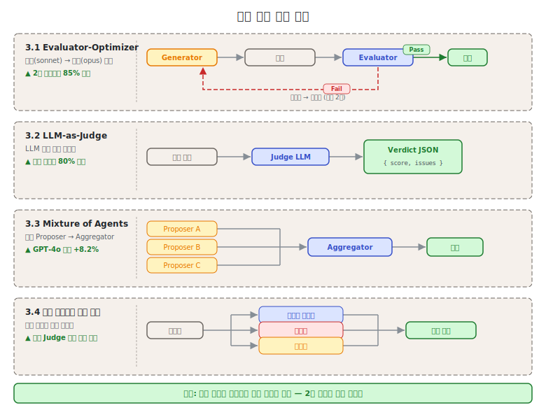
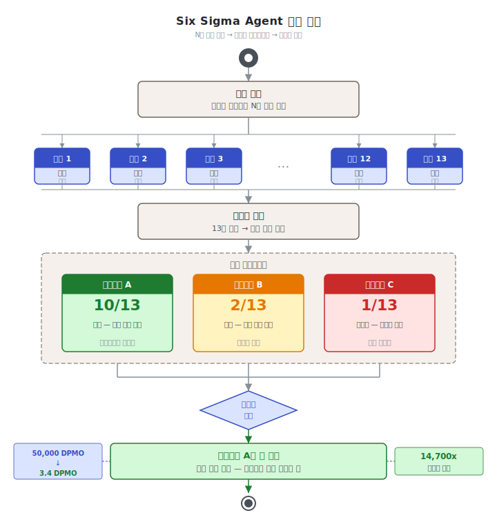

# 제6단원. 품질 보증 패턴 — 에이전트 출력의 품질 관리

---

## 학습 목표

이 단원을 마치면 다음을 할 수 있다:

1. 6가지 품질 보증 패턴의 동작 원리와 효과를 설명할 수 있다
2. 작업 특성에 맞는 품질 보증 전략을 설계할 수 있다
3. Six Sigma Agent의 14,700배 신뢰도 향상의 수학적 원리를 증명할 수 있다
4. Evaluator-Optimizer를 품질 보증 관점에서 심화 적용할 수 있다

---



멀티에이전트 시스템에서 품질 보증은 단일 에이전트보다 복잡하다. 각 에이전트의 출력이 다른 에이전트에 전달되므로, 하나의 오류가 **연쇄적으로 증폭**될 수 있다. 이 단원에서는 이를 방지하기 위한 6가지 패턴을 다룬다.

품질 보증 패턴은 [2단원](02_기본_패턴.md)의 기본 패턴과 달리, **생산 환경에서의 신뢰성**에 초점을 맞춘다. 단순히 좋은 결과를 얻는 것이 아니라, 일관적으로 허용 가능한 품질을 유지하는 것이 목표이다.

---

## 6.1 Evaluator-Optimizer (생성-평가 루프) — 품질 보증 심화

[2단원 2.6](02_기본_패턴.md)에서 Evaluator-Optimizer의 기본 구조를 소개하였다. 이 단원에서는 **품질 보증 관점의 심화 적용**을 다룬다: 평가 기준 설계 방법론, 반복 횟수 최적화, 실전 안티패턴이다.

### 2단원과의 차별화

| 관점 | 2단원 (기본 개념) | 6단원 (품질 보증 심화) |
|------|----------------|---------------------|
| 초점 | 패턴 구조와 루프 | 평가 기준 설계 방법론 |
| 반복 횟수 | 수확 체감 원칙 소개 | 최적 반복 횟수 결정 방법 |
| 적용 | 일반적 사용 사례 | 프로덕션 품질 보증 전략 |
| 안티패턴 | 없음 | 4가지 안티패턴 분석 |

### 평가 기준 설계 방법론

모호한 "더 좋게"라는 지시 대신, **구조화된 JSON 평가 기준**을 사용해야 한다:

```json
{
  "criteria": {
    "correctness": {
      "weight": 0.4,
      "description": "코드가 명세에 맞게 동작하는가",
      "pass_threshold": 0.9,
      "evaluation_method": "단위 테스트 실행 결과"
    },
    "security": {
      "weight": 0.3,
      "description": "보안 취약점이 없는가",
      "pass_threshold": 0.95,
      "evaluation_method": "OWASP Top 10 체크리스트"
    },
    "maintainability": {
      "weight": 0.2,
      "description": "코드가 읽기 쉽고 유지보수 가능한가",
      "pass_threshold": 0.7,
      "evaluation_method": "복잡도 지표 및 주석 비율"
    },
    "performance": {
      "weight": 0.1,
      "description": "성능이 요구사항을 충족하는가",
      "pass_threshold": 0.8,
      "evaluation_method": "벤치마크 실행 결과"
    }
  },
  "overall_pass_threshold": 0.85
}
```

**평가 기준 설계 원칙**:
1. **측정 가능성**: 각 기준은 객관적으로 측정 가능해야 한다. "좋은 코드인가"는 측정 불가능하지만, "Cyclomatic Complexity 10 이하인가"는 가능하다.
2. **가중치 합산**: 모든 가중치의 합이 1.0이어야 한다.
3. **임계값 차별화**: 보안(0.95)은 기능 정확도(0.9)보다 높은 임계값을 적용한다.

### 최적 반복 횟수 결정

2단원에서 "85%가 첫 2회 반복에서 달성된다"는 원칙을 소개하였다. 프로덕션에서는 다음 기준으로 최대 반복 횟수를 설정한다:

```python
class EvaluatorOptimizer:
    def __init__(self, max_iterations: int = 3,
                 quality_threshold: float = 0.85,
                 improvement_min: float = 0.02):
        self.max_iterations = max_iterations
        self.quality_threshold = quality_threshold
        self.improvement_min = improvement_min  # 최소 개선율

    def optimize(self, generator, evaluator, task: dict) -> dict:
        response = generator.generate(task)
        previous_score = 0.0

        for i in range(self.max_iterations):
            evaluation = evaluator.evaluate(response)
            current_score = evaluation["score"]

            # 조기 종료 조건 1: 품질 임계값 달성
            if current_score >= self.quality_threshold:
                return {"result": response, "iterations": i + 1,
                        "final_score": current_score}

            # 조기 종료 조건 2: 개선이 미미한 경우 (수확 체감)
            if i > 0 and (current_score - previous_score) < self.improvement_min:
                return {"result": response, "iterations": i + 1,
                        "final_score": current_score,
                        "note": "개선 한계 도달로 조기 종료"}

            # 피드백과 함께 재생성
            response = generator.regenerate(task, evaluation["feedback"])
            previous_score = current_score

        return {"result": response, "iterations": self.max_iterations,
                "final_score": current_score}
```

### 안티패턴

프로덕션에서 자주 발생하는 Evaluator-Optimizer 안티패턴:

1. **무한 반복 허용**: 최대 반복 횟수 없이 "통과될 때까지" 반복하면 비용이 폭발한다.
2. **모호한 평가 기준**: "더 나은 코드로 수정하라"는 지시는 평가자가 일관성 없는 피드백을 생성한다.
3. **같은 모델 사용**: 생성자와 평가자에 같은 모델을 사용하면 자기 편향(self-bias)이 발생한다. 반드시 다른 모델 또는 다른 역할을 사용해야 한다.
4. **피드백 누적 없음**: 매 반복에서 새 피드백만 전달하고 이전 피드백을 버리면, 에이전트가 이전에 수정한 내용을 다시 되돌린다.

---

## 6.2 LLM-as-Judge

### 개념

LLM을 **자동화된 품질 심사관**으로 활용한다.

### 성능 수치

| 지표 | 수치 |
|------|------|
| 인간 선호도와의 합의율 | **80%** (인간 간 일치율과 동등) |
| 인간 대비 비용 | **500~5,000배 절감** |
| 한계 | 전문 도메인의 사실 정확도 평가에서 약함 |

### 실무 배합

```
전체 평가 작업 100%
  ├── LLM-as-Judge   90%  → 자동 평가
  └── 인간 리뷰       10%  → 캘리브레이션용
```

### Anthropic의 평가 방법론

Anthropic의 연구팀은 LLM-as-Judge에 대해 다음과 같은 구체적 기준을 사용하였다:

- **사실 정확도**: 주장이 출처와 일치하는가?
- **인용 정확도**: 인용된 출처가 주장과 일치하는가?
- **완전성**: 요청된 모든 측면이 다뤄졌는가?
- **출처 품질**: 1차 출처를 저품질 2차 출처보다 우선 사용하였는가?
- **도구 효율성**: 올바른 도구를 합리적 횟수로 사용하였는가?

> "여러 judge를 사용하여 각 구성 요소를 평가하는 실험도 했지만, 0.0~1.0 점수와 합격/불합격 등급을 출력하는 단일 프롬프트의 단일 LLM 호출이 가장 일관되고 인간 판단과 정렬되었다."
> — Anthropic (2025)

### LLM-as-Judge 구현 예시

```python
import json

class LLMJudge:
    def __init__(self, judge_model="claude-opus-4"):
        self.model = judge_model

    def evaluate(self, task: str, response: str,
                 criteria: dict) -> dict:
        prompt = f"""
당신은 엄격한 품질 심사관입니다. 다음 기준으로 응답을 평가하고
반드시 JSON 형식으로만 응답하십시오.

평가 기준:
{json.dumps(criteria, ensure_ascii=False, indent=2)}

작업:
{task}

응답:
{response}

JSON 형식:
{{
  "overall_score": 0.0~1.0,
  "verdict": "pass" | "fail",
  "criteria_scores": {{
    "기준명": {{"score": 0.0~1.0, "reasoning": "..."}}
  }},
  "feedback": ["개선사항 1", "개선사항 2"],
  "strengths": ["강점 1", "강점 2"]
}}
"""
        result = self.model.generate(prompt)
        return json.loads(result)
```

---

## 6.3 Mixture of Agents (MoA)

### 개념

여러 LLM을 **레이어로 쌓아** Proposer → Aggregator 구조를 만든다.

```
Layer 1 (Proposers):
  LLM A ──▶ 응답 A ──┐
  LLM B ──▶ 응답 B ──┤──▶ Layer 2 (Aggregator): 합성 ──▶ 최종 출력
  LLM C ──▶ 응답 C ──┘
```

### 성능 수치

- GPT-4o 대비 AlpacaEval에서 **8.2% 절대 성능 향상**
- 경량 변형 "MoA w/ Lite": 2 레이어 + 저가 Aggregator로 비용 절감

### 2 레이어가 실용적 상한인 이유

레이어를 3층, 4층으로 쌓을수록 이론적으로는 품질이 향상되어야 하지만, 실무에서는 2 레이어가 비용-품질 균형의 최적점이다:

- **지연 증가**: 레이어가 추가될수록 직렬 지연이 누적된다
- **컨텍스트 압축 손실**: Aggregator가 이전 레이어의 요약을 처리하면서 정보 손실이 발생한다
- **비용 기하급수적 증가**: Proposer 수 × 레이어 수 = 호출 횟수

실무 권장: **2 레이어, 3~4 Proposers**가 최적

### Proposer 다양성의 중요성

MoA의 효과는 Proposer의 **다양성**에서 나온다. 같은 모델을 여러 번 호출하는 것(다수결 투표)보다, 서로 다른 모델/프롬프트를 사용하는 것이 효과적이다:

```python
# 효과 낮음: 동일 모델 3번
proposers_bad = [claude_sonnet, claude_sonnet, claude_sonnet]

# 효과 높음: 다양한 모델/관점
proposers_good = [
    claude_opus,      # 심층 분석
    gpt4_turbo,       # 대안 관점
    claude_sonnet,    # 비용 효율
]
```

### 실전 도구의 적용

OMC에서 explorer(Opus)가 여러 Sonnet scout의 결과를 합성하는 구조가 MoA와 동일한 아키텍처이다.

---

## 6.4 다중 에이전트 평가 패널

### 개념

여러 LLM에 **다른 역할**(도메인 전문가, 비평가, 옹호자)을 부여하여 패널 심사한다.

```
결과물 ──▶ 도메인 전문가: "기술적으로 정확한가?"
       ──▶ 비평가:       "논리적 허점은?"
       ──▶ 옹호자:       "장점과 가치는?"
              │
              ▼
         패널 합의 ──▶ 최종 판정
```

### 성능 수치 및 실무 가이드

- 단일 judge 대비 허위 긍정(false positive) 비율 **30~40% 감소**
- 적용 비용이 높으므로 **핵심 산출물에만** 적용 권장
- 패널 구성 시 역할 간 독립성이 핵심: 옹호자가 비평가의 의견을 사전에 알면 독립성이 훼손된다

### 장점

- 단일 judge보다 **다각적 평가**, 편향 감소
- 각 역할이 서로 다른 관점을 강제하므로 맹점 최소화

### 구현 시 주의

평가 패널은 병렬로 실행해야 한다. 순차 실행하면 이전 에이전트의 평가가 다음 에이전트에게 영향을 준다(앵커링 효과).

```python
import asyncio

async def panel_evaluation(artifact: str, panelists: list) -> dict:
    # 반드시 병렬 실행 (독립적 평가 보장)
    evaluations = await asyncio.gather(*[
        panelist.evaluate(artifact)
        for panelist in panelists
    ])

    # 합의 과정: 다수결 또는 가중 평균
    return aggregate_panel_results(evaluations)
```

---

## 6.5 합의 투표 / Six Sigma Agent

### 개념

각 원자적 작업을 N회(5~13) 병렬 실행하고, 임베딩 기반 의미 클러스터링으로 유사 출력을 그룹화한 뒤 **다수결 클러스터의 답을 선택**한다.

```
동일 작업을 13회 병렬 실행:

  실행 1  → 답 A    ┐
  실행 2  → 답 A    │
  실행 3  → 답 B    │  의미 클러스터링
  실행 4  → 답 A    │  → 클러스터 A: 10회
  실행 5  → 답 A    ├─→ 클러스터 B: 2회
  실행 6  → 답 A    │  → 클러스터 C: 1회
  ...               │
  실행 13 → 답 A    ┘  → 다수결: 답 A 선택
```



### 성능 수치

- 단일 GPT-4o-mini: 50,000 DPMO (Defects Per Million Opportunities)
- Six Sigma Agent (n=13): **3.4 DPMO** — 신뢰도 **14,700배 향상**
- 저가 모델 + 합의로 비용 **80% 절감**

### 수학적 원리 — 이항 분포와 다수결

Six Sigma Agent의 14,700배 신뢰도 향상은 **이항 분포의 다수결 원리**에서 비롯된다.

**기본 가정**: 각 에이전트의 오류율을 p, 정답률을 (1-p)로 정의한다. 각 실행은 독립 시행이다(이항 분포 가정).

**단일 시행의 오류율**: 단일 GPT-4o-mini의 DPMO = 50,000이면,
```
p_single = 50,000 / 1,000,000 = 0.05 (5% 오류율)
```

**n회 독립 시행의 다수결**: n회 실행 중 과반수(ceil(n/2) 이상)가 오류여야 최종 오류가 발생한다.

n회 독립 시행에서 오류가 k회 이상 발생할 확률:

```
P_error(n, p) = Σ[k=ceil(n/2) to n] C(n,k) * p^k * (1-p)^(n-k)
```

**n=13, p=0.05의 경우**:

시스템 오류는 13회 중 7회 이상 오류여야 한다:

```
P_error(13, 0.05) = Σ[k=7 to 13] C(13,k) * (0.05)^k * (0.95)^(13-k)

k=7: C(13,7) * (0.05)^7 * (0.95)^6 ≈ 1716 * 7.8e-9 * 0.735 ≈ 9.8e-6
k=8: C(13,8) * (0.05)^8 * (0.95)^5 ≈ 1287 * 3.9e-10 * 0.774 ≈ 3.9e-7
k=9~13: 각각 10^-10 이하로 무시 가능

P_error(13, 0.05) ≈ 9.8e-6 + 3.9e-7 + ... ≈ 1.0e-5 ≈ 10 DPMO
```

그런데 실제 실험 결과는 3.4 DPMO이다. 이는 의미 클러스터링이 단순 다수결보다 정밀하게 "오류 클러스터"를 식별하기 때문이다.

**신뢰도 향상 배율 계산**:

```
개선 배율 = p_single / P_error(n, p)
           = 50,000 DPMO / 3.4 DPMO
           ≈ 14,700배
```

**일반화**: P_sys(n, p) = O(p^ceil(n/2))

n이 증가할수록 시스템 오류율은 p의 ceil(n/2) 거듭제곱으로 감소한다. 예를 들어 p=0.1, n=5이면:

```
P_sys(5, 0.1) ≈ C(5,3) * (0.1)^3 * (0.9)^2 = 10 * 0.001 * 0.81 = 0.0081
단일 시행 오류율: 0.1
개선 배율: 0.1 / 0.0081 ≈ 12배
```

### 핵심 가정과 한계

이 수학적 원리가 성립하려면 **독립 시행** 가정이 충족되어야 한다. 실제로는 다음 두 가지 이유로 독립성이 완전히 보장되지 않는다:

1. **공통 훈련 데이터**: 같은 모델 여러 인스턴스는 동일한 체계적 오류(systematic bias)를 공유한다. 특정 유형의 질문에 동시에 틀리는 경향이 있다.

2. **동일 프롬프트**: 완전히 동일한 프롬프트를 사용하면 유사한 오류 패턴이 나타난다.

이를 완화하기 위해 **다양한 프롬프트 변형**과 **다양한 모델 조합**을 사용한다.

### 적합한 상황

단일 에이전트 오류율이 허용 불가한 **미션 크리티컬 워크플로**

- 의료 진단 지원, 금융 거래 분석, 보안 취약점 탐지
- 오류 비용이 재실행 비용보다 극도로 큰 경우

---

## 6.6 신뢰도 점수 기반 적대적 저항 (Credibility Scoring)

### 개념

멀티에이전트 협업을 **반복 게임**으로 모델링하여, 각 에이전트에 **과거 기여 품질 기반 신뢰도 점수**를 부여한다. 출력 집계 시 신뢰도 가중치를 적용하여, 저품질/적대적 에이전트를 자동으로 다운웨이트한다.

```
에이전트 신뢰도 히스토리:

  Agent A: 0.95 (높은 품질 이력)    → 가중치 높음
  Agent B: 0.82 (보통 품질 이력)    → 가중치 중간
  Agent C: 0.41 (저품질/적대적)     → 가중치 매우 낮음

집계 시: 결과 = 0.95*A + 0.82*B + 0.41*C (정규화)
```

### 효과

- 적대적 에이전트가 **과반수(>50%)**여도 효과적 방어
- 데이터/통신 포이즈닝 공격 완화

### 신뢰도 점수 업데이트 알고리즘

신뢰도 점수를 어떻게 업데이트하는지가 시스템의 반응성을 결정한다. **지수 이동 평균(EMA)**이 일반적으로 사용된다:

```python
class CredibilityTracker:
    def __init__(self, initial_score: float = 0.7,
                 alpha: float = 0.1):
        """
        alpha: 학습률 (0.1 = 최근 성과에 10% 가중)
               낮을수록 안정적, 높을수록 최근 성과에 민감
        """
        self.scores: dict = {}  # agent_id → 신뢰도 점수
        self.alpha = alpha
        self.initial_score = initial_score

    def get_score(self, agent_id: str) -> float:
        return self.scores.get(agent_id, self.initial_score)

    def update(self, agent_id: str, quality_score: float):
        """
        지수 이동 평균으로 신뢰도 업데이트
        EMA: score_new = (1-alpha) * score_old + alpha * quality_score
        """
        current = self.get_score(agent_id)
        self.scores[agent_id] = (1 - self.alpha) * current + \
                                  self.alpha * quality_score

    def weighted_aggregate(self, agent_results: dict) -> str:
        """신뢰도 가중 집계"""
        total_weight = 0.0
        weighted_contributions = []

        for agent_id, result in agent_results.items():
            weight = self.get_score(agent_id)
            weighted_contributions.append((weight, result))
            total_weight += weight

        # 정규화된 가중치로 합성
        normalized = [
            (w / total_weight, r)
            for w, r in weighted_contributions
        ]
        return synthesize_with_weights(normalized)
```

**alpha 선택 가이드**:
- `alpha = 0.05`: 안정적, 변화에 느리게 반응 (장기 안정성 중요 시)
- `alpha = 0.1`: 균형적 (권장 기본값)
- `alpha = 0.3`: 최근 성과에 민감, 빠른 적응 (에이전트가 빠르게 개선/악화될 때)

### 베이지안 업데이트 대안

EMA 외에 베이지안 신뢰도 업데이트도 사용된다:

```python
from scipy.stats import beta as beta_dist

class BayesianCredibility:
    def __init__(self):
        # Beta(alpha, beta) 분포로 신뢰도를 모델링
        # 초기값: Beta(7, 3) = 평균 0.7
        self.params: dict = {}  # agent_id → (alpha, beta)

    def get_score(self, agent_id: str) -> float:
        a, b = self.params.get(agent_id, (7, 3))
        return a / (a + b)  # Beta 분포의 기댓값

    def update(self, agent_id: str, success: bool):
        """성공/실패에 따라 베이지안 업데이트"""
        a, b = self.params.get(agent_id, (7, 3))
        if success:
            self.params[agent_id] = (a + 1, b)
        else:
            self.params[agent_id] = (a, b + 1)
```

베이지안 방식의 장점: 초기에 데이터가 적을 때 사전 분포가 과적합을 방지한다. 데이터가 누적될수록 실제 성과가 지배적이 된다.

---

> **핵심 정리: 품질 보증 패턴 선택 가이드**
>
> | 상황 | 추천 패턴 | 이유 |
> |------|----------|------|
> | 반복 개선이 효과적 | Evaluator-Optimizer | 2회 반복으로 85% 개선 |
> | 대량 자동 평가 필요 | LLM-as-Judge | 인간의 500~5,000배 비용 효율 |
> | 다양한 관점이 필요 | 평가 패널 | 다각적 평가, 편향 감소 |
> | 미션 크리티컬 정확도 | Six Sigma Agent | 14,700배 신뢰도 향상 |
> | 적대적 환경 | 신뢰도 점수 | 과반 적대 에이전트도 방어 |
> | 다양한 LLM 활용 가능 | MoA | 8.2% 절대 성능 향상 |

---

## 복습 질문

1. Evaluator-Optimizer에서 "구조화된 JSON 평가 기준"을 사용해야 하는 이유를 설명하고, 코드 리뷰 작업에 적합한 평가 기준 4개를 설계하라.

2. LLM-as-Judge의 인간 합의율이 80%라는 수치가 의미하는 바를 해석하고, 이 방법의 한계를 2가지 서술하라.

3. Six Sigma Agent가 단일 GPT-4o-mini 대비 14,700배 신뢰도 향상을 달성하는 수학적 원리를 이항 분포를 사용하여 설명하라. n=5, p=0.1의 경우 개선 배율을 계산하라.

4. 신뢰도 점수 기반 적대적 저항에서 지수 이동 평균(EMA)을 사용할 때 alpha 값 선택이 시스템 동작에 미치는 영향을 설명하라.

5. Anthropic의 Research 시스템에서 사용한 LLM-as-Judge 기준 5가지를 나열하고, 각각의 역할을 설명하라.

6. Six Sigma Agent의 독립 시행 가정이 현실에서 완전히 성립하지 않는 두 가지 이유를 설명하고, 이를 완화하는 방법을 제시하라.

---

*이전 단원: [제5단원. 모델 라우팅 패턴](05_모델_라우팅_패턴.md) | 다음 단원: [제7단원. 오류 처리 및 안전](07_오류_처리_및_안전.md)*
