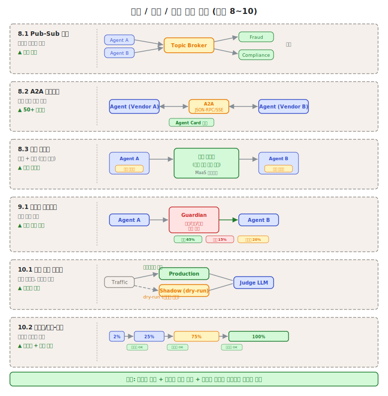
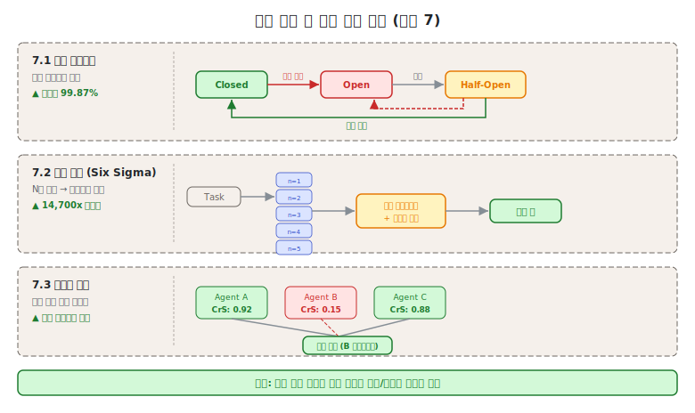
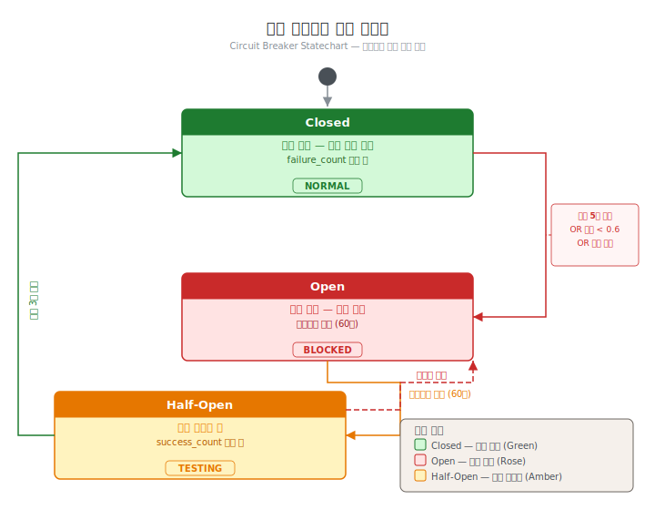

# 제7단원. 오류 처리 및 안전 — 신뢰성과 보안

---

## 학습 목표

이 단원을 마치면 다음을 할 수 있다:

1. 에이전트 서킷 브레이커, 가디언 에이전트 등 오류 처리 패턴을 설명할 수 있다
2. 에이전트 시스템의 통신 패턴(Pub-Sub, A2A)을 이해할 수 있다
3. 프로덕션 배포 전략(섀도 모드, 카나리, 블루-그린)을 설계할 수 있다
4. 서킷 브레이커 상태 머신을 Python으로 구현할 수 있다
5. 합의 투표 / Six Sigma Agent와의 관계를 교차 참조하여 이해할 수 있다

---





Anthropic의 엔지니어링 팀은 에이전트 시스템의 오류에 대해 다음과 같이 경고한다:

> "전통적 소프트웨어에서 버그는 기능을 망가뜨리거나, 성능을 저하시키거나, 장애를 유발할 수 있다. 에이전틱 시스템에서는 사소한 변경이 큰 행동 변화로 연쇄되어, 장기 실행 프로세스에서 상태를 유지해야 하는 복잡한 에이전트에 코드를 작성하는 것을 현저히 어렵게 만든다."
> — Anthropic, "How We Built Our Multi-Agent Research System" (2025)

이 경고는 단순한 수사가 아니다. 에이전틱 시스템의 오류는 전통적 소프트웨어와 세 가지 측면에서 근본적으로 다르다:

1. **비결정성**: 같은 입력에서도 다른 출력이 나올 수 있다. 재현 가능한 버그 리포트가 어렵다.
2. **오류 복합**: 한 에이전트의 오류가 다른 에이전트의 입력이 되어 연쇄적으로 증폭된다.
3. **상태 의존성**: 장기 실행 에이전트는 이전 상태를 기반으로 결정하므로, 초기 오류가 나중에 복잡한 형태로 나타난다.

> **교차 참조**: [6단원의 합의 투표 / Six Sigma Agent (6.5)](06_품질_보증_패턴.md)는 원본 문서에서 오류 처리 범주에 있던 패턴이다. 교재에서는 품질 보증의 맥락이 더 적합하다고 판단하여 6단원으로 이동하였으며, 오류 복구 관점의 활용은 이 단원에서 교차 참조한다.

---

## 7.1 에이전트 서킷 브레이커 (Circuit Breaker)

### 개념

에이전트 장애율을 3가지 상태로 관리한다: **Closed**(정상), **Open**(임계값 초과 → 즉시 폴백), **Half-Open**(테스트 요청으로 복구 확인). LLM 특화 적응으로, HTTP 오류뿐 아니라 **품질 저하**(환각률, 관련성 점수 하락)에도 트립한다.

```
Closed ──장애 누적──▶ Open ──일정 시간──▶ Half-Open
  ▲                     │                    │
  └──── 복구 확인 ◀─────┘     테스트 성공 ──▶┘
                              테스트 실패 ──▶ Open (재진입)
```



### 전통적 서킷 브레이커와의 차이

일반 서킷 브레이커는 HTTP 상태 코드나 응답 시간만을 트리거로 사용한다. 에이전트 서킷 브레이커는 **LLM 특화 장애 지표**를 추가로 감지한다:

| 트리거 | 전통적 | LLM 특화 |
|--------|--------|---------|
| 네트워크 오류 | O | O |
| 응답 시간 초과 | O | O |
| 환각 감지 (사실 불일치) | X | O |
| 응답 관련성 하락 | X | O |
| 반복적 동일 오류 | X | O |
| 품질 점수 임계값 | X | O |

### Python 서킷 브레이커 구현 (상태 머신)

```python
import time
from enum import Enum
from typing import Callable, Optional

class CircuitState(Enum):
    CLOSED = "closed"      # 정상 운영
    OPEN = "open"          # 장애 차단
    HALF_OPEN = "half_open"  # 복구 테스트 중

class AgentCircuitBreaker:
    def __init__(self,
                 failure_threshold: int = 5,     # Open 전환 실패 횟수
                 success_threshold: int = 3,     # Closed 복귀 성공 횟수
                 timeout: float = 60.0,          # Open → Half-Open 대기 시간 (초)
                 quality_threshold: float = 0.6  # LLM 품질 임계값
                 ):
        self.failure_threshold = failure_threshold
        self.success_threshold = success_threshold
        self.timeout = timeout
        self.quality_threshold = quality_threshold

        self.state = CircuitState.CLOSED
        self.failure_count = 0
        self.success_count = 0
        self.last_failure_time: Optional[float] = None

    def is_open(self) -> bool:
        return self.state == CircuitState.OPEN

    def can_attempt(self) -> bool:
        """현재 요청을 시도할 수 있는지 판단"""
        if self.state == CircuitState.CLOSED:
            return True

        if self.state == CircuitState.OPEN:
            # 타임아웃 후 Half-Open으로 전환
            if time.time() - self.last_failure_time >= self.timeout:
                self.state = CircuitState.HALF_OPEN
                self.success_count = 0
                return True
            return False  # 아직 타임아웃 미도달

        if self.state == CircuitState.HALF_OPEN:
            return True  # 테스트 요청 허용

        return False

    def record_success(self):
        """성공 기록"""
        self.failure_count = 0

        if self.state == CircuitState.HALF_OPEN:
            self.success_count += 1
            if self.success_count >= self.success_threshold:
                self.state = CircuitState.CLOSED

    def record_failure(self, reason: str = "unknown"):
        """실패 기록"""
        self.failure_count += 1
        self.last_failure_time = time.time()

        if self.state == CircuitState.HALF_OPEN:
            # Half-Open에서 실패 → 즉시 Open으로 복귀
            self.state = CircuitState.OPEN
        elif self.failure_count >= self.failure_threshold:
            self.state = CircuitState.OPEN

    def record_quality_failure(self, quality_score: float):
        """LLM 특화: 품질 저하도 장애로 처리"""
        if quality_score < self.quality_threshold:
            self.record_failure(reason=f"quality_below_threshold: {quality_score}")

    def execute(self, agent_func: Callable, *args, **kwargs):
        """서킷 브레이커를 통해 에이전트 실행"""
        if not self.can_attempt():
            # Open 상태: 폴백 체인 실행
            return self.execute_fallback(*args, **kwargs)

        try:
            result = agent_func(*args, **kwargs)

            # LLM 품질 검사
            if hasattr(result, 'quality_score'):
                if result.quality_score < self.quality_threshold:
                    self.record_quality_failure(result.quality_score)
                    return self.execute_fallback(*args, **kwargs)

            self.record_success()
            return result

        except Exception as e:
            self.record_failure(reason=str(e))
            return self.execute_fallback(*args, **kwargs)

    def execute_fallback(self, *args, **kwargs):
        """폴백 체인: Claude Sonnet → Haiku → GPT-4o → 로컬 모델"""
        fallback_chain = [
            claude_sonnet_agent,
            claude_haiku_agent,
            gpt4o_agent,
            local_model_agent
        ]
        for fallback in fallback_chain:
            try:
                return fallback(*args, **kwargs)
            except Exception:
                continue
        raise AllFallbacksFailedError("모든 폴백 에이전트 실패")
```

### 성능 수치

- 가동률 99.2% → **99.87%** (캐시 폴백 포함)
- 폴백 체인: Claude Sonnet → Haiku → GPT-4o → 로컬 모델

---

## 7.2 가디언 에이전트 (Guardian Agent)

### 개념

에이전트 간 통신 경로에 **전담 감시 에이전트**를 배치하여, 모든 상호작용의 안전성, 공정성, 보안, 정책 준수를 런타임으로 모니터링한다. **환각의 에이전트 체인 전파를 감지하고 완화**한다.

```
Agent A ──▶ [Guardian] ──▶ Agent B
                │
         APPROVED (65%)
         REJECTED (15%)
         ESCALATE (20%) ──▶ 인간 리뷰
```

### 판정 비율의 의미

가디언 에이전트의 세 가지 판정은 다음 상황에서 발생한다:

**APPROVED (65%)**
- 요청이 정책을 준수하고, 환각 지표가 없으며, 보안 위협이 감지되지 않는다
- 표준적인 에이전트 간 데이터 전달

**REJECTED (15%)**
- 요청이 명확히 정책을 위반한다 (예: 민감 데이터 노출, 금지된 도구 호출)
- 환각 감지 신뢰도가 높은 경우 (잘못된 사실 기반 요청)
- Agent A에게 거절 사유와 함께 수정 요청 반환

**ESCALATE (20%)**
- 정책 위반 여부가 불확실하거나, 판단에 도메인 전문성이 필요한 경우
- 영향 범위가 크거나 되돌리기 어려운 작업 (예: 프로덕션 DB 수정)
- 인간 리뷰를 거쳐 허용/거부 결정

> **주의**: 이 비율(65/15/20)은 규제 산업(의료, 금융, 법률)에서의 내부 보고 수치이며, 범용적 수치가 아니다. 실제 비율은 시스템의 위험 허용도와 정책 엄격도에 따라 크게 다를 수 있다.

### 가디언 에이전트 구현 예시

```python
class GuardianAgent:
    def __init__(self, policy_checker, hallucination_detector, security_scanner):
        self.policy = policy_checker
        self.hallucination = hallucination_detector
        self.security = security_scanner

    def evaluate(self, request: dict) -> dict:
        """모든 에이전트 간 통신을 검사"""
        issues = []

        # 1. 정책 준수 확인
        policy_result = self.policy.check(request)
        if not policy_result.compliant:
            if policy_result.severity == "critical":
                return {"verdict": "REJECTED", "reason": policy_result.violation}
            else:
                issues.append(policy_result.violation)

        # 2. 환각 감지
        hallucination_score = self.hallucination.score(request["content"])
        if hallucination_score > 0.8:
            return {"verdict": "REJECTED",
                    "reason": f"높은 환각 확률 감지: {hallucination_score:.2f}"}
        elif hallucination_score > 0.5:
            issues.append(f"환각 위험 중간 수준: {hallucination_score:.2f}")

        # 3. 보안 스캔
        security_result = self.security.scan(request)
        if security_result.threat_level == "HIGH":
            return {"verdict": "REJECTED", "reason": security_result.description}
        elif security_result.threat_level == "MEDIUM":
            issues.append(security_result.description)

        # 판정 결정
        if not issues:
            return {"verdict": "APPROVED"}
        elif len(issues) <= 1 and not any(i.startswith("환각") for i in issues):
            return {"verdict": "APPROVED", "warnings": issues}
        else:
            return {
                "verdict": "ESCALATE",
                "issues": issues,
                "escalation_target": "human_reviewer"
            }
```

### 적합한 상황

- 규제 산업(의료, 금융, 법률)
- 에이전트 행동이 실세계에 영향을 미치는 프로덕션 배포

---

## 7.3 이벤트 기반 Pub-Sub 통신

### 개념

동기 요청-응답 체인을 **비동기 이벤트 기반 통신**으로 대체한다. 에이전트가 토픽에 이벤트를 발행하고 관련 토픽을 구독한다.

```
┌──────────┐  publish   ┌──────────────┐  subscribe  ┌──────────┐
│ Agent A  │──────────▶│ Event Bus    │────────────▶│ Agent B  │
│          │           │              │              │          │
│  코드변경 │           │ topic:       │              │  테스트   │
│  완료    │           │ "code.change"│              │  실행    │
└──────────┘           └──────────────┘              └──────────┘
```

### AutoGen v0.4의 이벤트 기반 재설계

AutoGen v0.4는 기존의 동기 채팅 기반 아키텍처를 이벤트 기반 코어로 **전면 재설계**하였다. 이 변화의 핵심 동기는 세 가지였다:

1. **동기 블로킹 제거**: 기존 AutoGen에서 에이전트 A가 B의 응답을 기다리는 동안 A는 완전히 블로킹되었다. 이벤트 기반으로 전환하면 A가 이벤트를 발행하고 즉시 다른 작업을 수행할 수 있다.

2. **연쇄 장애 방지**: 동기 체인에서는 B가 다운되면 A도 블로킹된다. 이벤트 기반에서는 B가 없어도 이벤트가 큐에 남고, B가 복구되면 처리된다.

3. **수평 확장**: 동일한 토픽을 여러 에이전트가 구독할 수 있으므로, 처리 용량 부족 시 구독자를 추가하면 된다.

### 이벤트 기반 통신 구현

```python
import asyncio
from collections import defaultdict

class EventBus:
    def __init__(self):
        self.subscribers = defaultdict(list)
        self.event_queue = asyncio.Queue()

    def subscribe(self, topic: str, handler):
        """에이전트가 특정 토픽 구독"""
        self.subscribers[topic].append(handler)

    async def publish(self, topic: str, event: dict):
        """이벤트 발행 (비동기)"""
        event["topic"] = topic
        await self.event_queue.put(event)

    async def dispatch(self):
        """이벤트 디스패치 루프"""
        while True:
            event = await self.event_queue.get()
            topic = event["topic"]
            handlers = self.subscribers.get(topic, [])

            # 구독자들에게 병렬 전달
            await asyncio.gather(*[
                handler(event) for handler in handlers
            ])

# 사용 예시
bus = EventBus()

# 코드 에이전트: 변경 완료 시 이벤트 발행
async def code_agent_on_complete(change):
    await bus.publish("code.change", {
        "files_modified": change.files,
        "diff": change.diff
    })

# 테스트 에이전트: 코드 변경 구독
async def test_agent_handler(event):
    await run_tests(event["files_modified"])

# 문서화 에이전트: 코드 변경 구독
async def doc_agent_handler(event):
    await update_docs_from_diff(event["diff"])

bus.subscribe("code.change", test_agent_handler)
bus.subscribe("code.change", doc_agent_handler)
```

### 효과

- AutoGen v0.4가 이벤트 기반 코어로 전면 재설계
- 동기 블로킹에 의한 연쇄 장애 제거
- 수평 확장 가능

---

## 7.4 접근 제어 기반 협업 메모리

### 개념

2계층 메모리 구현: **사적 메모리**(원본 에이전트만 접근)와 **공유 메모리**(역할 기반 접근 제어로 선택적 공유).

```
┌──────────────────────────────────────────┐
│              메모리 시스템                 │
│                                          │
│  ┌──────────┐  ┌──────────┐  ┌─────────┐│
│  │ Agent A  │  │ Agent B  │  │  공유    ││
│  │ 사적     │  │ 사적     │  │  메모리  ││
│  │ 메모리   │  │ 메모리   │  │         ││
│  │          │  │          │  │ RBAC    ││
│  │ [비공개] │  │ [비공개] │  │ 기반    ││
│  └──────────┘  └──────────┘  │ 접근    ││
│                              └─────────┘│
└──────────────────────────────────────────┘
```

(참고: 이전 버전에서 이모지로 표시된 부분은 텍스트 표기로 수정하였다)

### RBAC (Role-Based Access Control) 구현

```python
from enum import Enum

class MemoryAccessLevel(Enum):
    PRIVATE = "private"   # 소유 에이전트만
    TEAM = "team"         # 같은 팀 에이전트
    PROJECT = "project"   # 같은 프로젝트 내 모든 에이전트
    PUBLIC = "public"     # 모든 에이전트

class CollaborativeMemory:
    def __init__(self):
        self.memories: dict = {}  # key → {value, owner, access_level}

    def write(self, agent_id: str, key: str, value,
              access_level: MemoryAccessLevel = MemoryAccessLevel.PRIVATE):
        self.memories[key] = {
            "value": value,
            "owner": agent_id,
            "access_level": access_level
        }

    def read(self, agent_id: str, key: str):
        if key not in self.memories:
            return None

        memory = self.memories[key]
        access = memory["access_level"]

        # 접근 권한 확인
        if access == MemoryAccessLevel.PUBLIC:
            return memory["value"]
        elif access == MemoryAccessLevel.PRIVATE:
            if memory["owner"] == agent_id:
                return memory["value"]
            return None  # 접근 거부
        elif access == MemoryAccessLevel.TEAM:
            if self.same_team(agent_id, memory["owner"]):
                return memory["value"]
            return None
        elif access == MemoryAccessLevel.PROJECT:
            if self.same_project(agent_id, memory["owner"]):
                return memory["value"]
            return None

        return None
```

### 실전 도구의 적용

- **OMC Context Firewall**: 워커 간 정보 격리. 자신의 태스크/코드만 접근, 공유 인터페이스만 교환
- **Gas Town Beads**: 모든 상태를 git 기반으로 영속화, bead 유형(영속/임시)으로 접근 제어
- **GSD .gsd/ 디렉터리**: 파일 시스템 기반 상태 외부화, 태스크별 격리된 컨텍스트 주입

---

## 7.5 배포 전략

에이전트 시스템의 배포는 전통적 소프트웨어 배포와 다른 특별한 고려사항이 있다. 에이전트는 **상태 유지 시스템**이므로, 버전 전환 중에 진행 중인 작업을 보호해야 한다.

### 7.5.1 섀도 모드 테스트

에이전트를 실제 프로덕션 트랜잭션에 대해 **섀도 모드**로 실행한다. 도구는 dry-run 모드(부작용 없음)로 동작하고, 별도 Judge LLM이 에이전트의 예측 행동과 실제 인간 행동을 비교한다. 정확도가 임계값에 도달하면 라이브 승격한다.

> "도구 호출 AI 배포는 챗봇이 아니라 결제 코드 배포에 가깝다."

**에이전트 배포의 특수한 고려사항**:

전통적 소프트웨어와 달리, 에이전트의 동작은 프롬프트 변경 한 줄로도 크게 달라질 수 있다. 섀도 모드에서 다음을 검증해야 한다:

1. **도구 호출 패턴**: 어떤 도구를 어떤 순서로 호출하는가?
2. **결정 경계**: 같은 입력에서 일관된 결정을 내리는가?
3. **비용 효율**: 예상 토큰 사용량이 허용 범위 내인가?
4. **안전성 게이트**: 위험한 작업 전에 확인을 요청하는가?

**구현 예시**:

```python
class ShadowModeDeployer:
    def __init__(self, production_agent, shadow_agent, judge_llm):
        self.production = production_agent
        self.shadow = shadow_agent
        self.judge = judge_llm
        self.comparison_log = []

    async def run_shadow(self, task: dict):
        """동일 입력으로 프로덕션과 섀도를 병렬 실행"""
        prod_result, shadow_result = await asyncio.gather(
            self.production.execute(task),
            self.shadow.execute(task, dry_run=True)  # 부작용 없음
        )

        # Judge LLM이 두 결과 비교
        comparison = await self.judge.compare(
            task=task,
            production_result=prod_result,
            shadow_result=shadow_result
        )

        self.comparison_log.append({
            "task_id": task["id"],
            "agreement": comparison["agreement_score"],
            "differences": comparison["key_differences"]
        })

        return prod_result  # 항상 프로덕션 결과 반환

    def get_promotion_readiness(self, min_agreement: float = 0.90) -> bool:
        """승격 준비 여부 판단"""
        if len(self.comparison_log) < 100:  # 최소 샘플 필요
            return False
        recent = self.comparison_log[-100:]
        avg_agreement = sum(e["agreement"] for e in recent) / len(recent)
        return avg_agreement >= min_agreement
```

### 7.5.2 카나리 배포

카나리 배포는 새 버전을 전체 트래픽의 소량에만 노출하고, 메트릭을 모니터링하며 점진적으로 확장한다.

```
카나리 진행: 2% ──▶ 25% ──▶ 75% ──▶ 100%
                    ↑ 각 단계에서 메트릭 게이트 통과 필요
```

**에이전트 배포에서의 카나리 특수 고려사항**:

에이전트 카나리 배포에서는 단순 트래픽 분할 외에 **작업 유형 기반 분할**이 효과적이다. 위험도가 낮은 작업(읽기 전용, 코드 탐색 등)을 먼저 새 버전으로 라우팅하고, 위험도가 높은 작업(파일 수정, DB 접근 등)은 나중에 전환한다.

**메트릭 게이트 설계**:
- 오류율 < 1%
- 평균 응답 품질 점수 >= 이전 버전 - 0.05
- 사용자 개입 요청률 < 5%
- 평균 토큰 사용량 <= 이전 버전 × 1.2

### 7.5.3 블루-그린 배포와 레인보우 배포

블루-그린 배포는 두 개의 동일한 프로덕션 환경을 유지하고, 전환 시 트래픽을 한 번에 이동한다.

**에이전트의 특수성**: 에이전트는 세션을 유지하고 진행 중인 작업이 있다. 단순 블루-그린 전환은 진행 중인 에이전트 작업을 중단시킨다.

Anthropic의 멀티에이전트 연구 시스템이 사용하는 **레인보우 배포**가 이 문제를 해결한다:

> "실행 중인 에이전트를 방해하지 않기 위해, 레인보우 배포를 사용하여 이전 버전과 새 버전을 동시에 실행하면서 트래픽을 점진적으로 전환한다."
> — Anthropic (2025)

```
레인보우 배포 (다중 버전 공존):

시간 →
v1.0 ████████████░░░░░░░░  진행 중 작업 완료 대기
v1.1 ░░████████████████░░  새 작업은 v1.1 할당
v1.2 ░░░░░░░░░░████████░░  더 새로운 작업은 v1.2

각 버전은 자신의 실행 중인 작업이 완료될 때까지 유지
```


**레인보우 배포 구현 원칙**:
1. 새 버전은 새로운 작업만 받는다
2. 이전 버전은 진행 중인 작업을 완료한다
3. 모든 작업이 완료된 버전은 종료한다
4. 각 버전의 상태는 독립된 git 브랜치 또는 네임스페이스로 격리한다

---

## 7.6 Google A2A 프로토콜

### 개념

프레임워크/벤더에 관계없이 AI 에이전트가 통신할 수 있는 **개방형 표준 프로토콜**이다. JSON-RPC 2.0 over HTTPS 기반으로, "Agent Card"로 에이전트를 발견하고, 동기/스트리밍(SSE)/비동기 푸시를 지원한다.

### Agent Card JSON 구조

Agent Card는 에이전트가 자신을 광고하는 메타데이터 문서이다. 다른 에이전트나 orchestrator가 이 Card를 읽어 에이전트의 능력을 파악한다:

```json
{
  "agent_id": "code-reviewer-v2",
  "name": "Code Reviewer",
  "version": "2.1.0",
  "description": "Python/TypeScript 코드 리뷰 전문 에이전트",
  "capabilities": [
    "code_review",
    "security_audit",
    "performance_analysis"
  ],
  "input_schema": {
    "type": "object",
    "properties": {
      "code": {"type": "string", "description": "리뷰할 코드"},
      "language": {"type": "string", "enum": ["python", "typescript", "go"]},
      "review_type": {"type": "string", "enum": ["full", "security", "performance"]}
    },
    "required": ["code", "language"]
  },
  "output_schema": {
    "type": "object",
    "properties": {
      "issues": {"type": "array"},
      "severity": {"type": "string", "enum": ["critical", "major", "minor"]},
      "suggestions": {"type": "array"}
    }
  },
  "endpoint": "https://api.example.com/agents/code-reviewer",
  "auth": {"type": "bearer_token"}
}
```

### JSON-RPC 요청/응답 예시

```json
// 요청 (JSON-RPC 2.0)
{
  "jsonrpc": "2.0",
  "method": "execute",
  "params": {
    "task_id": "review-20260408-001",
    "input": {
      "code": "def process_payment(amount, card_number):\n    return db.execute(f'INSERT INTO payments VALUES ({amount}, {card_number})')",
      "language": "python",
      "review_type": "security"
    }
  },
  "id": "req-001"
}

// 응답
{
  "jsonrpc": "2.0",
  "result": {
    "task_id": "review-20260408-001",
    "status": "completed",
    "output": {
      "issues": [
        {
          "type": "SQL_INJECTION",
          "severity": "critical",
          "line": 2,
          "description": "f-string을 사용한 SQL 쿼리 구성은 SQL 인젝션에 취약하다",
          "suggestion": "매개변수화된 쿼리(parameterized query)를 사용한다"
        }
      ],
      "overall_severity": "critical"
    }
  },
  "id": "req-001"
}
```

### 핵심 특성

| 항목 | A2A | MCP (비교) |
|------|-----|-----------|
| 목적 | 에이전트 간 통신 | 도구/데이터 접근 |
| 관계 | 보완적 | 보완적 |
| 출시 | 2025년 4월 (Google) | 2024년 (Anthropic) |
| 파트너 | 50+ (Atlassian, Salesforce, SAP 등) | 에코시스템 확장 중 |

**A2A와 MCP가 보완적인 이유**: MCP는 에이전트가 외부 도구(데이터베이스, API, 파일 시스템)에 접근하는 방법을 표준화한다. A2A는 에이전트들이 서로 통신하는 방법을 표준화한다. 하나의 시스템에서 에이전트는 MCP로 도구에 접근하면서, A2A로 다른 에이전트와 협업할 수 있다.

---

> **핵심 정리: Anthropic의 프로덕션 교훈**
>
> 1. **에이전트는 상태 유지 시스템이며 오류가 복합된다** — 효과적인 완화 없이는 사소한 시스템 장애가 에이전트에 치명적이다
> 2. **디버깅에는 새로운 접근이 필요하다** — 에이전트는 동적 결정을 내리고 실행 간 비결정적이므로, 전체 프로덕션 추적이 필수적이다
> 3. **배포에는 신중한 조율이 필요하다** — 에이전트 시스템은 거의 연속적으로 실행되는 상태 유지 웹이므로, 레인보우 배포로 실행 중인 에이전트를 보호해야 한다

---

## 복습 질문

1. 에이전트 서킷 브레이커가 전통적 서킷 브레이커와 다른 점(LLM 특화 적응)을 설명하고, LLM 특화 트리거 2가지를 구체적으로 서술하라.

2. 가디언 에이전트의 3가지 판정(APPROVED, REJECTED, ESCALATE)이 각각 어떤 상황에서 발생하는지 예시를 들어 설명하라.

3. AutoGen v0.4가 이벤트 기반 아키텍처로 재설계된 이유 3가지를 설명하고, 동기 아키텍처 대비 장점을 논하라.

4. 카나리 배포와 레인보우 배포의 차이를 설명하고, 에이전트 시스템에서 레인보우 배포가 더 적합한 이유를 논하라.

5. A2A 프로토콜과 MCP가 "보완적"인 이유를 설명하고, 두 프로토콜이 함께 사용되는 구체적 시나리오를 제시하라.

6. [6단원의 합의 투표 / Six Sigma Agent (6.5)](06_품질_보증_패턴.md)가 오류 처리 관점에서도 활용될 수 있는 방법을 설명하라.

---

*이전 단원: [제6단원. 품질 보증 패턴](06_품질_보증_패턴.md) | 다음 단원: [제8단원. 실전 도구 분석](08_실전_도구_분석.md)*
