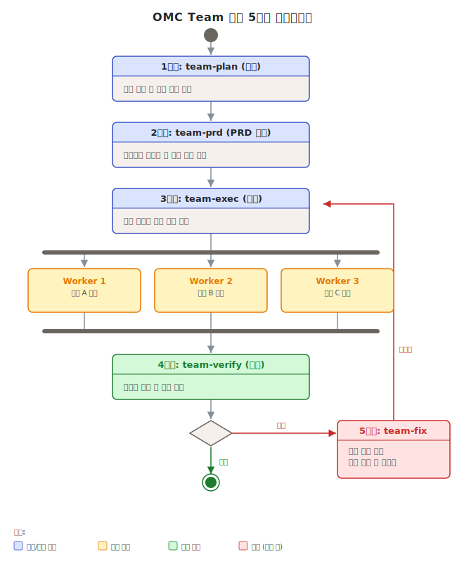
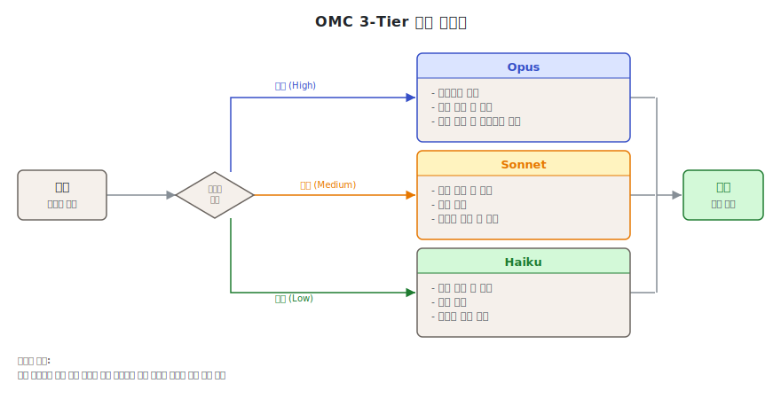
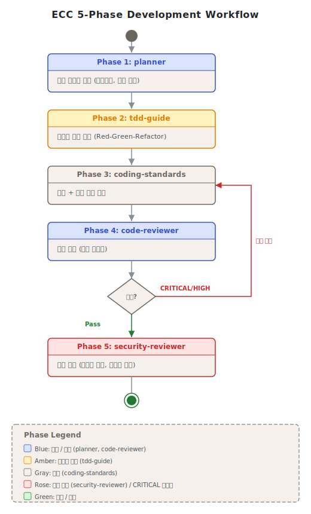
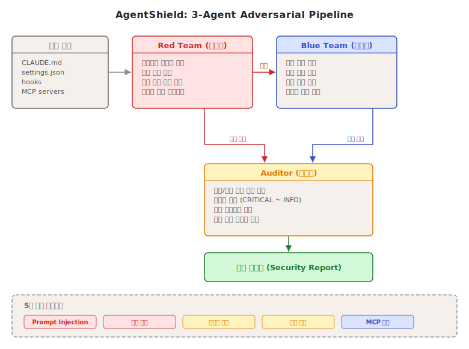
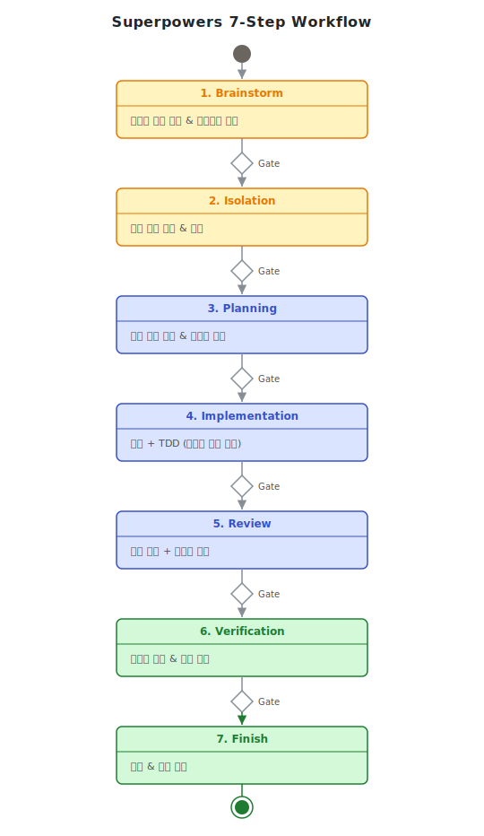
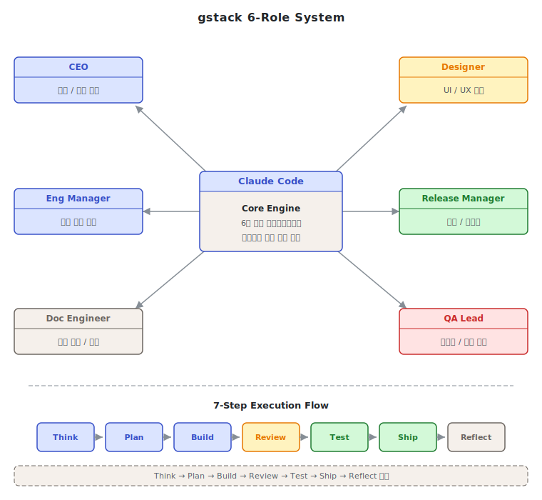
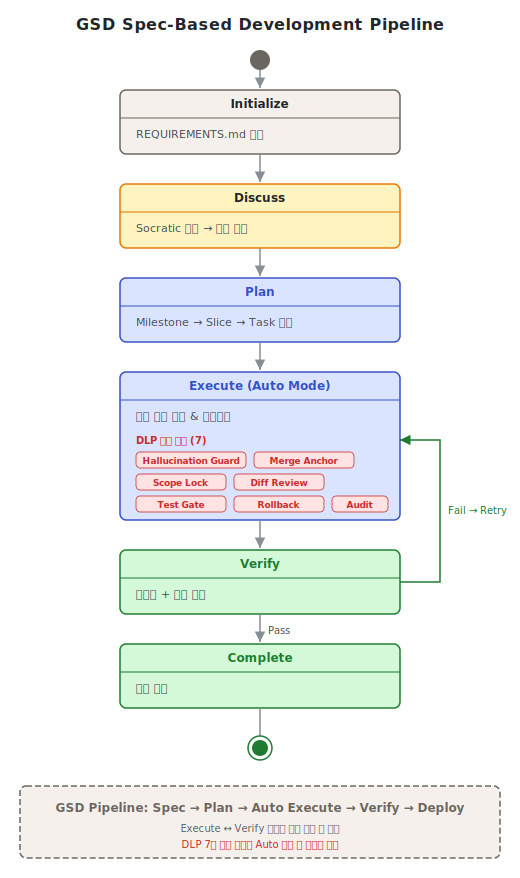
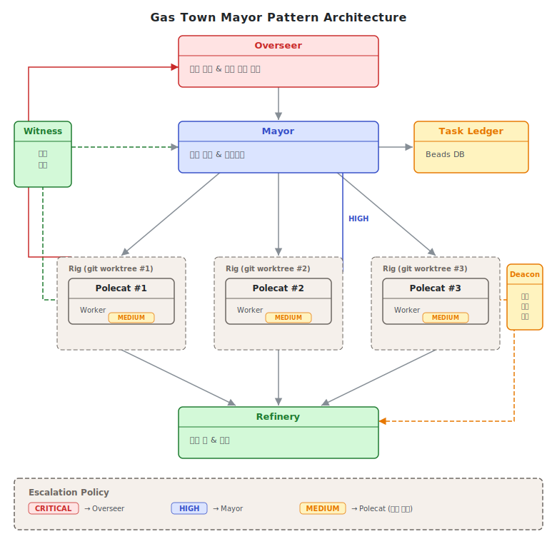

# 제8단원. 실전 도구 분석 — 주요 Claude Code 도구 비교

---

## 학습 목표

이 단원을 마치면 다음을 할 수 있다:

1. 6개 주요 Claude Code 오케스트레이션 도구의 핵심 특성을 설명할 수 있다
2. 10개 이상의 차원에서 도구를 비교 분석할 수 있다
3. 프로젝트 상황에 맞는 도구를 선택하고 조합할 수 있다

---

2025~2026년 사이 Claude Code 생태계에서는 멀티에이전트 오케스트레이션 도구가 폭발적으로 등장하였다. 이 단원에서는 가장 영향력 있는 6개 도구를 체계적으로 분석한다.

---

## 8.1 oh-my-claudecode (OMC)

> **"A weapon, not a tool."**

### 프로젝트 개요

| 항목 | 내용 |
|------|------|
| GitHub | [Yeachan-Heo/oh-my-claudecode](https://github.com/Yeachan-Heo/oh-my-claudecode) |
| 저자 | Yeachan Heo (Bellman) — 퀀트 트레이딩 종사자 |
| 스타 | ~26,400 |
| 핵심 | 32 에이전트, 5 실행 모드, 3티어 모델 라우팅 |
| npm | `oh-my-claude-sisyphus` (v4.11.2) |

### 5가지 실행 모드

| 모드 | 동시 워커 | 모델 라우팅 | 적합한 상황 |
|------|----------|-----------|-----------|
| **Autopilot** | 1 | 자동 (의도 기반) | 표준 작업, 단일 포커스 |
| **Ultrapilot** | 최대 5 | 3레이어 아키텍처 | 20+ 파일 리팩토링 |
| **Swarm** | N | 복잡도 기반 | 독립적 다수 마이크로태스크 |
| **Pipeline** | 1 (순차) | 단계별 최적 | 구조화된 순차 워크플로우 |
| **Ecomode** | 1 | Haiku 우선 | 비용 제한 환경 |

### Team 모드 5단계 파이프라인



```
team-plan(Opus) → team-prd(Opus) → team-exec(Sonnet) → team-verify(Sonnet) → team-fix(Sonnet)
```

### 32 에이전트 티어 분포



| 티어 | 수량 | 비율 | 대표 에이전트 |
|------|------|------|-------------|
| Opus (심층 추론) | 8 | 25% | architect, planner, critic, team-lead |
| Sonnet (루틴 실행) | 16 | 50% | executor, debugger, verifier, security-auditor |
| Haiku (단순/반복) | 8 | 25% | explore, git-master, formatter, searcher |

### Ralph 모드 (영속 실행)

시지프스 모티프에서 영감을 받은 영속 실행 모드이다. Rate limit에 걸려도 지수 백오프로 자동 대기 후 재개하며, 검증 통과까지 무한 반복한다.

```
Planner(Opus) → Executor(Sonnet) → Verifier(Sonnet) → PASS? → 완료
                                         │
                                        FAIL
                                         │
                                   Debugger(Sonnet) → Planner로 돌아감
```

### 한계 및 주의사항

- **설치 복잡도**: tmux, Node.js(npm), Claude Code 동시 요구. Windows는 WSL 필요로 실험적 지원에 그침
- **Ultrapilot 비용**: 5 워커 동시 실행 시 단일 세션 대비 토큰 사용량 3~7배 증가. API 비용 예측이 어렵다
- **Ralph 무한 루프 위험**: 검증 조건이 잘못 설계되면 무한 반복에 빠질 수 있다. 최대 반복 횟수(`maxTurns`)를 반드시 설정해야 한다
- **32 에이전트의 커스터마이징 복잡도**: 에이전트 수가 많아 프로젝트 특화 수정이 번거롭다
- **커뮤니티 규모**: 스타 수 ~26K로 상대적으로 소규모. 이슈 해결이 느릴 수 있다

---

## 8.2 Everything Claude Code (ECC)

> **"The agent harness performance optimization system"**

### 프로젝트 개요

| 항목 | 내용 |
|------|------|
| GitHub | [affaan-m/everything-claude-code](https://github.com/affaan-m/everything-claude-code) |
| 저자 | Affaan Mustafa — Anthropic 해커톤 우승자 |
| 스타 | ~145,700 (GitHub Global Rank #46) |
| 핵심 | 47 에이전트, 181 스킬, AgentShield 보안, 크로스플랫폼 |
| 테스트 | 1,282개 (98% 커버리지) |

### 에이전트 카테고리

| 카테고리 | 수량 | 예시 |
|---------|------|------|
| Core Workflow | 9 | planner, architect, code-reviewer, tdd-guide |
| Infrastructure/Meta | 5 | chief-of-staff, loop-operator, eval-harness |
| Language-Specific Reviewers | 8 | go-reviewer, rust-reviewer, python-reviewer |
| Build Resolvers | 5 | go-build-resolver, rust-build-resolver |
| Domain-Specific | 1+ | database-reviewer |
| 기타 | 19 | api-designer, docker-advisor, react-reviewer |

### ECC 개발 워크플로우



ECC의 전체 개발 워크플로우는 위 다이어그램과 같이, chief-of-staff orchestrator가 최상위에서 작업을 분배하고, 각 언어별/도메인별 전문 에이전트가 병렬로 작업한 뒤, eval-harness가 품질을 검증하는 구조이다.

### AgentShield 3-에이전트 적대적 파이프라인



```
Red Team (공격자) → Blue Team (방어자) → Auditor (감사자)
  공격 벡터 탐색      방어 수준 평가       최종 보안 등급
```

- 102개 정적 분석 규칙, 5개 카테고리
- 25+ MCP 취약점 데이터베이스
- `--opus` 플래그로 3-에이전트 적대적 분석 활성화

### CL2 지속 학습 시스템 (Instinct)

ECC의 고유 기능인 CL2(Continuous Learning v2)는 에이전트가 세션 간에 학습한 패턴을 유지하는 메커니즘이다. `/instinct-status`, `/instinct-import`, `/instinct-export` 커맨드로 관리한다.

### 한계 및 주의사항

- **크로스플랫폼의 범위**: 비교 매트릭스에서 "6개 도구 지원"은 Claude Code, Cursor, Windsurf, Zed, Continue, Copilot 등의 코딩 어시스턴트 도구를 의미한다. 범용 지원이 아니라 코딩 어시스턴트에 한정된다
- **181 스킬의 초기 진입 장벽**: 스킬 수가 많아 새 팀원이 학습하는 데 시간이 필요하다. 팀 전체가 ECC를 사용하지 않으면 효과가 반감된다
- **CL2(Instinct)의 한계**: 세션 간 학습이 실제 모델 업데이트가 아닌 프롬프트 컨텍스트에 의존한다. 컨텍스트 윈도우를 많이 소비할 수 있다
- **AgentShield 오탐**: 102개 규칙 기반 정적 분석은 컨텍스트를 이해하지 못하므로 오탐(false positive)이 발생할 수 있다

---

## 8.3 Superpowers

> **"An agentic skills framework & software development methodology that works."**

### 프로젝트 개요

| 항목 | 내용 |
|------|------|
| GitHub | [obra/superpowers](https://github.com/obra/superpowers) |
| 저자 | Jesse Vincent (obra) — RT 창시자 |
| 스타 | ~107,000 (2026년 4월 기준, Claude Code 플러그인 최다) |
| 핵심 | 강제적 스킬, TDD 사이클 강제, 7단계 워크플로우 |
| 최초 출시 | 2025.10.09 (Anthropic 플러그인 시스템 출시 당일) |

### 핵심 철학: "제안이 아닌 강제"



Superpowers는 스킬이 **제안(suggestion)이 아닌 강제(enforcement)**라는 점에서 다른 도구와 근본적으로 다르다.

```
기존 CLAUDE.md:                    Superpowers:
"테스트를 먼저 작성하라"             스킬 발견 → 로드 → 실행 강제
     │                                │
     ▼                                ▼
 에이전트가 무시                     게이트가 차단
 → 테스트 없는 코드                  → RED 테스트 없으면 구현 불가
```

### 7단계 개발 워크플로우

```
brainstorming → writing-plans → using-git-worktrees
→ subagent-driven-development (또는 dispatching-parallel-agents)
→ verification-before-completion → requesting-code-review
→ finishing-a-development-branch
```

### 주요 스킬 (20+ 핵심)

| 카테고리 | 스킬 | 역할 |
|---------|------|------|
| 워크플로우 코어 | brainstorming, writing-plans, executing-plans | 설계→구현 파이프라인 |
| 품질 보증 | test-driven-development, systematic-debugging | TDD + 4단계 디버깅 |
| subagent 관리 | subagent-driven-development, dispatching-parallel-agents | 작업별 subagent 파견 |
| 디버깅 | root-cause-tracing, defense-in-depth | 근본 원인 분석 |

### 한계 및 주의사항

- **"강제" 메커니즘의 실제 한계**: 스킬 강제는 Claude Code의 프롬프트 레이어에서 작동한다. 에이전트가 스킬을 무시하는 경우를 완전히 막을 수는 없으며, 강제는 권고에 가깝다
- **GitHub 스타 수**: 교재 작성 시점(2026년 4월) 기준 ~107,000 (2025년 출시 이후 성장 중)
- **모델 라우팅 부재**: 단일 모델로 모든 스킬을 실행한다. 비용 효율이 중요한 환경에서는 OMC와 조합 필요
- **7단계 워크플로우의 경직성**: 빠른 프로토타이핑이나 탐색적 작업에는 단계가 너무 많아 과도할 수 있다

---

## 8.4 gstack

> **"AI is most valuable when it runs engineering process, not when it writes code."**

### 프로젝트 개요

| 항목 | 내용 |
|------|------|
| GitHub | [garrytan/gstack](https://github.com/garrytan/gstack) |
| 저자 | Garry Tan — Y Combinator CEO |
| 스타 | ~50,000 (2026년 4월 기준, 출시 48시간 만에 10K) |
| 핵심 | 6역할 시스템, 23개 도구, 브라우저 자동화 |
| 저자의 생산성 | 주당 10K 라인 코드 + 100 PR |

### 6가지 역할 시스템



| 역할 | 핵심 기능 | 게이트 유형 |
|------|----------|-----------|
| **CEO** | 제품 방향 검증, YC 오피스아워 시뮬레이션 | 정보 제공 |
| **Designer** | AI 슬롭 감지, 디자인 시스템 구축 | 정보 제공 |
| **Eng Manager** | 아키텍처 리뷰, 코드 리뷰 | **필수 게이트** |
| **Release Manager** | PR 생성, 카나리 배포, 벤치마크 | 실행 |
| **Doc Engineer** | diff 기반 문서 드리프트 감지 및 갱신 | 실행 |
| **QA Lead** | 실제 Chromium 브라우저 테스트, 보안 감사 | 실행 |

### 브라우저 자동화

- Playwright 기반 **영속 헤드리스 Chromium 데몬**
- 콜드 스타트 3~5초, 웜 호출 100~200ms
- 바이너리 크기 ~58MB (Bun 컴파일)
- 실제 브라우저에서 쿠키 임포트 가능

### 한계 및 주의사항

- **단일 세션 실행**: 병렬 에이전트를 지원하지 않는다. 대규모 프로젝트에서는 OMC나 GSD와 조합 필요
- **브라우저 자동화 의존**: Chromium 데몬이 필요하므로 CI/CD 환경이나 서버리스 환경에서 제약이 있다
- **Eng Manager 게이트가 필수 병목**: 모든 코드가 Eng Manager 게이트를 통과해야 하므로, 이 역할의 설정이 부실하면 전체 워크플로우가 느려진다
- **스타 수 불안정**: 빠른 성장(48시간 10K)은 바이럴 효과에 의존하며, 장기 유지보수 여부를 보장하지 않는다
- **커스터마이징 진입 장벽**: 6가지 역할의 프롬프트를 프로젝트에 맞게 수정하려면 각 역할의 의도와 게이트 로직을 깊이 이해해야 한다. 기본 설정만으로는 YC 스타일 제품 개발에 특화되어 있어 다른 도메인에 적용 시 조정이 필요하다

---

## 8.5 GSD (Get Stuff Done)

> **"A powerful meta-prompting, context engineering and spec-driven development system."**

### 프로젝트 개요

| 항목 | 내용 |
|------|------|
| GitHub | [gsd-build/gsd-2](https://github.com/gsd-build/gsd-2) |
| 저자 | Lex Christopherson (TACHES) |
| 스타 | ~35,000 |
| 핵심 | 스펙 기반 개발, 메타프롬프팅, 7가지 DLP 안전장치 |

### 스펙 기반 개발: 마일스톤 → 슬라이스 → 태스크



```
마일스톤 (릴리스 가능한 가치 단위)
  └── 슬라이스 (독립 배포 가능한 기능 조각)
        └── 태스크 (단일 컨텍스트 윈도우 내 완결)
```

### 컨텍스트 엔지니어링의 핵심

GSD v2의 가장 강력한 특성은 **태스크별 깨끗한 컨텍스트**이다:

```
단일 세션:  시작: 10% → 중간: 60% → 끝: 95% (품질 저하)
GSD:       태스크 1: 20% | 태스크 2: 20% | 태스크 3: 20%
           → 태스크 50이 태스크 1과 동일 품질
```

### 7가지 DLP 안전장치

| 안전장치 | 역할 |
|---------|------|
| 환각 가드 | 도구 호출 0회 태스크를 환각으로 판정 |
| 머지 앵커 검증 | 워크트리 해체 전 데이터 손실 방지 |
| 더티 트리 감지 | 커밋 안 된 변경의 워크트리 삭제 방지 |
| 크래시 복구 | auto.lock + PID 추적 → 자동 재개 |
| 교착 감지 | 동일 태스크 반복 실패 루프 감지 |
| 스냅샷 | 실행 전 상태 백업 |
| 사전 머지 검사 | 머지 전 자동 검증 |

### 한계 및 주의사항

- **스펙 품질에 극도로 의존**: 마일스톤/슬라이스/태스크 정의가 부정확하면 전체 시스템이 잘못된 방향으로 작동한다. 초기 스펙 작성에 상당한 노력이 필요하다
- **학습 곡선**: 메타프롬프팅 개념과 GSD의 고유 용어(wave, slice, task 등)를 익히는 데 시간이 필요하다
- **12개 도구 지원의 복잡성**: 지원 범위가 넓지만, 각 도구와의 통합 품질에 차이가 있다

---

## 8.6 Gas Town

> **"Kubernetes for AI agents."**

### 프로젝트 개요

| 항목 | 내용 |
|------|------|
| GitHub | [steveyegge/gastown](https://github.com/steveyegge/gastown) |
| 저자 | Steve Yegge — 전 Google/Amazon 엔지니어 |
| 스타 | ~13,200 |
| 핵심 | Mayor 패턴, Beads 영속 메모리, 3단계 에스컬레이션 |
| 언어 | Go |

### Mayor 패턴



```
Overseer (인간) → Mayor (수석 에이전트) → Polecat (워커, 임시)
                       │
                  ┌────┼────┐
                  ▼    ▼    ▼
              Witness  Refinery  Deacon
              (감시)   (머지)    (순찰)
```

### Beads 영속 메모리 시스템

모든 상태가 git으로 백업되는 이슈 트래킹 시스템이다. MEOW(Molecular Expression of Work) 스택으로 크래시 복구 가능한 작업 오케스트레이션을 구현한다.

**비결정적 경로, 결정적 결과**: 에이전트가 매번 다른 접근법을 선택할 수 있지만, 수락 기준이 명시적이므로 결과는 수렴한다.

### 3단계 에스컬레이션

| 심각도 | 라우팅 |
|--------|--------|
| CRITICAL (P0) | Polecat → Deacon → Mayor → **Overseer** |
| HIGH (P1) | Polecat → Deacon → **Mayor** |
| MEDIUM (P2) | Polecat → **Deacon** |

### 한계 및 주의사항

- **Go 언어 의존**: Go 런타임 필요. Python/Node.js 생태계에 익숙한 팀은 별도 환경 설정 필요
- **Windows 미지원**: Unix/Linux/macOS 전용. Windows 개발 환경에서는 사용 불가
- **설치 복잡도**: 6개 도구 중 가장 높은 설치 복잡도. Docker, Go, git 등의 사전 설정 필요
- **Beads 시스템의 운영 부담**: git 기반 상태 관리는 강력하지만, 많은 bead 항목이 쌓이면 관리가 복잡해진다
- **소규모 커뮤니티**: 스타 수 ~13K로 6개 도구 중 가장 낮음. 공식 문서 미흡, 이슈 해결 지원이 제한적

---

## 8.7 통합 비교 매트릭스

| 차원 | OMC | ECC | Superpowers | gstack | GSD | Gas Town |
|------|-----|-----|------------|--------|-----|----------|
| **접근법** | 멀티에이전트 오케스트레이션 | 에이전트 하네스 최적화 | 스킬/방법론 프레임워크 | 역할 기반 스킬 팩 | 메타프롬프팅+스펙 | 멀티에이전트 워크스페이스 |
| **에이전트 수** | 32 | 47 | 38(+subagent) | - | - | 7 역할 |
| **스킬 수** | 43 | 181 | 156 | 23+8 | 44(v1) | TOML Formula |
| **병렬 실행** | 최대 5 워커 | 단일 세션 | subagent 파견 | 단일 세션 | 웨이브 병렬 | 12~30 Polecat |
| **모델 라우팅** | 3티어 자동 | 에이전트별 지정 | 없음(동적) | 브라우저 작업별 | 없음 | 없음 |
| **Git 격리** | worktree | 없음 | worktree | 없음 | worktree | git 기반 전체 |
| **영속 실행** | Ralph 모드 | 없음 | 없음 | 없음 | auto 모드 | Beads+Molecule |
| **보안** | 훅 기반 | AgentShield 102규칙 | 도구 화이트리스트 | /careful, /freeze | DLP 7가지 | 에스컬레이션 |
| **크로스플랫폼** | Claude Code | 6개 도구[^1] | 6개 도구[^1] | 7개 도구[^2] | 12개 도구[^3] | Claude Code |
| **Windows** | 실험적(WSL) | 전체 지원 | 지원 | 부분 지원 | 지원 | 미지원 |
| **설치 복잡도** | 중간 | 낮음 | 매우 낮음 | 낮음 | 낮음 | 높음 |
| **GitHub 스타** | ~26K | ~145K | ~137K | ~50K | ~35K | ~13K |

**크로스플랫폼 각주**:
- [^1]: Claude Code, Cursor, Windsurf, Zed, Continue, Copilot (코딩 어시스턴트 6개)
- [^2]: 위 6개 + JetBrains (7개)
- [^3]: 위 7개 + VS Code, Neovim, Emacs 등 확장 지원 (12개)

---

## 8.8 상황별 선택 가이드

| 상황 | 1순위 추천 | 이유 | 2순위 |
|------|-----------|------|-------|
| 즉시 속도 3~5배 향상 | **OMC** (Ultrapilot) | tmux 병렬, worktree 격리 | Gas Town |
| 체계적 코드 품질 + 보안 | **ECC** (AgentShield) | 102 정적 규칙, Red/Blue Team | Superpowers |
| SDLC 전체 강제 | **Superpowers** | 강제적 스킬, TDD 사이클 | ECC |
| 빠른 시작 + 실전 검증 | **gstack** | YC CEO 실전 설정, 30초 설치 | Superpowers |
| 장기 자율 실행 | **GSD** (auto 모드) | 깨끗한 컨텍스트, DLP 7가지 | OMC (Ralph) |
| Steve Yegge 스타일 공장 | **Gas Town** | Mayor 패턴, Beads 영속 | OMC |
| Windows 환경 | **ECC** | v1.1.0부터 완전 Node.js | GSD |
| 최소 오버헤드 | **gstack** | 마크다운 프롬프트만, PATH 미수정 | Superpowers |

---

## 8.9 도구 조합 전략

이 도구들은 상호 배타적이지 않다. 실무에서는 **레이어별로 조합**하여 사용할 수 있다:

### 전략 1: 방법론 + 오케스트레이션

```
Superpowers (방법론 레이어)
    + OMC (오케스트레이션 레이어)

→ Superpowers가 TDD, 계획, 리뷰를 강제하고
  OMC가 병렬 실행과 모델 라우팅을 담당
```

### 전략 2: 보안 + 역할

```
ECC AgentShield (보안 레이어)
    + gstack (역할 기반 워크플로우)

→ gstack의 6역할 워크플로우에
  ECC의 보안 스캐닝을 추가
```

### 전략 3: 스펙 기반 + 영속 실행

```
GSD (스펙 + 컨텍스트 엔지니어링)
    + OMC Ralph (영속 실행)

→ GSD가 마일스톤/슬라이스/태스크를 관리하고
  Ralph가 rate limit 대응을 처리
```

### 전략 조합 시 .claude/ 디렉터리 구성 예시

도구를 레이어별로 조합할 때 `.claude/` 디렉터리는 다음과 같이 구성한다 (전략 1 기준):

```
.claude/
├── settings.json               # 공통 설정 (훅, 권한 등)
├── agents/
│   ├── omc/                    # OMC 에이전트 정의
│   │   ├── architect.md
│   │   ├── executor.md
│   │   └── verifier.md
│   └── custom/                 # 프로젝트 특화 에이전트
│       └── domain-expert.md
├── skills/
│   ├── superpowers/            # Superpowers 스킬 (방법론 레이어)
│   │   ├── SKILLS.md
│   │   ├── brainstorming.md
│   │   └── test-driven-development.md
│   └── project/                # 프로젝트 특화 스킬
│       └── deploy-prod.md
└── hooks/
    ├── pre-tool-use.sh          # 도구 실행 전 검증
    └── post-tool-use.sh         # 도구 실행 후 정리
```

---

## 8.10 리뷰어 비율 규칙 (실무 가이드라인)

원본 연구(8_multi_agent_orchestration_patterns.md 4.3절)에서 제시하는 중요한 실무 원칙이다.

### 규칙

**빌더(builder) 에이전트 3~4명당 전담 리뷰어(reviewer) 에이전트 1명**을 배치하여 지속적 품질 게이트를 제공한다.

```
Builder A ──▶ ┐
Builder B ──▶ ┤──▶ Reviewer (1명): 지속적 코드 리뷰
Builder C ──▶ ┘
```

### 근거

- 리뷰어 1명이 빌더 5명 이상을 담당하면 리뷰가 병목이 되어 전체 파이프라인이 지연된다
- 리뷰어 수가 빌더 수와 같으면 불필요한 비용이 발생한다 (리뷰 대기 시간 증가)
- 빌더 3~4명: 리뷰어 1명 비율이 실험적으로 최적 균형점으로 확인되었다

### 실전 적용

OMC의 경우 code-reviewer 에이전트가 리뷰어 역할을 담당한다. Ultrapilot에서 4 워커(빌더) + 1 verifier(리뷰어) 구성이 이 비율을 따른다.

ECC는 47개 에이전트 중 code-reviewer를 포함한 Language-Specific Reviewers 8개를 별도 카테고리로 분리하여, 리뷰어 풀을 명시적으로 관리한다.

Gas Town의 경우, Mayor 오케스트레이터가 작업 완료 후 QA Polecat을 리뷰어로 파견하는 구조로 비율을 유연하게 조정한다. 작업 규모에 따라 QA Polecat 수를 늘리거나 줄일 수 있다.

### 비율 위반 시 증상

리뷰어 비율 규칙을 어기면 다음 증상이 나타난다:
- **리뷰어 부족(1:5+)**: 리뷰 큐 지연, 미리뷰 코드 축적, 기술 부채 증가
- **리뷰어 과잉(1:1~2)**: 빌더 대기 시간 증가, 리뷰어 유휴 상태, 비용 낭비
- **리뷰어 없음**: 빌더 오류가 파이프라인 끝까지 전파, 후반 수정 비용 급증

> **핵심 정리: 도구 선택의 3원칙**
>
> 1. **가장 단순한 것부터 시작한다** — gstack 또는 Superpowers로 시작하여 병목이 발견되면 확장
> 2. **문제에 맞는 도구를 선택한다** — 속도 문제면 OMC, 품질 문제면 ECC, 프로세스 문제면 Superpowers
> 3. **레이어별로 조합한다** — 방법론, 오케스트레이션, 보안은 서로 다른 레이어이므로 조합 가능

---

## 복습 질문

1. OMC의 5가지 실행 모드를 각각 설명하고, 20파일 리팩토링 작업에 가장 적합한 모드를 선택하여 그 이유를 서술하라.

2. ECC의 AgentShield 3-에이전트 적대적 파이프라인(Red Team/Blue Team/Auditor)의 각 에이전트 역할을 설명하라.

3. Superpowers의 "강제적 스킬" 접근법이 기존 CLAUDE.md 방식보다 효과적인 이유를 구조적으로 설명하라.

4. GSD의 "태스크별 깨끗한 컨텍스트" 전략이 해결하는 문제(컨텍스트 부패)를 설명하고, 이것이 품질에 미치는 영향을 논하라.

5. 통합 비교 매트릭스를 참고하여, "10명 규모 팀의 마이크로서비스 프로젝트"에 적합한 도구 조합을 설계하고 그 근거를 제시하라.

---

*이전 단원: [제7단원. 오류 처리 및 안전](07_오류_처리_및_안전.md) | 다음 단원: [제9단원. 에이전트 구현 가이드](09_에이전트_구현_가이드.md)*
