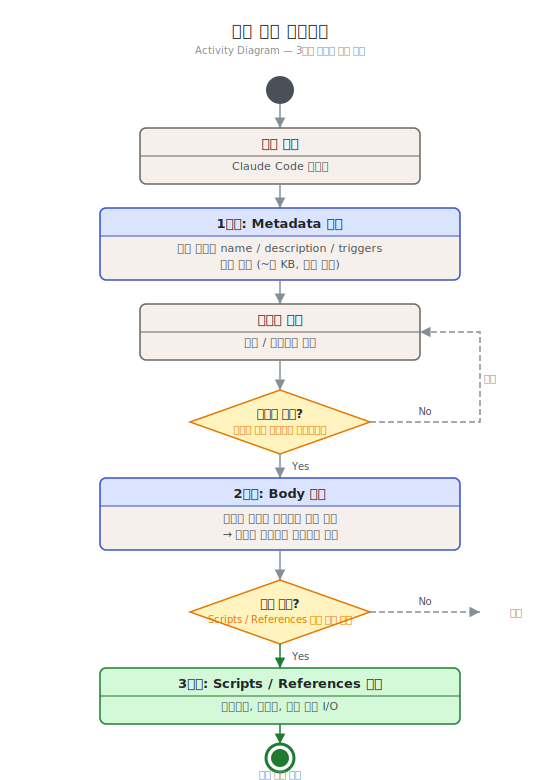
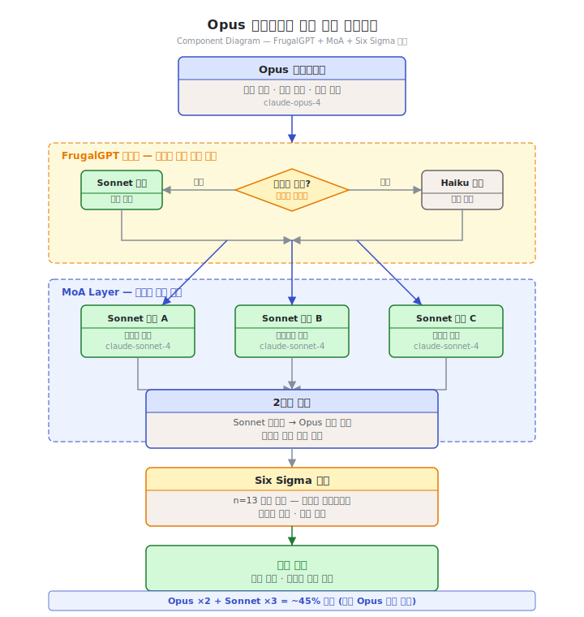

# 제9단원. 에이전트 구현 가이드 — 에이전트를 직접 만들기

---

## 학습 목표

이 단원을 마치면 다음을 할 수 있다:

1. YAML frontmatter + Markdown 형식으로 에이전트 정의 파일을 작성할 수 있다
2. SKILL.md 형식으로 스킬을 정의하고 3단계 로딩 프로세스를 이해할 수 있다
3. hooks.json으로 생명주기 이벤트에 자동화를 등록할 수 있다
4. 모델 티어 배정 전략을 설계할 수 있다
5. 코드 리뷰 에이전트를 직접 만들 수 있다

---

## 9.1 에이전트 정의 파일 형식

### YAML Frontmatter + Markdown Body

Claude Code의 에이전트는 `.md` 파일로 정의된다. 파일 상단에 YAML frontmatter로 메타데이터를, 본문에 시스템 프롬프트를 기술한다.

```markdown
---
name: "code-reviewer"
model: "claude-sonnet-4-20250514"
description: "코드 리뷰 전문 에이전트. 변경된 코드의 품질, 패턴, 보안 이슈를 분석한다."
tools:
  - "Read"
  - "Grep"
  - "Glob"
  - "Bash(git diff:*)"
  - "Bash(git log:*)"
disallowed-tools:
  - "Write"
  - "Edit"
  - "Bash(rm:*)"
category: "quality"
---

# Code Reviewer Agent

## 역할
변경된 코드를 분석하여 품질, 패턴 준수, 보안, 성능 이슈를 발견한다.

## 리뷰 기준

### CRITICAL (즉시 수정 필수)
- 보안 취약점 (SQL 인젝션, XSS, 인증 우회)
- 데이터 손실 가능성
- 무한 루프 / 메모리 누수

### HIGH (병합 전 수정 권장)
- 에러 핸들링 누락
- 경쟁 조건
- 성능 병목

## 출력 형식
이슈별로 [등급] 파일:라인 — 설명 형태로 출력한다.
```

### 필드 상세

| 필드 | 타입 | 필수 | 설명 |
|------|------|------|------|
| `name` | string | Y | 에이전트 고유 식별자 |
| `model` | string | N | 사용할 모델. 미지정 시 세션 기본 모델 |
| `description` | string | Y | 역할 설명. 오케스트레이터가 위임 시 참조 |
| `tools` | list | N | 허용 도구 목록 |
| `allowed-tools` | list | N | 화이트리스트 (이 목록만 허용) |
| `disallowed-tools` | list | N | 블랙리스트 (이 목록은 차단) |
| `category` | string | N | 분류 (orchestrator, quality, workflow 등) |
| `maxTurns` | number | N | 최대 대화 턴 수 |
| `temperature` | number | N | 모델 temperature (0.0~1.0) |

### 도구 접근 제어

**화이트리스트 vs 블랙리스트**: `allowed-tools`가 존재하면 블랙리스트는 무시된다. Bash 도구는 콜론 패턴으로 세분화할 수 있다:

```yaml
tools:
  - "Bash(git diff:*)"     # git diff 관련 명령만 허용
  - "Bash(npm test:*)"     # npm test만 허용
```

---

## 9.2 스킬 정의 형식

### SKILL.md 구조

스킬은 `skills/` 디렉토리 하위에 개별 디렉토리로 구성된다:

```
skills/
└── my-review/
    ├── SKILL.md           ← 스킬 정의 (필수)
    ├── templates/         ← 템플릿 (선택)
    └── scripts/           ← 자동화 스크립트 (선택)
```

```markdown
---
name: "my-review"
description: "변경된 코드를 리뷰하고 이슈를 분류한다."
category: "quality"
triggers:
  - "코드 리뷰"
  - "code review"
  - "리뷰해줘"
allowed-tools:
  - "Read"
  - "Grep"
disable-model-invocation: false
---

# Code Review Skill

## 프로세스
1. `git diff` 를 실행하여 변경된 파일 목록을 확인한다
2. 각 변경 파일을 읽고 이슈를 분류한다
3. CRITICAL > HIGH > MEDIUM > LOW 순서로 보고한다
4. 개선 제안을 포함한다

## 출력 형식
| 등급 | 파일:라인 | 설명 | 제안 |
|------|----------|------|------|
```

### 3단계 로딩 프로세스

스킬은 성능 최적화를 위해 점진적으로 로딩된다:

```
[세션 시작]
    │
    ▼
1단계: Metadata 로딩 (모든 스킬의 name/description/triggers)
    │  메모리: ~수 KB
    │
    │ 사용자 입력 → 트리거 매칭
    ▼
2단계: Body 로딩 (매칭된 스킬의 마크다운 본문)
    │  컨텍스트에 주입
    │
    │ 실행 필요 시
    ▼
3단계: Scripts/References 로딩 (스크립트, 템플릿)
       파일 I/O 발생
```



---

## 9.3 훅 시스템

### hooks.json 구조

훅은 Claude Code의 생명주기 이벤트에 등록되는 스크립트이다:

```json
{
  "hooks": {
    "PreToolUse": [
      {
        "matcher": "Write|Edit",
        "command": "node .claude/hooks/detect-secrets.js",
        "description": "시크릿 패턴 감지"
      }
    ],
    "PostToolUse": [
      {
        "matcher": "Bash",
        "command": "node .claude/hooks/analyze-build.js",
        "description": "빌드 결과 분석"
      }
    ],
    "SessionStart": [
      {
        "matcher": "",
        "command": "node .claude/hooks/session-init.js",
        "description": "세션 초기화"
      }
    ]
  }
}
```

### 주요 이벤트 타입

| 이벤트 | 시점 | 용도 |
|--------|------|------|
| `SessionStart` | 세션 시작 | 환경 정보 주입, 메모리 복원 |
| `SessionEnd` | 세션 종료 | 메모리 저장, 정리 |
| `PreToolUse` | 도구 사용 전 | 위험 명령 차단, 시크릿 감지 |
| `PostToolUse` | 도구 사용 후 | 빌드 분석, 감사 로그 |
| `PreSendMessage` | 메시지 전송 전 | 키워드 감지, 스킬 라우팅 |
| `PostSendMessage` | 응답 후 | 영속 모드 유지 |

### Exit Code 규약

| Exit Code | 의미 | 동작 |
|-----------|------|------|
| `0` | 성공 | stdout의 JSON 처리 |
| `1` | 실패 | 훅 무시, 원래 동작 계속 |
| `2` | 차단 | 현재 동작 중단 (보안 훅 등) |

### 보안 훅 예시: 시크릿 감지

```javascript
// hooks/detect-secrets.js
const SECRET_PATTERNS = [
  { name: "AWS Access Key", pattern: /AKIA[0-9A-Z]{16}/ },
  { name: "GitHub Token", pattern: /ghp_[a-zA-Z0-9]{36}/ },
  { name: "Anthropic Key", pattern: /sk-ant-[a-zA-Z0-9-]{95}/ },
  { name: "Private Key", pattern: /-----BEGIN\s+(RSA\s+)?PRIVATE\sKEY-----/ },
];

const input = JSON.parse(require("fs").readFileSync("/dev/stdin", "utf-8"));
const content = input.data?.content || "";
const found = SECRET_PATTERNS.filter(s => s.pattern.test(content));

if (found.length > 0) {
  console.log(JSON.stringify({
    action: "block",
    message: `시크릿 감지: ${found.map(f => f.name).join(", ")}`
  }));
  process.exit(2); // 차단
} else {
  process.exit(0); // 통과
}
```

---

## 9.4 모델 티어 배정 전략

### 3티어 원칙

OMC에서 검증된 3티어 배정 전략이다:

| 기준 | Opus ($$$$) | Sonnet ($$) | Haiku ($) |
|------|-----------|-----------|---------|
| **추론 깊이** | 다단계 추론 필요 | 단순 추론 | 추론 불필요 |
| **창의성** | 설계 결정, 대안 비교 | 명세 기반 구현 | 패턴 적용 |
| **오류 비용** | 오류 시 재작업 비용 큼 | 오류 시 재작업 가능 | 오류 시 즉시 재시도 |

### 배정 매트릭스

```
┌───────────────────────┬────────┬────────┬────────┐
│ 태스크 유형             │ Opus   │ Sonnet │ Haiku  │
├───────────────────────┼────────┼────────┼────────┤
│ 아키텍처 설계           │   ✓    │        │        │
│ 코드 리뷰 (핵심 모듈)   │   ✓    │        │        │
│ 기술 전략 수립           │   ✓    │        │        │
├───────────────────────┼────────┼────────┼────────┤
│ 코드 구현               │        │   ✓    │        │
│ 단위 테스트 작성         │        │   ✓    │        │
│ 버그 수정               │        │   ✓    │        │
│ 보안 감사               │        │   ✓    │        │
├───────────────────────┼────────┼────────┼────────┤
│ 코드 탐색/검색          │        │        │   ✓    │
│ Git 작업                │        │        │   ✓    │
│ 코드 포맷팅             │        │        │   ✓    │
└───────────────────────┴────────┴────────┴────────┘
```

---

## 9.5 CLAUDE.md 설계 원칙

### 원칙 1: 컨텍스트 효율성

CLAUDE.md가 너무 길면 매 턴마다 토큰이 낭비된다. 핵심 규칙만 포함하고, 상세한 지침은 스킬/규칙 파일로 분리한다.

### 원칙 2: 마커 기반 보존

OMC의 마커 패턴을 참고하여, 자동 생성 영역과 사용자 영역을 분리한다:

```markdown
# My Project

사용자가 직접 작성한 프로젝트 규칙

<!-- AUTO:START -->
자동 생성 설정 (도구가 관리)
<!-- AUTO:END -->

사용자가 추가한 다른 규칙
```

### 원칙 3: 에이전트 라우팅 규칙 포함

모델 티어 배정 규칙을 CLAUDE.md에 명시하여, 에이전트가 자율적으로 올바른 판단을 내릴 수 있게 한다.

### 프로젝트 유형별 CLAUDE.md 템플릿

**웹 앱 프로젝트 템플릿**

```markdown
# [프로젝트명] Web App

## 기술 스택
- Backend: FastAPI (Python 3.11+)
- Frontend: React 18 + TypeScript
- DB: PostgreSQL 15, Redis 7
- 테스트: pytest, Vitest

## 코딩 표준
- Python: PEP 8, type hints 필수, docstring 필수
- TypeScript: strict 모드, any 금지
- 모든 함수에 단위 테스트 작성

## 에이전트 라우팅 규칙
- 아키텍처 결정 → Opus
- 코드 구현 (100줄 이상) → Sonnet
- 코드 구현 (100줄 미만), 리팩토링 → Sonnet
- 검색, 파일 탐색, git 작업 → Haiku

## 금지 사항
- 프로덕션 DB 직접 수정 금지
- .env 파일 수정 금지
- main/master 브랜치 직접 push 금지
```

**API 서버 프로젝트 템플릿**

```markdown
# [프로젝트명] API Server

## 아키텍처
- REST API (OpenAPI 3.0 스펙 유지)
- 모든 엔드포인트에 인증 필수
- Rate limiting: 분당 100 요청

## 변경 규칙
- API 스펙 변경 시 CHANGELOG.md 업데이트 필수
- Breaking change는 major 버전 업 후 진행
- 모든 엔드포인트 변경 시 통합 테스트 실행

## 보안 규칙
- SQL 쿼리는 반드시 파라미터화
- 사용자 입력은 항상 검증 후 사용
- 민감 데이터(비밀번호, 토큰)는 로그에 출력하지 않음
```

**모노레포 프로젝트 템플릿**

```markdown
# [조직명] Monorepo

## 패키지 구조
packages/
  api/        - Express API 서버
  web/        - Next.js 프론트엔드
  shared/     - 공유 타입 및 유틸리티
  mobile/     - React Native 앱

## 변경 범위 규칙
- 단일 패키지 변경: 해당 패키지 테스트만 실행
- shared/ 변경: 전체 패키지 테스트 실행 필수
- 크로스 패키지 API 변경: 아키텍처 검토 후 진행

## 워크스페이스 격리
- 각 패키지는 독립 컨텍스트에서 작업
- 패키지 간 import는 shared/를 통해서만
```

### CLAUDE.md 안티패턴

**안티패턴 1: 너무 긴 CLAUDE.md**

```markdown
# 나쁜 예: 모든 규칙을 CLAUDE.md에 직접 작성
## 코딩 표준
[300줄의 상세 코딩 표준 규칙...]
## 아키텍처 가이드
[200줄의 아키텍처 설명...]
```

해결: 상세 규칙은 `.claude/rules/` 폴더에 분리하고, CLAUDE.md에는 핵심 원칙만 유지한다.

**안티패턴 2: 모호한 지시**

```markdown
# 나쁜 예
코드를 잘 작성하고 테스트를 충분히 작성한다.

# 좋은 예
모든 public 함수에 단위 테스트를 작성한다.
커버리지 80% 이상을 유지한다.
```

**안티패턴 3: 모델명 하드코딩**

```markdown
# 나쁜 예
model: "claude-opus-4-20250514"

# 좋은 예: 환경 변수 또는 설정 파일 사용
```

모델명 관리 전략: 모델명을 CLAUDE.md에 직접 쓰는 대신, `.claude/config.json`에서 관리하거나 환경 변수(`CLAUDE_CODE_DEFAULT_MODEL`)로 설정한다. 모델이 업데이트될 때 한 곳만 수정하면 된다.

---

## 9.6 실전 예시: 코드 리뷰 에이전트 만들기

### 단계 1: 에이전트 정의 파일 생성

```markdown
---
name: "my-code-reviewer"
model: "claude-sonnet-4-20250514"
description: "프로젝트 코딩 표준에 따라 코드 리뷰를 수행한다."
tools:
  - "Read"
  - "Grep"
  - "Glob"
  - "Bash(git diff:*)"
  - "Bash(git log:*)"
  - "Bash(git blame:*)"
disallowed-tools:
  - "Write"
  - "Edit"
category: "quality"
maxTurns: 30
temperature: 0.2
---

# My Code Reviewer

## 역할
변경된 코드를 프로젝트 코딩 표준에 따라 리뷰한다.
코드를 직접 수정하지 않고, 발견한 이슈를 보고한다.

## 리뷰 프로세스
1. `git diff --name-only HEAD~1`로 변경 파일 목록을 확인한다
2. 각 파일의 변경 내용을 `git diff HEAD~1 -- <파일>`로 확인한다
3. 프로젝트의 코딩 표준 파일을 참조한다
4. 이슈를 등급별로 분류한다

## 등급 체계
- **CRITICAL**: 보안 취약점, 데이터 손실 위험
- **HIGH**: 에러 핸들링 누락, 성능 병목
- **MEDIUM**: 코드 중복, 네이밍 위반
- **LOW**: 스타일 개선, 문서화 보완

## 출력 형식
각 이슈를 다음 형식으로 보고한다:

[등급] 파일명:라인번호
  문제: 발견된 이슈 설명
  제안: 개선 방안
  근거: 위반된 규칙 또는 모범 사례
```

### 단계 2: 리뷰 스킬 정의

```markdown
---
name: "project-review"
description: "프로젝트 코딩 표준에 따른 코드 리뷰를 실행한다."
triggers:
  - "코드 리뷰"
  - "리뷰"
  - "review"
category: "quality"
---

# Project Review Skill

## 활성화 조건
- 사용자가 코드 리뷰를 요청할 때
- PR 생성 직전

## 프로세스
1. my-code-reviewer 에이전트를 활성화한다
2. 변경된 파일에 대한 리뷰를 실행한다
3. CRITICAL 이슈가 0개일 때만 "리뷰 통과"로 판정한다
4. 결과를 구조화된 형식으로 보고한다
```

### 단계 3: 보안 훅 추가

```json
{
  "hooks": {
    "PreToolUse": [
      {
        "matcher": "Write|Edit",
        "command": "node .claude/hooks/review-gate.js",
        "description": "리뷰 미완료 시 코드 수정 경고"
      }
    ]
  }
}
```

---

## 9.7 실전 예시: 보안 감사 에이전트

코드 리뷰 에이전트와 다른 관점에서, 보안 취약점에만 특화된 에이전트이다.

### 단계 1: 보안 감사 에이전트 정의

```markdown
---
name: "security-auditor"
model: "claude-sonnet-4-20250514"
description: "코드베이스의 보안 취약점을 전문적으로 분석한다. OWASP Top 10 기반 검토."
tools:
  - "Read"
  - "Grep"
  - "Glob"
  - "Bash(git log:*)"
  - "Bash(git diff:*)"
  - "Bash(find:*)"
disallowed-tools:
  - "Write"
  - "Edit"
  - "Bash(rm:*)"
  - "Bash(curl:*)"
  - "Bash(wget:*)"
category: "security"
maxTurns: 50
temperature: 0.1
---

# Security Auditor Agent

## 역할
OWASP Top 10 기반으로 코드베이스의 보안 취약점을 발견하고 보고한다.
코드를 직접 수정하지 않고, 발견된 취약점만 보고한다.

## 검토 범위 (OWASP Top 10 기반)

### A01: Broken Access Control
- 인증 없는 민감 엔드포인트 접근
- 직접 객체 참조(IDOR)
- CORS 설정 오류

### A02: Cryptographic Failures
- 평문 비밀번호 저장
- 취약한 암호화 알고리즘 (MD5, SHA-1)
- 하드코딩된 비밀키

### A03: Injection
- SQL 인젝션 (문자열 직접 연결 쿼리)
- 커맨드 인젝션 (os.system, subprocess.call에 사용자 입력)
- XSS (innerHTML에 사용자 입력 직접 삽입)

### A05: Security Misconfiguration
- 디버그 모드 프로덕션 사용
- 기본 자격증명 사용
- 불필요한 기능 활성화

## 검토 프로세스
1. `grep -r "password\|secret\|api_key" --include="*.py" .`로 하드코딩 탐지
2. SQL 쿼리에서 f-string 또는 % 연산자 사용 탐지
3. subprocess/os.system 호출에서 사용자 입력 추적
4. 인증 미들웨어 적용 현황 확인

## 출력 형식
각 취약점을 다음 형식으로 보고한다:

[CRITICAL/HIGH/MEDIUM/LOW] CVE 유형
  파일: 파일명:라인번호
  코드: 취약한 코드 스니펫
  위험: 공격 시나리오 설명
  대응: 수정 방법
```

### 단계 2: 보안 감사 훅 설정

```json
{
  "hooks": {
    "PreToolUse": [
      {
        "matcher": "Bash",
        "command": "node .claude/hooks/command-allowlist.js",
        "description": "허용되지 않은 Bash 명령 차단"
      }
    ]
  }
}
```

```javascript
// hooks/command-allowlist.js
const ALLOWED_BASH_PATTERNS = [
  /^git (log|diff|status|show)/,
  /^grep /,
  /^find /,
  /^cat /,
  /^ls /,
];

const input = JSON.parse(require("fs").readFileSync("/dev/stdin", "utf-8"));
const command = input.data?.command || "";

const isAllowed = ALLOWED_BASH_PATTERNS.some(p => p.test(command));

if (!isAllowed) {
  console.log(JSON.stringify({
    action: "block",
    message: `보안 감사 에이전트: 허용되지 않은 명령 차단: ${command}`
  }));
  process.exit(2);
} else {
  process.exit(0);
}
```

---

## 9.8 Opus 코디네이터 패턴 종합 사례

Opus 코디네이터 패턴은 원본 Anthropic 연구(Explorer/Scribe 패턴)에서 도출된 실전 패턴이다. 고비용 Opus 모델을 코디네이터로, 저비용 Sonnet 모델을 실행 워커로 구성하여 비용 효율과 성능을 동시에 달성한다.

### 패턴 개요

```
Opus 코디네이터 (주 세션)
  │
  ├─▶ [FrugalGPT 라우팅] 작업 복잡도 평가
  │         │
  │         ├─ 복잡 → Sonnet 워커에 위임
  │         └─ 단순 → Haiku 워커에 위임
  │
  ├─▶ [MoA] 여러 Sonnet 워커의 응답 수집
  │         │
  │         └─ 2단계 병합: Sonnet → Opus 최종 합성
  │
  └─▶ [Six Sigma Agent] Sonnet 리뷰어들의 검증
            │
            └─ n=13, p=0.05 기준 통과 시 완료
```



### 구현 예시

```python
from anthropic import Anthropic
from typing import Literal

client = Anthropic()

def opus_coordinator_pattern(task: str) -> str:
    """
    Opus 코디네이터 패턴:
    1. Opus가 작업 복잡도를 평가하여 라우팅 결정
    2. Sonnet 워커들이 병렬로 응답 생성 (MoA)
    3. Opus가 최종 합성
    """
    
    # 1단계: Opus 코디네이터가 복잡도 평가
    routing_response = client.messages.create(
        model="claude-opus-4-20250514",
        max_tokens=100,
        messages=[{
            "role": "user",
            "content": f"다음 작업의 복잡도를 평가하라. 'HIGH' 또는 'LOW'로만 답하라: {task}"
        }]
    )
    complexity: Literal["HIGH", "LOW"] = (
        "HIGH" if "HIGH" in routing_response.content[0].text else "LOW"
    )
    
    worker_model = "claude-sonnet-4-20250514" if complexity == "HIGH" else "claude-haiku-4-20250514"
    
    # 2단계: MoA — 여러 워커가 다양한 관점으로 응답 생성
    # (실제 환경에서는 asyncio.gather로 병렬 실행)
    worker_responses = []
    for perspective in ["기술적 관점", "비즈니스 관점", "사용자 관점"]:
        r = client.messages.create(
            model=worker_model,
            max_tokens=512,
            messages=[{
                "role": "user",
                "content": f"{perspective}에서 다음 작업을 처리하라: {task}"
            }]
        )
        worker_responses.append(r.content[0].text)
    
    # 3단계: Opus 코디네이터가 워커 응답을 최종 합성
    synthesis_prompt = (
        "다음 세 가지 관점의 응답을 종합하여 최적의 최종 답변을 작성하라:\n\n"
        + "\n\n---\n\n".join(
            f"[{i+1}] {resp}" for i, resp in enumerate(worker_responses)
        )
    )
    
    final_response = client.messages.create(
        model="claude-opus-4-20250514",
        max_tokens=1024,
        messages=[{"role": "user", "content": synthesis_prompt}]
    )
    
    return final_response.content[0].text

# 사용 예시
result = opus_coordinator_pattern(
    "마이크로서비스 아키텍처에서 서비스 간 인증을 구현하는 최선의 방법을 제시하라"
)
```

### 비용 분석

| 구성 | 모델 | 예상 비용(상대) |
|------|------|--------------|
| 단순 Opus 사용 | Opus x1 | 100% |
| Opus 코디네이터 패턴 | Opus x2 + Sonnet x3 | 약 45% |
| 완전 Sonnet | Sonnet x1 | 약 8% |

Opus 코디네이터 패턴은 비용이 단순 Opus 대비 절반 이하이면서, 단순 Sonnet 대비 훨씬 높은 품질을 달성한다. MoA의 다양성 효과와 Opus 합성의 깊이가 결합되기 때문이다.

---

> **핵심 정리: 에이전트 구현의 핵심 원칙**
>
> 1. **에이전트 정의**: YAML frontmatter로 역할, 모델, 도구 접근을 정의한다
> 2. **스킬 정의**: SKILL.md로 워크플로우를 정의한다
> 3. **훅 등록**: hooks.json으로 자동화를 연결한다
> 4. **모델 배정**: 3티어 원칙에 따라 모델을 배정한다
> 5. **CLAUDE.md 설계**: 핵심 규칙만 포함하고, 상세 지침은 별도 파일로 분리한다
> 6. **도구 최소화**: 에이전트에 필요한 도구만 허용하여 보안과 비용을 최적화한다
> 7. **Opus 코디네이터 패턴 적용**: 복잡한 작업은 Opus가 코디네이터 역할을 하고, Sonnet/Haiku 워커에 위임하여 비용과 품질을 균형 잡는다

---

## 복습 질문

1. 에이전트 정의 파일의 YAML frontmatter에서 `allowed-tools`와 `disallowed-tools`가 동시에 지정되면 어느 것이 우선하는가? 그 이유를 설명하라.

2. 3단계 스킬 로딩 프로세스의 각 단계에서 로딩되는 내용과 그 시점을 설명하라.

3. 훅의 Exit Code 2(차단)가 사용되는 실전 시나리오 3가지를 제시하라.

4. 3티어 모델 배정 전략에서 "코드 리뷰"를 Opus가 아닌 Sonnet에 배정하는 것이 적절한 경우와 Opus에 배정하는 것이 적절한 경우를 각각 설명하라.

5. 이 단원의 코드 리뷰 에이전트 예시를 확장하여, 보안 전문 리뷰 에이전트의 정의 파일을 작성하라.

---

*이전 단원: [제8단원. 실전 도구 분석](08_실전_도구_분석.md) | 다음 단원: [제10단원. 프로덕션 배포](10_프로덕션_배포.md)*
