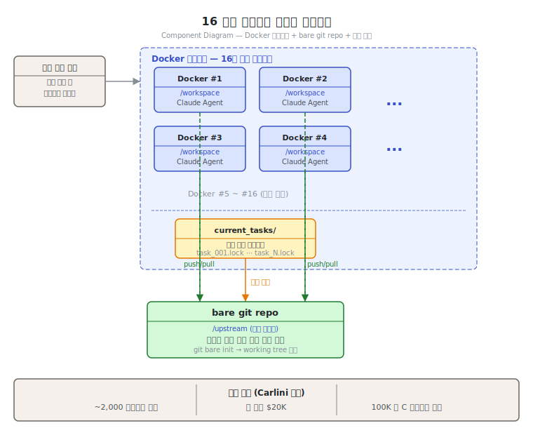
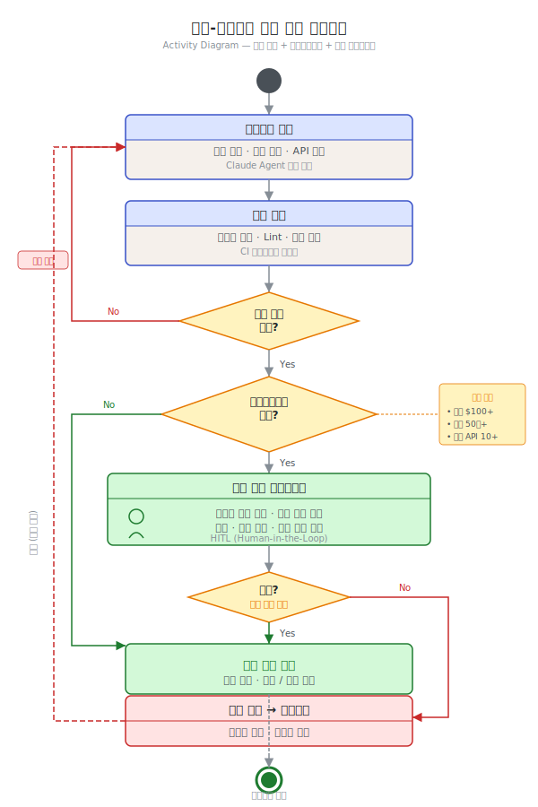

# 제10단원. 프로덕션 배포 — 실전 운영

---

## 학습 목표

이 단원을 마치면 다음을 할 수 있다:

1. Anthropic의 C 컴파일러 사례에서 병렬 에이전트 운영의 핵심 교훈을 추출할 수 있다
2. 에이전트 간 Git 충돌을 방지하고 해결하는 전략을 구현할 수 있다
3. 토큰 예산 관리 전략을 설계할 수 있다
4. Rate limit 대응 메커니즘을 구현할 수 있다
5. 에이전트 시스템의 테스트 하네스를 설계할 수 있다
6. 모니터링 시스템을 구현하고 핵심 지표를 추적할 수 있다
7. SWE-bench 등 코딩 에이전트 벤치마크를 해석하고 평가에 활용할 수 있다
8. 인간-에이전트 협업 검증 체크포인트를 설계할 수 있다

---

## 10.1 Anthropic의 C 컴파일러 사례 연구

Nicholas Carlini(Anthropic Safeguards 연구원)의 C 컴파일러 프로젝트는 2026년 초 멀티에이전트 시스템의 가능성과 한계를 동시에 보여준 기념비적 사례이다.

### 프로젝트 요약

| 항목 | 수치 |
|------|------|
| 에이전트 수 | 16 병렬 |
| Claude Code 세션 | ~2,000 |
| API 비용 | ~$20,000 |
| 결과물 | 100,000줄 Rust 기반 C 컴파일러 |
| 성과 | Linux 6.9 빌드 가능 (x86, ARM, RISC-V) |
| 기간 | 약 2주 |
| 토큰 소비 | 입력 20억, 출력 1.4억 |
| 모델 | Claude Opus 4.6 |
| 추가 성과 | GCC torture test suite 99% 통과, Doom 컴파일 가능 |

### 핵심 하네스 구조

Carlini가 구축한 하네스의 핵심은 단순한 무한 루프이다:

```bash
#!/bin/bash
while true; do
    COMMIT=$(git rev-parse --short=6 HEAD)
    LOGFILE="agent_logs/agent_${COMMIT}.log"
    claude --dangerously-skip-permissions \
           -p "$(cat AGENT_PROMPT.md)" \
           --model claude-opus-X-Y &> "$LOGFILE"
done
```

### 병렬 에이전트 동기화 아키텍처

각 에이전트는 Docker 컨테이너에서 독립적으로 실행되며, bare git repo를 공유 저장소로 사용한다:

```
┌─────────────────────────────────────────────────────────┐
│                  병렬 에이전트 시스템                      │
│                                                         │
│  ┌──────────────┐  ┌──────────────┐  ┌──────────────┐  │
│  │ Docker #1    │  │ Docker #2    │  │ Docker #16   │  │
│  │ /workspace   │  │ /workspace   │  │ /workspace   │  │
│  │ (local clone)│  │ (local clone)│  │ (local clone)│  │
│  └──────┬───────┘  └──────┬───────┘  └──────┬───────┘  │
│         │ push            │ push            │ push      │
│         └─────────────────┼─────────────────┘           │
│                           ▼                             │
│                  ┌────────────────┐                     │
│                  │ bare git repo  │                     │
│                  │   /upstream    │                     │
│                  └────────────────┘                     │
└─────────────────────────────────────────────────────────┘
```



동기화 알고리즘:
1. 에이전트가 `current_tasks/` 텍스트 파일 작성으로 태스크를 "잠금(lock)"한다
2. 에이전트가 작업을 완료하면, upstream에서 pull하고 변경을 병합(merge)하여 push한 뒤 잠금을 해제한다
3. 무한 에이전트 생성 루프가 새 Docker 컨테이너에서 새 Claude Code 세션을 시작한다

### 5가지 핵심 교훈

#### 교훈 1: 극도로 높은 품질의 테스트를 작성하라

> "Claude는 내가 준 문제를 자율적으로 풀어낸다. 따라서 태스크 검증자가 거의 완벽해야 한다. 그렇지 않으면 Claude는 잘못된 문제를 푼다."

테스트 품질이 에이전트 출력 품질을 결정한다. 테스트가 부정확하면 에이전트가 테스트를 통과하되 실제로는 잘못된 해결책을 구현한다.

**구체적 대응**: GCC torture test suite(수만 개의 C 코드 테스트 케이스)를 검증 오라클로 사용하였다. 이 suite를 99% 통과하는 것이 최종 성공 기준이 되었다.

#### 교훈 2: Claude의 입장에서 생각하라

LLM의 내재적 제한을 고려하여 하네스를 설계해야 한다:

- **컨텍스트 윈도우 오염**: 테스트 하네스가 수천 바이트의 무의미한 출력을 프린트하면 안 된다. 몇 줄의 출력만 프린트하고, 중요한 정보는 파일에 기록한다
- **시간 맹목**: Claude는 시간을 알 수 없으므로, 방치하면 몇 시간이고 테스트를 돌린다. `--fast` 옵션으로 1% 또는 10% 랜덤 샘플을 돌리는 기본값을 설정한다

#### 교훈 3: 병렬화를 쉽게 만들라

독립적인 실패 테스트가 많을 때 병렬화는 자명하다. 그러나 모든 에이전트가 같은 버그를 만나면 서로의 변경을 덮어쓴다.

해결책: **GCC를 온라인 오라클**로 사용하여, 대부분의 커널 파일을 GCC로 컴파일하고 나머지만 Claude의 컴파일러로 컴파일하였다. 이렇게 각 에이전트가 다른 파일의 버그를 수정하게 하였다.

#### 교훈 4: 다중 에이전트 역할

병렬화는 전문화도 가능하게 한다. 서로 다른 에이전트에 서로 다른 역할을 부여하였다:
- 중복 코드 통합
- 성능 개선
- 효율적 컴파일 코드 출력
- Rust 개발자 관점의 설계 비평
- 문서화

#### 교훈 5: 인간 검증의 중요성

> "테스트가 통과하고 작업이 끝났다고 가정하는 것은 쉽지만, 이것은 거의 사실이 아니다. 프로그래머가 직접 검증하지 않은 소프트웨어를 배포한다는 생각은 진정한 우려이다."

완성된 컴파일러에는 명확한 한계가 있었다: x86 부팅에 필요한 16비트 컴파일러 미구현, 어셈블러와 링커 버그, 생성 코드 효율 저하, 일부 실세계 프로젝트의 신뢰성 문제. 이러한 한계는 자동화 테스트만으로는 발견하기 어렵다.

---

## 10.2 에이전트 충돌 해결 전략

병렬 에이전트가 동일 파일을 동시에 수정할 때 발생하는 Git 충돌은 프로덕션에서 가장 빈번한 문제 중 하나이다.

### Git 기반 충돌 해결

```python
import subprocess
import random
import time

class AgentConflictResolver:
    """병렬 에이전트 환경의 Git 충돌 자동 해결기"""
    
    def __init__(self, upstream_url: str, max_retries: int = 5):
        self.upstream_url = upstream_url
        self.max_retries = max_retries
    
    def push_with_retry(self, branch: str) -> bool:
        """지수 백오프로 push 재시도"""
        for attempt in range(self.max_retries):
            result = subprocess.run(
                ["git", "push", "upstream", branch],
                capture_output=True, text=True
            )
            if result.returncode == 0:
                return True
            
            # 충돌 감지
            if "rejected" in result.stderr or "conflict" in result.stderr:
                wait = (2 ** attempt) + random.uniform(0, 1)
                print(f"충돌 감지, {wait:.1f}초 후 재시도 ({attempt+1}/{self.max_retries})")
                time.sleep(wait)
                
                # upstream에서 최신 변경 pull 후 rebase
                subprocess.run(["git", "pull", "--rebase", "upstream", branch])
            else:
                break  # 충돌이 아닌 다른 오류
        
        return False
    
    def assign_disjoint_tasks(self, all_tasks: list, agent_count: int) -> list[list]:
        """에이전트마다 겹치지 않는 태스크 집합 할당"""
        # 파일 기반 파티셔닝: 같은 파일을 다루는 태스크는 같은 에이전트에
        file_to_agent = {}
        agent_tasks = [[] for _ in range(agent_count)]
        
        for task in all_tasks:
            key = task.get("target_file", task["id"])
            if key not in file_to_agent:
                # 가장 적게 배정된 에이전트에 배정
                agent_idx = min(range(agent_count), key=lambda i: len(agent_tasks[i]))
                file_to_agent[key] = agent_idx
            agent_tasks[file_to_agent[key]].append(task)
        
        return agent_tasks
```

### 충돌 예방 전략

| 전략 | 설명 | 적합한 상황 |
|------|------|-----------|
| 파일 기반 파티셔닝 | 각 에이전트가 담당 파일을 고정 | 파일 단위로 독립적인 작업 |
| 잠금 파일 방식 | `current_tasks/` 디렉터리에 잠금 파일 생성 | Carlini C 컴파일러 방식 |
| 브랜치 격리 | 에이전트마다 별도 브랜치, 완료 시 병합 | 대규모 기능 개발 |
| worktree 격리 | `git worktree`로 물리적 작업 공간 분리 | OMC Ultrapilot 방식 |

---

## 10.3 토큰 예산 관리

### 에이전트별 예산 설정

```
┌──────────────────────────────────────────────┐
│              토큰 예산 관리 정책               │
├──────────────────────────────────────────────┤
│                                              │
│  임계값       행동                            │
│  ─────────   ────────────────────            │
│  85% 소진    일시 정지 + 진행 상황 보고         │
│  100% 소진   강제 종료                        │
│  3회 stuck    kill 후 재할당                   │
│                                              │
│  교훈: "Claude는 진척 없이 몇 시간이고        │
│        테스트를 돌리는 것을 기꺼이 한다"       │
│                                              │
│  대응: maxTurns 설정 + --fast 옵션 활용       │
│                                              │
└──────────────────────────────────────────────┘
```

### 토큰 효율성 지표

Anthropic의 데이터에 따른 상호작용 유형별 토큰 사용량:

| 유형 | 토큰 (상대) | 절대 수치 예시 |
|------|-----------|--------------|
| 일반 채팅 | 1x | ~2K 토큰 |
| 단일 에이전트 | ~4x | ~8K 토큰 |
| 멀티에이전트 | ~15x | ~30K 토큰 |

Carlini의 C 컴파일러 사례에서 실측된 수치는 세션당 평균 약 105만 입력 토큰(20억 / 2000 세션)으로, 이는 멀티에이전트 시스템의 토큰 소비가 단순 채팅의 수백 배에 달할 수 있음을 보여준다.

### GSD의 비용 추적

GSD는 `metrics.json`에 모든 실행의 토큰 사용량과 비용을 자동 기록한다:

```json
{
  "milestone": "M001",
  "total_tokens": 1250000,
  "total_cost_usd": 45.20,
  "tasks": [
    {"id": "T01", "tokens": 85000, "cost": 3.10},
    {"id": "T02", "tokens": 92000, "cost": 3.35}
  ]
}
```

---

## 10.4 Rate Limit 대응

### OMC Ralph의 지수 백오프

```
API 응답 수신
    │
    ├── 정상 응답 (200) → 계속 실행
    │
    ├── Rate Limit (429) → Backoff 계산
    │     1차: 30초 대기
    │     2차: 60초 대기
    │     3차: 120초 대기
    │     4차: 300초 대기
    │     (지수 백오프)
    │     → 대기 완료 → 자동 재개
    │
    └── 서버 오류 (5xx) → 3회 재시도 후 에스컬레이션
```

### GSD의 크래시 복구

GSD v2는 `auto.lock` 파일로 PID를 추적하여 크래시 후 자동 재개한다:

```
에이전트 실행 중 → auto.lock 생성 (PID, 현재 태스크)
    │
    ├── 정상 완료 → auto.lock 삭제
    │
    └── 크래시 → 다음 실행 시 auto.lock 감지
                 → 마지막 완료 태스크부터 재개
```

---

## 10.5 테스트 하네스 설계

### "Claude를 위한 테스트" 설계 원칙

Carlini의 경험에서 도출된 원칙:

1. **테스트 출력을 최소화한다**: 수천 줄의 에러 메시지 대신 요약만 프린트한다
2. **빠른 검증 모드를 제공한다**: `--fast` 플래그로 랜덤 샘플만 돌린다
3. **오라클을 제공한다**: 알려진 정답 소스(GCC 등)와 비교할 수 있게 한다
4. **격리된 환경을 사용한다**: Docker 컨테이너에서 각 에이전트를 실행한다
5. **자동 정리를 구현한다**: git worktree, tmux 세션의 자동 정리

### 테스트 하네스 아키텍처

```
┌──────────────────────────────────────────────┐
│              테스트 하네스                     │
│                                              │
│  ┌──────────┐  ┌──────────┐  ┌──────────┐   │
│  │ Docker   │  │ Docker   │  │ Docker   │   │
│  │ Agent 1  │  │ Agent 2  │  │ Agent N  │   │
│  │          │  │          │  │          │   │
│  │ /upstream│  │ /upstream│  │ /upstream│   │
│  │ (mount)  │  │ (mount)  │  │ (mount)  │   │
│  └────┬─────┘  └────┬─────┘  └────┬─────┘   │
│       │              │              │         │
│       └──────────────┼──────────────┘         │
│                      │                        │
│              ┌───────▼───────┐                │
│              │  bare git repo │                │
│              │  /upstream     │                │
│              └───────────────┘                │
└──────────────────────────────────────────────┘
```

---

## 10.6 모니터링과 관측성

### OMC HUD (Heads-Up Display)

OMC HUD는 터미널 상단에 에이전트 상태를 실시간으로 표시한다.
아래는 원본 OMC UI를 텍스트로 표현한 것이다 (원본에는 아이콘 문자가 사용되었으나, 교재 서식에 맞게 텍스트로 대체하였다)[^hud]:

```
┌──────────────────────────────────────────────────────────────┐
│ [dir] ~/projects/app  [branch] feat/auth  [status] clean     │
│ [mode] autopilot  [workers] 3/5  [tokens] 12.4K  [time] 5m32s│
└──────────────────────────────────────────────────────────────┘
```

[^hud]: OMC 원본 UI에는 폴더, 나뭇가지, 로봇, 타겟, 시계 등의 이모지가 사용되었다. 교재 문체 일관성을 위해 대괄호 텍스트 표기로 대체하였다.

### Anthropic의 관측성 원칙

> "표준 관측성을 넘어, 우리는 에이전트 결정 패턴과 상호작용 구조를 모니터링한다 — 모두 사용자 프라이버시를 유지하기 위해 개별 대화의 내용을 모니터링하지 않으면서."
> — Anthropic (2025)

### 필수 모니터링 지표

| 지표 | 설명 | 임계값 |
|------|------|--------|
| 토큰 사용량/작업 | 작업당 평균 토큰 소비 | 예산의 85% 경고 |
| 완료율 | 성공/실패/타임아웃 비율 | 실패율 > 20% 알림 |
| 평균 작업 시간 | 작업 유형별 소요 시간 | 기준 대비 2x 초과 시 알림 |
| Rate limit 빈도 | 시간당 rate limit 횟수 | 시간당 5회 초과 시 알림 |
| 에스컬레이션 빈도 | 모델 에스컬레이션 횟수 | 30% 초과 시 라우팅 재검토 |

### 모니터링 시스템 구현 예시

```python
import time
import json
from dataclasses import dataclass, field
from typing import Optional
from collections import defaultdict

@dataclass
class AgentMetrics:
    agent_id: str
    tokens_input: int = 0
    tokens_output: int = 0
    tasks_completed: int = 0
    tasks_failed: int = 0
    rate_limit_hits: int = 0
    start_time: float = field(default_factory=time.time)
    
    @property
    def total_tokens(self) -> int:
        return self.tokens_input + self.tokens_output
    
    @property
    def success_rate(self) -> float:
        total = self.tasks_completed + self.tasks_failed
        return self.tasks_completed / total if total > 0 else 0.0
    
    @property
    def elapsed_minutes(self) -> float:
        return (time.time() - self.start_time) / 60

class ProductionMonitor:
    """멀티에이전트 프로덕션 모니터링 시스템"""
    
    def __init__(self, token_budget: int, alert_threshold: float = 0.85):
        self.agents: dict[str, AgentMetrics] = {}
        self.token_budget = token_budget
        self.alert_threshold = alert_threshold
        self.alerts: list[dict] = []
    
    def register_agent(self, agent_id: str):
        self.agents[agent_id] = AgentMetrics(agent_id=agent_id)
    
    def record_tokens(self, agent_id: str, input_tokens: int, output_tokens: int):
        m = self.agents[agent_id]
        m.tokens_input += input_tokens
        m.tokens_output += output_tokens
        
        usage_ratio = m.total_tokens / self.token_budget
        if usage_ratio >= self.alert_threshold:
            self._raise_alert(agent_id, "token_budget",
                f"토큰 예산 {usage_ratio*100:.1f}% 소진")
    
    def record_task(self, agent_id: str, success: bool):
        m = self.agents[agent_id]
        if success:
            m.tasks_completed += 1
        else:
            m.tasks_failed += 1
            if m.success_rate < 0.8:
                self._raise_alert(agent_id, "high_failure_rate",
                    f"실패율 {(1-m.success_rate)*100:.1f}%")
    
    def record_rate_limit(self, agent_id: str):
        self.agents[agent_id].rate_limit_hits += 1
    
    def _raise_alert(self, agent_id: str, alert_type: str, message: str):
        alert = {
            "time": time.time(),
            "agent_id": agent_id,
            "type": alert_type,
            "message": message
        }
        self.alerts.append(alert)
        print(f"[ALERT] {agent_id}: {message}")
    
    def summary(self) -> dict:
        total_tokens = sum(m.total_tokens for m in self.agents.values())
        total_tasks = sum(m.tasks_completed + m.tasks_failed for m in self.agents.values())
        total_success = sum(m.tasks_completed for m in self.agents.values())
        return {
            "agent_count": len(self.agents),
            "total_tokens": total_tokens,
            "overall_success_rate": total_success / total_tasks if total_tasks > 0 else 0,
            "active_alerts": len(self.alerts)
        }
```

---

## 10.7 코딩 에이전트 벤치마크

멀티에이전트 시스템의 성능을 객관적으로 평가하려면 표준화된 벤치마크가 필요하다. 코딩 에이전트 평가에서 가장 널리 사용되는 세 가지 벤치마크를 소개한다.

### SWE-bench (Princeton, 2024)

**SWE-bench**(Software Engineering benchmark)는 실제 GitHub 이슈를 기반으로 한 코딩 에이전트 평가 기준이다.

| 항목 | 내용 |
|------|------|
| 출처 | Princeton NLP Group, Jimenez et al. (2024) |
| 과제 수 | 2,294개 (SWE-bench), 300개 (SWE-bench Verified) |
| 과제 형식 | 실제 GitHub 이슈 → 코드 수정 → 테스트 통과 |
| 평가 기준 | 전체 테스트 통과 여부 (pass@1) |
| Claude 성과 | Claude Opus 4.6 — SWE-bench Verified에서 72.5% 해결 (2026년 초 기준) |

SWE-bench의 핵심 강점은 **실제 소프트웨어 프로젝트**(Django, Flask, NumPy 등 유명 오픈소스)의 이슈를 사용한다는 점이다. 단순 알고리즘 문제가 아니라, 코드베이스 이해 → 버그 위치 파악 → 수정 → 테스트 통과라는 복잡한 워크플로우 전체를 평가한다.

멀티에이전트 시스템 평가에의 적용:
- **단일 에이전트 vs 멀티에이전트 비교**: 오케스트레이터-워커 구조가 단일 에이전트 대비 SWE-bench 점수를 얼마나 개선하는지 측정한다
- **전문화 효과 검증**: 코드 분석 전담 에이전트 + 수정 전담 에이전트 조합의 효과를 단일 범용 에이전트와 비교한다

### HumanEval (OpenAI, 2021)

**HumanEval**은 함수 수준 코드 생성 능력을 측정하는 벤치마크이다.

| 항목 | 내용 |
|------|------|
| 출처 | OpenAI, Chen et al. (2021) |
| 과제 수 | 164개 Python 함수 |
| 과제 형식 | docstring → 함수 구현 |
| 평가 기준 | pass@k (k번 시도 중 1회 이상 통과) |
| 특성 | 알고리즘 중심, 단일 파일 수준 |

HumanEval은 **모델 라우팅 효과** 검증에 특히 유용하다. 쉬운 문제(상위 50%)에 Haiku를 배정하고 어려운 문제에 Opus를 배정했을 때의 성능 대비 비용 절감 비율을 측정할 수 있다.

### MBPP (Google, 2021)

**MBPP**(Mostly Basic Python Problems)는 프로그래밍 입문 수준의 490개 Python 문제로 구성된다.

| 항목 | 내용 |
|------|------|
| 출처 | Google, Austin et al. (2021) |
| 과제 수 | 374개 (표준 분할) |
| 난이도 | 입문~중급 (HumanEval보다 쉬움) |
| 적합 용도 | Haiku/Sonnet 수준 평가, 라우팅 하한선 설정 |

### LiveCodeBench (2024~)

**LiveCodeBench**는 시험 오염(contamination) 문제를 해결하기 위해 최신 코딩 경쟁(LeetCode, Codeforces, AtCoder)에서 지속적으로 새 문제를 수집하는 동적 벤치마크이다.

### 벤치마크 활용 가이드

멀티에이전트 시스템을 구축할 때 다음 단계로 벤치마크를 활용한다:

```
1. 기준선 측정
   └─ 단일 에이전트(Sonnet) → SWE-bench Verified 점수 측정
   
2. 아키텍처 효과 검증
   └─ 오케스트레이터-워커(Opus + Sonnet) → 점수 비교
   
3. 비용 효율 최적화
   └─ FrugalGPT 라우팅 적용 → 동일 점수, 비용 절감 측정
   
4. 전문화 효과 측정
   └─ 역할별 전문 에이전트 → 동일 과제 재측정
```

**주의사항**: 공개 벤치마크는 훈련 데이터 오염 가능성이 있다. 내부 평가 세트(실제 버그 이슈 20~50개)를 병행하여 실제 운영 환경에서의 성능을 검증한다.

---

## 10.8 평가 방법론

### Anthropic의 평가 원칙

Anthropic 연구팀이 제시한 에이전트 평가 원칙:

#### 원칙 1: 즉시 소규모로 시작하라

> "대규모 평가 세트만 유용하다고 생각하여 평가 작성을 미루는 AI 개발 팀의 말을 자주 듣는다. 그러나 몇 가지 예시로 소규모 테스트를 바로 시작하는 것이 더 철저한 평가를 구축할 수 있을 때까지 미루는 것보다 낫다."

약 20개의 실제 사용 패턴을 대표하는 쿼리 세트로 시작한다. 초기에는 변경의 효과 크기가 크므로(30% → 80% 등), 소수의 테스트 케이스로도 영향을 확인할 수 있다.

#### 원칙 2: LLM-as-Judge를 활용하라

0.0~1.0 점수와 합격/불합격 등급을 출력하는 단일 프롬프트의 단일 LLM 호출이 가장 일관되고 인간 판단과 정렬되었다.

#### 원칙 3: 인간 평가가 자동화가 놓치는 것을 잡는다

초기 에이전트가 권위적이지만 순위가 낮은 출처(학술 PDF, 개인 블로그) 대신 SEO 최적화된 콘텐츠 팜을 일관되게 선택하는 편향을 인간 테스터가 발견하였다.

#### 원칙 4: 과정이 아닌 결과를 평가하라

> "에이전트가 특정 과정을 따랐는지 판단하는 대신, 올바른 최종 상태를 달성했는지 평가하라."

멀티에이전트 시스템은 동일한 시작점에서도 완전히 다른 유효한 경로를 취할 수 있다. 따라서 과정이 아닌 결과 중심으로 평가해야 한다.

---

## 10.9 인간-에이전트 협업 검증 프로세스

자율 에이전트 시스템에서 인간의 역할은 줄어드는 것이 아니라 **이동**한다. 매 단계를 직접 실행하는 대신, 에이전트가 생성한 결과를 검증하고 방향을 교정하는 역할로 전환된다.

### 검증 단계 설계

```
┌────────────────────────────────────────────────────────┐
│          인간-에이전트 협업 검증 흐름                    │
│                                                        │
│  [에이전트 실행]                                        │
│       │                                               │
│       ▼                                               │
│  [자동 검증] ── 테스트, lint, 정적 분석                  │
│       │                                               │
│       ├── 실패 → 에이전트 재실행 (자동)                  │
│       │                                               │
│       └── 통과 → [인간 검토 체크포인트]                  │
│                       │                               │
│                  ┌────┴────┐                           │
│                  │ 확인    │ 거부                       │
│                  └────┬────┘                           │
│                       │                               │
│                [다음 단계 진행]                         │
└────────────────────────────────────────────────────────┘
```



### 체크포인트 설계 원칙

**1. 비가역 작업 전 필수 확인**
- 프로덕션 DB 마이그레이션 실행 전
- 외부 API 호출 (이메일 발송, 결제 처리 등) 전
- 공개 저장소 push 전

**2. 에스컬레이션 임계값 설정**

```python
ESCALATION_RULES = {
    "cost_usd": 100,          # $100 초과 시 인간 승인 필요
    "files_modified": 50,     # 50개 초과 파일 수정 시
    "test_failure_rate": 0.3, # 테스트 실패율 30% 초과 시
    "api_calls_external": 10  # 외부 API 10회 초과 시
}
```

**3. 에이전트 의사결정 로깅**

검증 후 문제가 발견될 때 근본 원인 분석이 가능하도록, 에이전트의 주요 결정과 그 근거를 구조화된 형식으로 기록한다:

```json
{
  "decision": "파일 삭제",
  "rationale": "테스트에서 미사용 파일로 판정",
  "confidence": 0.87,
  "affected_files": ["src/legacy/old_parser.py"],
  "reversible": true,
  "timestamp": "2026-04-08T14:32:00Z"
}
```

---

> **핵심 정리: 프로덕션 배포 체크리스트**
>
> - [ ] 토큰 예산 관리 정책 수립 (85% 경고, 100% 종료)
> - [ ] Rate limit 자동 대응 메커니즘 구현 (지수 백오프)
> - [ ] 크래시 복구 메커니즘 구현 (상태 영속화)
> - [ ] 에이전트 충돌 해결 전략 결정 (파일 파티셔닝 또는 잠금 파일)
> - [ ] 테스트 하네스 설계 (격리, 최소 출력, 빠른 검증)
> - [ ] 모니터링 대시보드 구성 (토큰, 완료율, 시간, rate limit)
> - [ ] 벤치마크 선정 (SWE-bench, HumanEval 또는 내부 평가 세트)
> - [ ] 평가 세트 구축 (20개 쿼리로 시작)
> - [ ] 배포 전략 결정 (섀도 → 카나리 → 프로덕션, 7단원 참조)
> - [ ] 인간 검증 체크포인트 수립 (비가역 작업, 비용 임계값)

---

## 복습 질문

1. Carlini의 C 컴파일러 프로젝트에서 "GCC를 온라인 오라클로 사용"한 전략이 병렬화 문제를 어떻게 해결했는지 설명하라.

2. 토큰 예산의 85% 임계값에서 "일시 정지 + 진행 보고"를 선택한 이유를 분석하라.

3. GSD의 크래시 복구 메커니즘(auto.lock)이 OMC의 Ralph 모드와 어떻게 다른 접근법을 취하는지 비교하라.

4. SWE-bench, HumanEval, MBPP 세 벤치마크의 적합한 활용 목적을 각각 설명하고, 멀티에이전트 시스템 평가에서 내부 평가 세트를 병행해야 하는 이유를 논하라.

5. "인간의 역할이 이동한다"는 관점에서, 완전 자율 에이전트 시스템에서도 인간 검토 체크포인트가 필요한 이유를 Carlini의 교훈 5와 연결하여 설명하라.

6. 프로덕션 배포 체크리스트의 각 항목이 왜 필요한지, 빠뜨리면 어떤 문제가 발생하는지 설명하라.

---

*이전 단원: [제9단원. 에이전트 구현 가이드](09_에이전트_구현_가이드.md) | 다음 단원: [제11단원. 부록](11_부록.md)*
